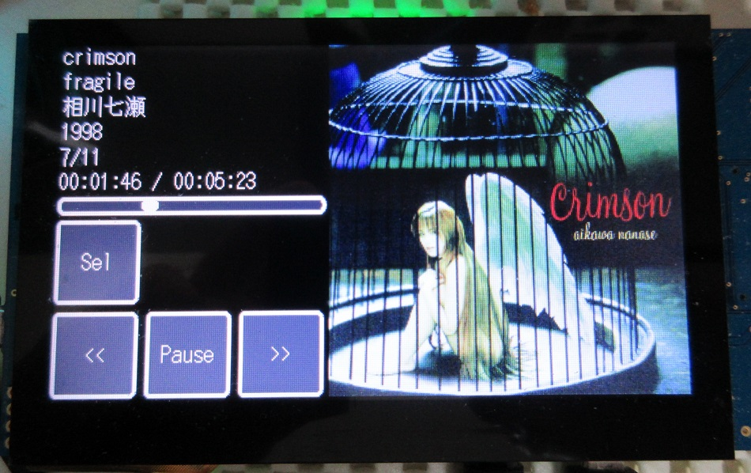
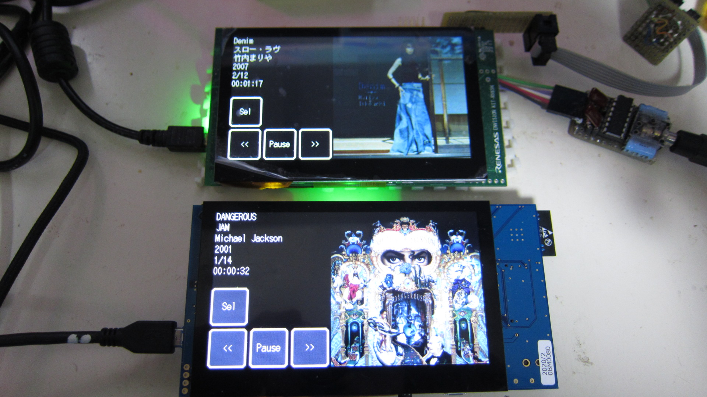
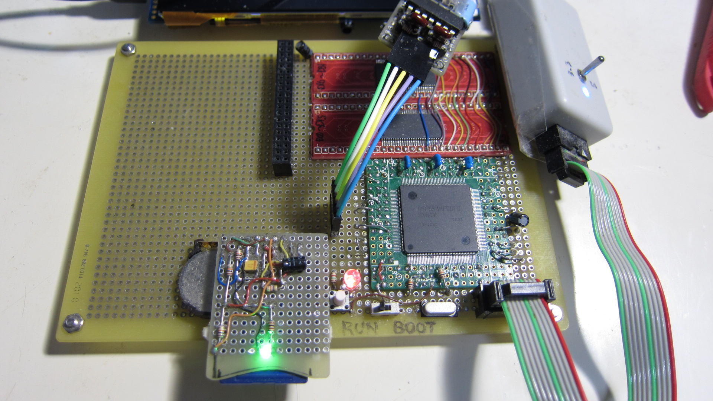

Renesas RX65N/RX72N Envision Kit, RX64M Audio Player
=========

[Japanese](READMEja.md)
   
## Overview
 - Audio player realized with RX microcontroller
 - GUI operation is available when using the RX65N/RX72N Envision Kit.
 - The RX64M can be operated from the console.
 - Playback of audio files in WAV and MP3 format (up to 48 kHz, 16 bits)
 - Displaying ID3 tag information and album art (RX65N/RX72N Envision Kit)
 - Use of built-in D/A (RX65N Envision Kit, RX64M)
 - Built-in digital audio output (RX72N Envision Kit)
 - Multitasking with FreeRTOS

## Project list
 - main.cpp
 - audio_gui.hpp
 - FreeRTOSConfig.h
 - Makefile
   
## Preparation of hardware (RX65N Envision Kit)

 - Preparing the SD card interface
 - Audio connection (output from DA0 and DA1, GND level is 1.65V) 3.3V p-p
 - P03_JOY_RIGHT_IRQ11 (DA0) Left Output
 - P05_IRQ13_SW (DA1) Right Output
 - Pmod (10) PB6_RXD9_PMOD_10 ---> Used as RXD (when using the command line interface)
 - Pmod ( 9) PB7_TXD9_PMOD_9  ---> Used as TXD (when using the command line interface)
 - RXD/TXD is 115200 Baud, 8-bits, 1-Stop, No-Parity Internal operation display, etc.

## Resource Preparation
 - Copy the "NoImage.jpg" file to the root of the SD card.
 - Write "mp3, wav" format files to an SD card.
   
## Build method
 - Move to target directory
 - RX64M、RX65N (Envision Kit)、RX72N (Envision Kit)
 - To make
 - Write the audio_sample.mot file to the microcontroller.
   
## How to operate the touch panel
 - The filer is started by pushing the "Sel" button.
 - Drag up and down to focus the file.
 - Right-drag to select a file (if it is a directory, move it to that directory)
 - Drag to the left to move to the previous directory.
 - Three point touch, filer close.
 - Play from the top of the song with the "<<" button
 - Pause and resume with the "Play/Pause" button
 - Press the ">>" button to play the next song.
 - In the directory, when the song is finished playing, play the next song.

## How to operate the Famicom pad (currently unsupported)
 - 「SELECT」ボタンで、ファイラーが有効になる。（もう一度押すと無効）
 - 上下ボタンで、ファイルフォーカス
 - 右ボタンで選択（ディレクトリーの場合、そのディレクトリーへ移動）
 - 左ボタンで、一つ手前のディレクトリーへ移動
 - 再生中、右ボタンで次の曲
 - 再生中、左ボタンでリプレイ
 - 再生中、「SELECT」で一時停止
 - 再生中「START」ボタンを押す事で、再生中断
 - 再生中は、曲の再生が終了したら、次の曲を再生
    
## Support for MP3 and WAV files
 - Supports up to 48 KHz, 16-bit and stereo file formats in WAV format.
 - Up to 320Kbps in MP3 format (44.1KHz, 48KHz, 16 Bits)
 - Parsing of the tag in WAV (part of it)
 - ID3V2 tag parsing (ID3V1 tag is not supported)

-----
   
License
----
   
Audio Player: (MIT open source license)    
   
FreeRTOS: (MIT open source license)    
libmad: See libma/libmad/COPYRIGHT (G.P.L. v2)   
libpng: See libpng/libpng/LICENSE  (libpng license)   
zlib: (zlib License)   
