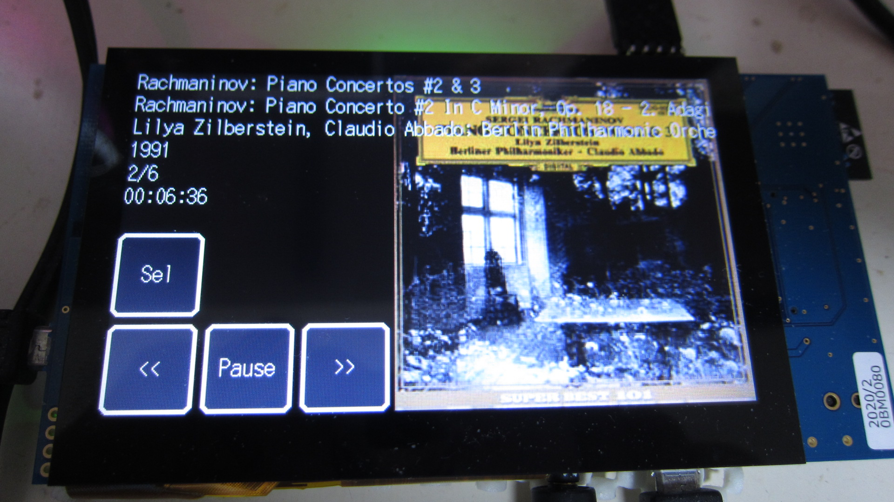

Renesas RX65N/RX72N Envision Kit, RX64M Audio Player
=========

[Japanese](READMEja.md)
   
## Overview
 - Audio player realized with RX microcontroller
 - GUI operation is available when using the RX65N/RX72N Envision Kit.
 - The RX64M can be operated from the console.
 - Playback of audio files in WAV and MP3 format (up to 48 kHz, 16 bits)
 - Displaying ID3 tag information and album art (RX65N/RX72N Envision Kit)
 - Use of built-in D/A (RX65N Envision Kit, RX64M)
 - Built-in digital audio output (RX72N Envision Kit)
 - Multitasking with FreeRTOS

## Project list
 - main.cpp
 - audio_gui.hpp
 - FreeRTOSConfig.h
 - Makefile
   
## Preparation of hardware (RX65N Envision Kit)

 - SD カードインターフェースの準備
 - オーディオの接続（DA0、DA1 から出力、GND レベルは、1.65V）3.3V p-p
 - P03_JOY_RIGHT_IRQ11 (DA0) Left 出力
 - P05_IRQ13_SW (DA1) Right 出力
 - ファミコン（互換）パッドの接続（利用する場合、main.cpp で ENABLE_FAMIPAD を有効にする）
 - Pmod (10) PB6_RXD9_PMOD_10 ---> RXD として使用 (コマンドラインインターフェースを利用する場合)
 - Pmod ( 9) PB7_TXD9_PMOD_9  ---> TXD として使用 (コマンドラインインターフェースを利用する場合)
 - RXD/TXD は 115200 Baud, 8-bits, 1-Stop, No-Parity 内部動作表示等

## リソースの準備
 - SD カード、ルートに、「NoImage.jpg」ファイルをコピーしておく。
 - SD カードに、「mp3、wav」形式のファイルを書き込む。
   
## ビルド方法
 - ターゲットディレクトリーに移動
 - RX64M、RX65N (Envision Kit)、RX72N (Envision Kit)
 - make する。
 - audio_sample.mot ファイルをマイコンに書き込む。
   
## タッチパネルでの操作方法
 - 「Sel」ボタンを押す事でファイラーが起動
 - 上下のドラッグで、ファイルフォーカス
 - 右ドラッグでファイル選択（ディレクトリーの場合、そのディレクトリーへ移動）
 - 左ドラッグで、一つ手前のディレクトリーへ移動
 - 三点タッチで、ファイラークローズ
 - 「<<」曲の先頭から再生
 - 「Play/Pause」一時停止と再開
 - 「>>」次の曲を再生
 - ディレクトリー内では、曲の再生が終了したら、次の曲を再生

## ファミコン・パッドでの操作方法（現在は未サポート）
 - 「SELECT」ボタンで、ファイラーが有効になる。（もう一度押すと無効）
 - 上下ボタンで、ファイルフォーカス
 - 右ボタンで選択（ディレクトリーの場合、そのディレクトリーへ移動）
 - 左ボタンで、一つ手前のディレクトリーへ移動
 - 再生中、右ボタンで次の曲
 - 再生中、左ボタンでリプレイ
 - 再生中、「SELECT」で一時停止
 - 再生中「START」ボタンを押す事で、再生中断
 - 再生中は、曲の再生が終了したら、次の曲を再生
    
## MP3、WAV ファイルの対応状況
 - WAV 形式の場合、最大 48KHz、16 ビット、ステレオのファイルフォーマットまで対応
 - MP3 形式の場合、320Kbps まで対応 (44.1KHz, 48KHz, 16 Bits)
 - WAV 内タグのパース（一部）
 - ID3V2 タグのパース（ID3V1 タグは未対応）

-----
   
License
----

Audio Player: (MIT open source license) 

FreeRTOS: (MIT open source license) 
libmad: See libma/libmad/COPYRIGHT (G.P.L. v2)
libpng: See libpng/libpng/LICENSE  (libpng license)
zlib: (zlib License)
