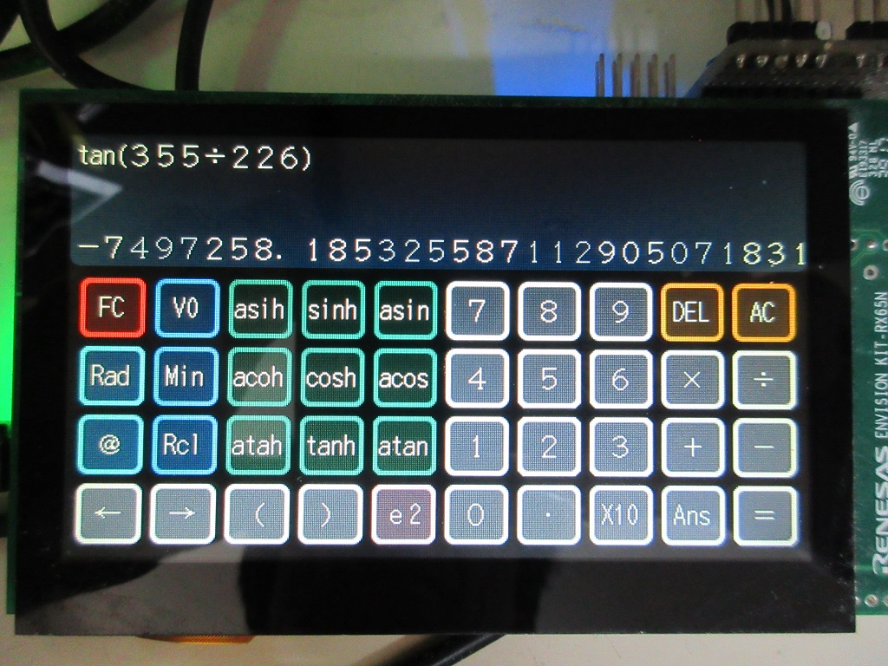

Calculator Sample
=========




[Japanese](READMEja.md)
   
## Overview

- General-purpose Function Calculator Sample
- When used with the RX65N/RX72N Envision Kit, operation via GUI
- Operated from the console on microcontrollers without graphics
- Multiple floating-point numbers using gmp mpfr library
- Internal processing of multiple digits (number of digits can be changed by changing constants)
- Binary, decimal, and hexadecimal display
- Calculations including binary (0b), decimal, and hexadecimal (0x)

## Project list

- main.cpp
- calc_gui.hpp
- calc_symbol.hpp
- calc_func.hpp
- calc_cmd.hpp
- calc_graph.hpp
- resource.hpp
- resource/
- README.md
- READMEja.md
- RX26T/Makefile CUI
- RX62N/Makefile CUI
- RX631/Makefile CUI
- RX64M/Makefile CUI
- RX71M/Makefile CUI
- RX66T/Makefile CUI
- RX72T/Makefile CUI
- RX65N/Makefile GUI (RX65N Envision Kit)
- RX72N/Makefile GUI (RX72N Envision Kit)

---

### Use Library

- libgmp.a
- libmpfr.a

---

### Main support classes

- common/basic_arith.hpp
- common/mpfr.hpp
- common/fixed_map.hpp
- common/fixed_string.hpp
- gui/
- graphics/

---

## Build Method

- Go to the target directory
- Make.
- Write the calc_sample.mot file to the microcontroller.

---

## Corresponding function

|function name|Button(GUI)|function|
|:-:|:-:|-------|
|sin|sin|正弦（サイン）|
|cos|cos|余弦（コサイン）|
|tan|tan|正接（タンジェント）|
|asin|asin|逆正弦（アークサイン）|
|acos|acos|逆余弦（アークコサイン）|
|atan|atan|逆正接（アークタンジェント）|
|sinh|sinh|双曲線関数（ハイパボリックサイン）|
|cosh|cosh|双曲線関数（ハイパボリックコサイン）|
|tanh|tanh|双曲線関数（ハイパボリックタンジェント）|
|asinh|asih|逆双曲線関数（アークハイパボリックサイン）|
|acosh|acoh|逆双曲線関数（アークハイパボリックコサイン）|
|atanh|atah|逆双曲線関数（アークハイパボリックタンジェント）|
|log10|log|基数 10 の対数関数|
|log|ln|基数 e の対数関数|
|x^y|x^y|X の Y 乗|
|x^-1|x^-1|X の -1 乗（逆数）|
|x^2|x^2|二乗|
|sqrt|sqrt|平方根（ルート）|
|exp10|exp|エクスポーネント１０|
|0b|0b|binary|
|0x|0x|hexadecimal|
|Dec|Dec|output decimal|
|Hex|Hex|output hexadecimal|
|Bin|Bin|output binary|
|π|PI|円周率（定数）|
|LOG2|LOG2|自然数（定数）|
|EULER|EULER|オイラー数（定数）|
|Deg|Deg|角度法、360|
|Rad|Rad|角度法、2 π|
|Grad|Grad|角度法、400|

---

## Command line（CUI, GUI）

Enter a formula from the console to perform the calculation and obtain the result:

```sh
# Start CALC sample for 'RX72T DIY' 200[MHz]
# Rad
# tan(355/226)
-7'497'258.185'325'587'089'863'352'83
# Hex
# ANS
-0x72'662A.2F71'7F67'A9B7'F
```

display help：

```sh
# ?
  PI        constant
  LOG2      constant
  EULER     constant
  ANS       constant
  V[0-9]    Memory symbol 0..9
  Min[0-9]  Memory In 0..9
  ListSym   List symbol
  Rad       0 to 2*PI
  Grad      0 to 400
  Deg       0 to 360
  Dec       Decimal mode
  Hex       Hexadecimal mode
  Bin       Binary mode
  Sep       Separate mode
  sin(x)
  cos(x)
  tan(x)
  asin(x)
  acos(x)
  atan(x)
  sinh(x)
  cosh(x)
  tanh(x)
  asinh(x)
  acosh(x)
  atanh(x)
  sqrt(x)
  log(x)
  ln(x)
  eint(x)
  exp10(x)
  gamma(x)
  zeta(x)
  abs(x)
  rint(x)
  frac(x)
```

---

## Future Plans

- A dedicated programming language, allowing you to perform your own operations
- Graphing
- Arithmetic Processing

---

## Answer of tan(355/226) 

This calculation is a simple benchmark requiring sufficient digits and precision

```
# Rad
# tan(355/226)
 -7497258.185325587112905071831891248663417267943785263161571
```

---

Translated with DeepL.com (free version)

---

License
----
   
MIT open source license   

libgmp:  GNU LGPL v3 and GNU GPL v2   
libfrmp: GNU LGPL v3   
