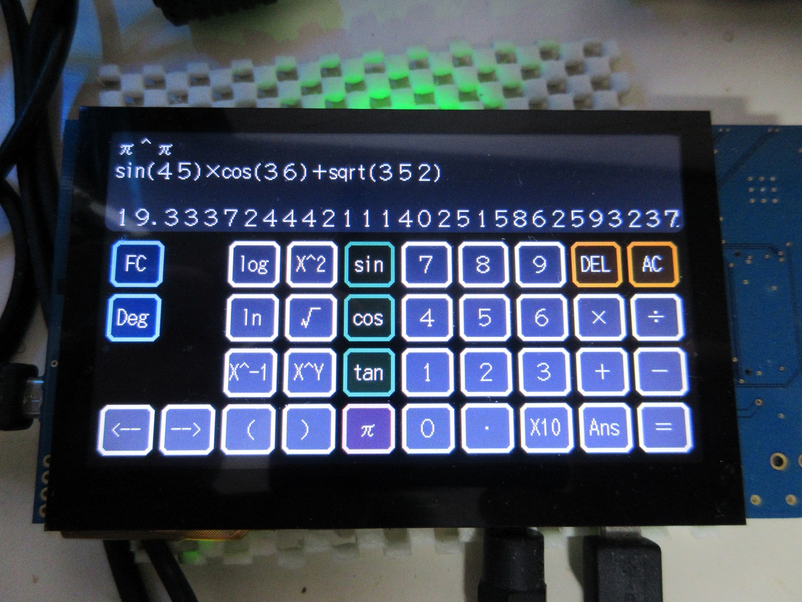

Renesas RX65N/RX72N Envision Kit 電卓アプリケーション
=========

[English](README.md)
   
## 概要
 - 汎用電卓アプリケーション
 - RX65N/RX72N Envision Kit で利用する場合、GUI での操作が可能
 - 他は、コンソールから操作可能（開発中）
    
## プロジェクト・リスト
 - main.cpp
 - calc_gui.hpp
 - calc_symbol.hpp
 - calc_func.hpp
 - RX72N/Makefile

### 利用ライブラリ

 - libgmp.a
 - libmpfr.a

### 主なサポートクラス

 - common/basic_arith.hpp
 - common/mpfr.hpp
   
## ビルド方法
 - ターゲットディレクトリーに移動
 - make する。
 - calc_sample.mot ファイルをマイコンに書き込む。
   
-----
   
License
----
   
MIT open source license   

libgmp:  GNU LGPL v3 and GNU GPL v2   
libfrmp: GNU LGPL v3   
