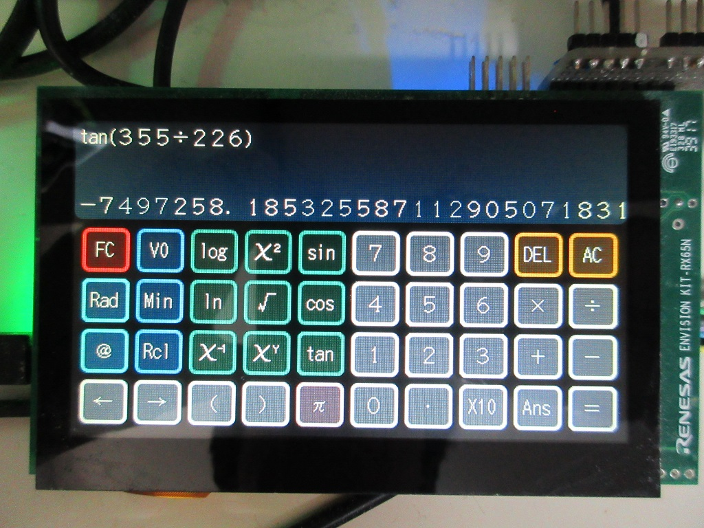
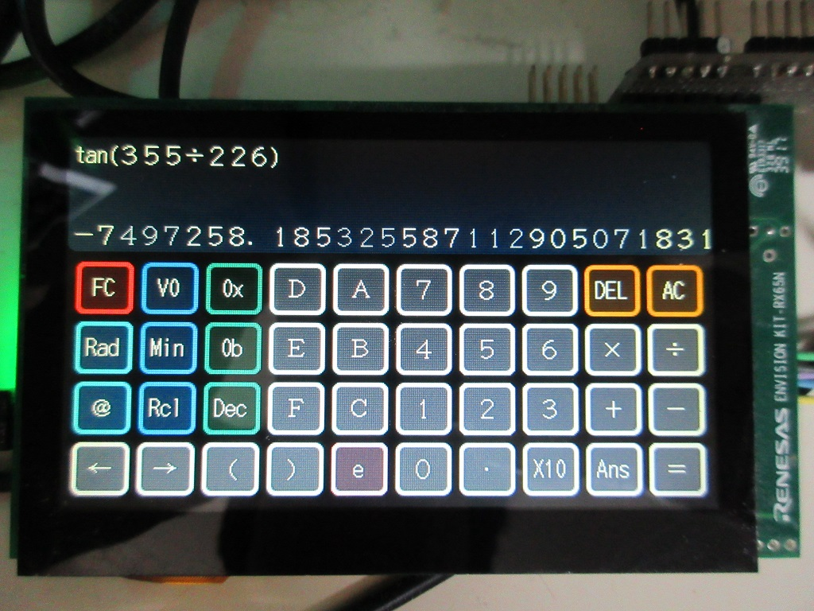
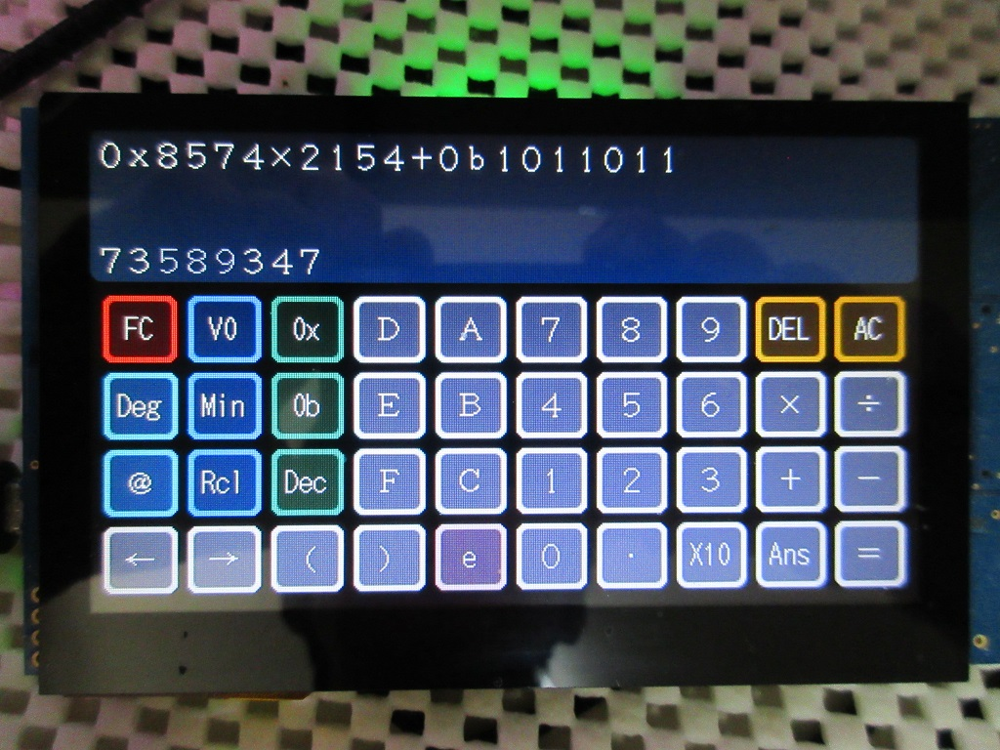
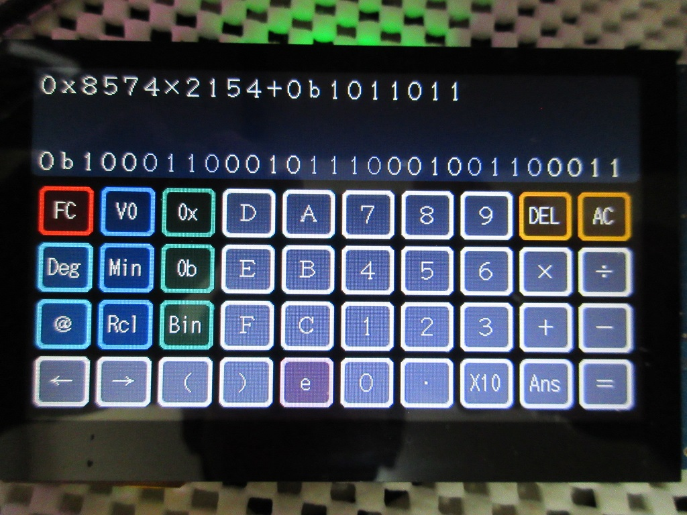

Renesas RX マイコン関数電卓サンプル
=========





[英語版](README.md)
   
## 概要

- 汎用関数電卓サンプル
- RX65N/RX72N Envision Kit で利用する場合、GUI での操作
- グラフィックスを持たないマイコンではコンソールから操作
- gmp mpfr ライブラリを使った、多倍長浮動小数点数
- 多数桁の内部処理（定数変更で桁数変更可能）
- ２進、１０進、１６進表示
- ２進（0b）、１０進、１６進（0x）を含めた、計算

---

## プロジェクト・リスト

- main.cpp
- calc_gui.hpp
- calc_symbol.hpp
- calc_func.hpp
- calc_cmd.hpp
- calc_graph.hpp
- resource.hpp
- resource/
- README.md
- READMEja.md
- RX26T/Makefile CUI
- RX62N/Makefile CUI
- RX631/Makefile CUI
- RX64M/Makefile CUI
- RX71M/Makefile CUI
- RX66T/Makefile CUI
- RX72T/Makefile CUI
- RX65N/Makefile GUI (RX65N Envision Kit)
- RX72N/Makefile GUI (RX72N Envision Kit)

---

### 外部利用ライブラリ

- rxlib/lib/libgmp.a
- rxlib/lib/libmpfr.a

---

### 主な利用クラス

- common/basic_arith.hpp
- common/mpfr.hpp
- common/fixed_map.hpp
- common/fixed_string.hpp
- gui/
- graphics/

---

## ビルド方法

- ターゲットディレクトリーに移動
- make する。
- calc_sample.mot ファイルをマイコンに書き込む。

---

## 利用可能な関数、機能など

|関数名|ボタン(GUI)|機能|
|:-:|:-:|-------|
|sin|sin|正弦（サイン）|
|cos|cos|余弦（コサイン）|
|tan|tan|正接（タンジェント）|
|asin|asin|逆正弦（アークサイン）|
|acos|acos|逆余弦（アークコサイン）|
|atan|atan|逆正接（アークタンジェント）|
|sinh|sinh|双曲線関数（ハイパボリックサイン）|
|cosh|cosh|双曲線関数（ハイパボリックコサイン）|
|tanh|tanh|双曲線関数（ハイパボリックタンジェント）|
|asinh|asih|逆双曲線関数（アークハイパボリックサイン）|
|acosh|acoh|逆双曲線関数（アークハイパボリックコサイン）|
|atanh|atah|逆双曲線関数（アークハイパボリックタンジェント）|
|log10|log|基数 10 の対数関数|
|log|ln|基数 e の対数関数|
|x^y|x^y|X の Y 乗|
|x^-1|x^-1|X の -1 乗（逆数）|
|x^2|x^2|二乗|
|sqrt|sqrt|平方根（ルート）|
|exp10|exp|エクスポーネント１０|
|0b|0b|２進数|
|0x|0x|１６進数|
|Dec|Dec|１０進表示|
|Hex|Hex|１６進表示|
|Bin|Bin|２進表示|
|π|PI|円周率（定数）|
|LOG2|LOG2|自然数（定数）|
|EULER|EULER|オイラー数（定数）|
|Deg|Deg|角度法、360|
|Rad|Rad|角度法、2 π|
|Grad|Grad|角度法、400|

---

## コマンドライン（CUI, GUI）

コンソールから計算式を入力して、計算を行い、結果を得ます：

```sh
# Start CALC sample for 'RX72T DIY' 200[MHz]
# Rad
# tan(355/226)
-7'497'258.185'325'587'089'863'352'83
# Hex
# ANS
-0x72'662A.2F71'7F67'A9B7'F
```

ヘルプ表示：

```sh
# ?
  PI        constant
  LOG2      constant
  EULER     constant
  ANS       constant
  V[0-9]    Memory symbol 0..9
  Min[0-9]  Memory In 0..9
  ListSym   List symbol
  Rad       0 to 2*PI
  Grad      0 to 400
  Deg       0 to 360
  Dec       Decimal mode
  Hex       Hexadecimal mode
  Bin       Binary mode
  Sep       Separate mode
  sin(x)
  cos(x)
  tan(x)
  asin(x)
  acos(x)
  atan(x)
  sinh(x)
  cosh(x)
  tanh(x)
  asinh(x)
  acosh(x)
  atanh(x)
  sqrt(x)
  log(x)
  ln(x)
  eint(x)
  exp10(x)
  gamma(x)
  zeta(x)
  abs(x)
  rint(x)
  frac(x)
```

---

## 今後の予定

- グラフ表示
- 専用プログラム言語の入力と実行
- 数式処理（微分や積分など）

---

## tan(355/226) の解

この計算は、十分な桁と精度が必要な簡単なベンチマークです

```sh
# Rad
# tan(355/226)
 -7497258.185325587112905071831891248663417267943785263161571
```

---
   
License
----
   
MIT open source license   

libgmp:  GNU LGPL v3 and GNU GPL v2   
libfrmp: GNU LGPL v3   
