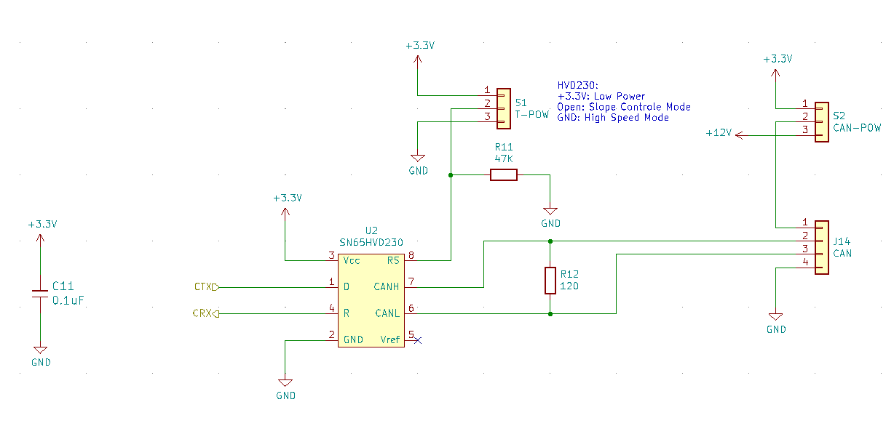

Renesas RX62N, RX631, RX64M, RX71M, RX66T, RX72T, RX72N CAN Communication Sample
=========

[Japanese](READMEja.md)
   
## Overview

Sample program for CAN communication using RX microcontroller   
A CAN bus transceiver has to be connected to the CAN port.   
If there are multiple channels of CAN, the communication channel is switched.   
The environment variable "MULTI" is enabled in "main.cpp".

## Description

- main.cpp
- RX62N/Makefile
- RX631/Makefile
- RX64M/Makefile
- RX71M/Makefile
- RX66T/Makefile
- RX72T/Makefile
- RX72N/Makefile
- README.md
- READMEja.md

## Hardware preparation

- The RXxxx/clock_profile.hpp declares a set frequency for each module.
- Connect the LED to the specified port.
- In the case of the RX72N Envision kit, it utilizes the blue LED on the board.
- Connect the CAN bus transceiver to the CAN port. (CTX0, CRX0)
- Connect the appropriate terminator resistor to the CAN bus transceiver.
- The CAN bus transceiver must be of the 3.3 V operating variety.
   
### CAN port setting

See the following sources for the ports to connect the CAN bus transceiver.   
**For actual connection, refer to the hardware manual for confirmation.**   

|microcontroller|file|CAN0 Alternate|CAN1 Alternate|
|-------|--------|:---:|:---:|
|RX62N  |[RX62x/port_map.hpp](../RX62x/port_map.hpp)|FIRST|X|
|RX631  |[RX63x/port_map.hpp](../RX63x/port_map.hpp)|FIRST|-|
|RX64M  |[RX64M/port_map.hpp](../RX64M/port_map.hpp)|FIRST|FIRST|
|RX65N  |[RX65x/port_map.hpp](../RX65x/port_map.hpp)|FIRST|X|
|RX71M  |[RX64M/port_map.hpp](../RX64M/port_map.hpp)|FIRST|FIRST|
|RX72N  |[RX72N/port_map.hpp](../RX72N/port_map.hpp)|X|SECOND|
|RX66T  |[RX66T/port_map.hpp](../RX66T/port_map.hpp)|FIRST|X|
|RX72T  |[RX72T/port_map.hpp](../RX72T/port_map.hpp)|FIRST|X|
   
CAN0:      
|microcontroller|FIRST/CRX0|FIRST/CTX0|\||SECOND/CRX0|SECOND/CTX0|
|-------|:---:|:---:|-|:---:|:---:|
|RX62N  |P33|P32|\||-|-|
|RX631  |P33|P32|\||PD2|PD1|
|RX64M  |P33|P32|\||PD2|PD1|
|RX65N  |P33|P32|\||PD2|PD1|
|RX71M  |P33|P32|\||PD2|PD1|
|RX72N  |P33|P32|\||PD2|PD1|
|RX66T  |P22|P23|\||PA1|PA0|
|RX72T  |P22|P23|\||PA1|PA0|
   
For RX64M (port_map.hpp FIRST candidate)
```C++
            case peripheral::CAN0:
                {
                    uint8_t sel = enable ? 0b010000 : 0;
                    PORT3::PMR.B2 = 0;
                    PORT3::PMR.B3 = 0;
                    MPC::P32PFS.PSEL = sel;  // CTX0 (P32 LQFP176: 29)
                    MPC::P33PFS.PSEL = sel;  // CRX0 (P33 LQFP176: 28)
                    PORT3::PMR.B2 = enable;
                    PORT3::PMR.B3 = enable;
                }
                break;
```

- By changing the CAN port candidate in main.cpp, the assigned port can be changed.
- Basic port settings are prepared in port_map.hpp.

```C++
    static const auto CAN0_PORT = device::port_map::option::FIRST;
    static const auto CAN1_PORT = device::port_map::option::FIRST;
```

---

### Typical varieties of CAN bus transceivers

[Texas Instruments: SN65HVD23x](https://www.ti.com/lit/ds/symlink/sn65hvd234.pdf?ts=1604192672378&ref_url=https%253A%252F%252Fwww.google.com%252F)
- Candidate for operation at 3.3V
- 5V not possible
- Max. 1 Mbit/s

[NXP Semiconductors: TJA1441](https://www.nxp.com/docs/en/data-sheet/TJA1441.pdf)
- Power 5V
- I/O 3.3V、5V selectable
- Max. 5 Mbit/s
   
---

### In the case of RX62N

- Use CAN0, single channel
- Operation check with FRK-RX62N(CQ 出版社)

### In the case of RX631

- Use CAN0, single channel
- Operation check with GR-CITRUS

### In the case of RX64M/RX71M

- Use CAN0/CAN1, Multi-channel support
- Operation check with DIY-board
   
### In the case of RX66T/RX72T

- Use CAN0, single channel
- Operation check with DIY-board

### In the case of the 'RX65N Envision Kit'

- The program supports multiple channels, but it is a single channel because it does not have access to the CAN port.
- Use CAN0, single channel
- CN13 (2) P32 (CTX0)
- CN13 (3) P33 (CRX0)
- CN8  (2) 3.3V
- CN8  (4) GND
- CN8  (5) GND

### In the case of the 'RX72N Envision Kit'

- The program supports multiple channels, but it is a single channel because it does not have access to the CAN port.
- Use CAN1, single channel
- Pmod1  (1) P54_SS    (CTX1)
- Pmod1  (7) P55/IRQ10 (CRX1)
- Pmod1  (6) 3.3V
- Pmod1 (12) 3.3V
- Pmod1  (5) GND
- Pmod1 (11) GND

---

## Collecting packet information by can_analize class

The instance corresponding to CAN0 collects packets by "[can_analize](../common/can_an_analize.hpp?ts=4)" class.

- Collection of arbitrary IDs and information about them.
- Collection of data sequence. (Only the last 8 bytes retrieved)
- Number of times received.
- Mapping of different IDs by std::map.
- Mapping by ID difference by std::map. (The order of display is displayed in an aligned manner.)
- You can also use boost::unordered_map. (In this case, the display order of CAN-IDs is unordered.)
- The execution binary is slightly smaller when using boost::unordered_map. (In that case, the memory allocation is also smaller.)

|Project|RX62N|RX631|RX64M|RX65N|RX71M|RX72N|RX66T|RX72T|
|---|:-:|:-:|:-:|:-:|:-:|:-:|:-:|:-:|
|Operation check|〇|〇|〇|－|－|－|－|〇|

Operation check:
Verified communication by actually connecting the CAN bus and communicating with each other.    
If the implementation of the port_map class, which depends on the hardware, is appropriate and the compilation passes, there should be no problem.

---

## Interactive commands

CAN data can be sent and received interactively.

- Whenever the program is started, all IDs are received.
- IDs are collected in the "can_analizer" class, which uses boost::unoderd_map.
- If the collection of IDs exceeds the memory limit, an eception will be thrown due to lack of memory and a crash is expected.
- The send_loop command sends IDs and data generated by random numbers in succession.
- The function to supplement ID (map) is provided only for channel 0.
- On the RX64M/RX71M, two CAN channels are enabled.
- For CAN1 reception, the received data is always displayed.
- MB-no is the mailbox number.
- Mailbox-related commands are for debugging.
- Received CAN frames are stored in memory and can be checked with the "dump" command.
- When a new data frame arrives with the same ID, it is overwritten and the counter is advanced.

```
CAN command version: 1.00
    ext                    set ext-id mode
    std                    set std-id mode
    send CAN-ID [data...]  send data frame
    stat MB-no             stat MCTLx register (MB-no: 0 to 31)
    list MB-no             list MBx register (MB-no: 0 to 31)
    status                 list recv/send error count
    clear [CAN-ID]         clear map
    map [CAN-ID]           Display all collected IDs
    dump CAN-ID            dump frame data
    send_loop NUM [-rtr]   random ID, random DATA, send loop (RTR)
    help                   command list (this)

  Input number: nnn decimal, xnnn hexa-decimal, bnnn binary
```

### ch command

- If "#define MULTI" is enabled and there is an instance of CAN1, change the current channel.

### valid command

- Enables or disables the VALID filter.

### valist command

- Displays a list of valid IDs.

### std command

- Enter standard ID mode. (11 bits)

### ext command

- Enables or disables the extended ID mode. (29 bits)

### send CAN-ID [data...] command

- Sends a sequence of data with ID.
- If ID only, send remote frame.
- Send a data string of up to 8 bytes.
- Numerical values can be entered in decimal, hexadecimal (prefixed with x), or binary (prefixed with b).
   
### stat MB-no command (for debugging)

- Display of CAN MCTLx register.
- MB-no is from 0 to 31.

### list MB-no command (for debugging)

- Display of CAN MBx registers.
- MB-no is 0 to 31.

### clear [CAN-ID] command

- Clear the individual ID information of the can_analizer class.
- Clear all collection history of can_analizer class.

### map [CAN-ID] command

- Displays the IDs collected by the can_analizer class.
- Displays the details of individual IDs.

### dump [CAN-ID] command

- Displays frame data related to the individual IDs of the can_analizer class.
- The frame data is the last one obtained by the ID.

### send_loop [num] command

- Generates an ID with a random number and sends data.
- Specify the number of repeating data transmission.

### help command

- Displays a brief description of the command.

---

## CAN/ID Filters

main.cpp contains sample code for a filter with a list of IDs that can be passed through.   

- This feature is used when the "MULTI" channel is enabled.
- It is applied to instances of CAN1 with multiple channels.    
- The filter uses "boost/unordered_set". 
- At the beginning of main.cpp, comment out "#define VALID_FILTER" to disable the filter. 
- The valid ID table is as follows
- boost::unordered_set.
- IDs can be added, deleted, etc. dynamically.

```C++
#include <boost/unordered_set.hpp>

	// 有効な ID だけ通すフィルター
	typedef boost::unordered_set<uint32_t> VALID;
//	typedef const boost::unordered_set<uint32_t> VALID;
	VALID	valid_{ 0x123, 0x200, 0x300, 0xaaa, 15, 21, 33 };
```
   
In the main loop, when dispatching the incoming frame of CAN1, check if the ID is valid and ignore invalid IDs.
   
```C++
		while(can1_.get_recv_num() > 0) {
			auto frm = can1_.get_recv_frame();
#ifdef VALID_FILTER
			if(valid_.find(frm.get_id()) != valid_.end()) {
#else
			{
#endif
				utils::format("\nCAN1:\n");
				CAN::list(frm, "  ");
			}
		}
```

---

## Resource preparation

- Connect an appropriate CAN bus transceiver to the CAN bus.
- Connect a terminator resistor to the CAN bus.
   
CAN bus transport SN65HVD230 sample circuit：   


---

## How to build

- Move to each platform directory and make it.
- Write the led_sample.mot file.
   
---

## Operation

- The LED flashes every 0.25 seconds.
- The terminal makes a serial connection and communicates with interactive commands.
   
---
   
License
----

[MIT](../LICENSE)
