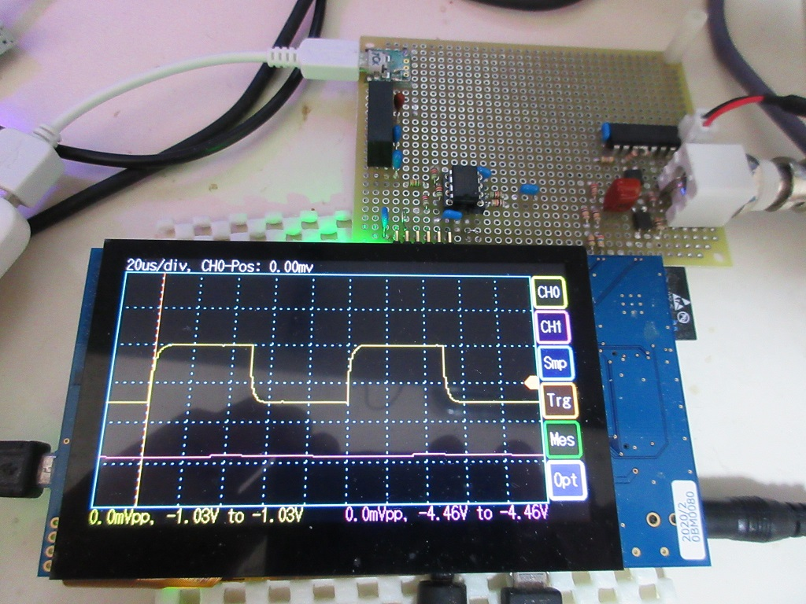
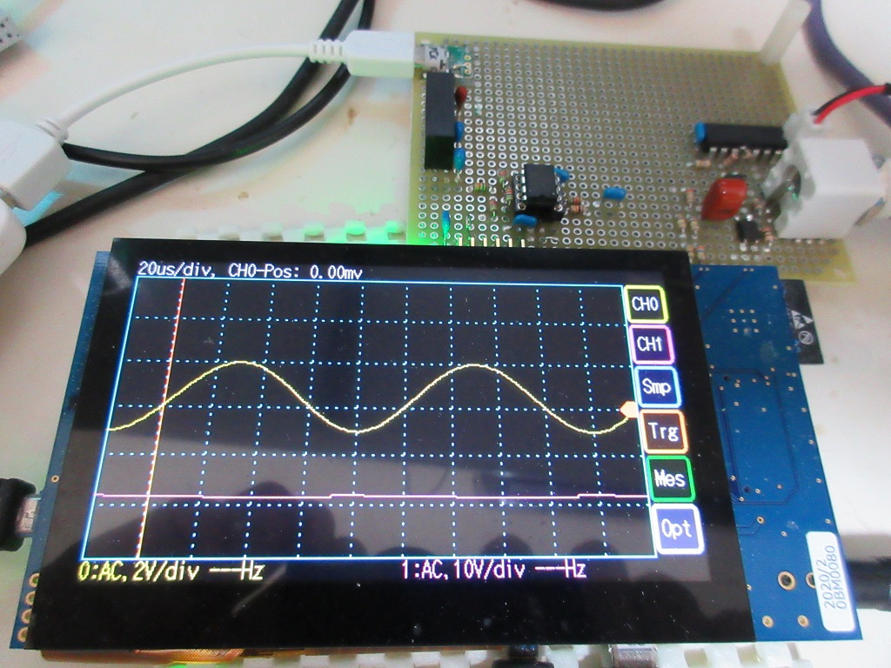

Renesas RX65N/RX72N Envision Kit / デジタル・ストレージ・オシロスコープ
=========

[英語版](README.md)

**RX65N Envision Kit は、ダブルバッファが物理的に出来ない為、一応動作しますが、レガシーとします。**   
**RX72N Envision Kit で利用下さい。**

---

## 概要

 - RX72N Envision Kit で実現するデジタルストレージオシロスコープ
 - 最大サンプリング速度 500 [ns] (2MHz)
 - 最大２チャネル同時
 - 内蔵１２ビット A/D コンバータ利用（４０９６段階）
 - タッチパネルを使った操作
 - 参考回路、基板用 KiCAD 関係ファイルも公開（RX72N Envision Kit 用）
 - ソースコードは MIT ライセンスで公開しているので、自分で、機能を付加する事も可能。

---

## プロジェクト・リスト

 - main.cpp
 - capture.hpp
 - render_base.hpp
 - render_wave.hpp
 - dso_gui.hpp
 - resource.hpp resource.cpp
 - resource/cnv.sh  gui_parts.png  res_dir_0.h  res_dir_1.h  res_dir_2.h  res_dir_3.h
 - Makefile
   
リソースの画像を変換するには、bmc.exe が必要です。
[ビットマップコンバーター](https://github.com/hirakuni45/glfw3_app/tree/master/glfw3_app/bmc)

---

## ハードウェアーの準備

### 回路の説明

- アナログ回路は、プローブから入力された信号を処理して、A/D コンバーターに渡す処理を行います。
- プローブは、通常、「１：１」と「１０：１」の切り替えがあり、それぞれ、生の信号か、1/10 に減衰させた信号に変換する事が出来ます。
- 入力抵抗は、1MΩ です。（10:1 では、等価的に 9MΩ の抵抗が直列に入っている事になります）
- BNC コネクタを通じて入った信号は、GDT(ガス放電管アレスタ)により、大きなサージ電圧から保護しています。
- AC モードでは、DC 成分を除去する為、直列にコンデンサでカップリングされます。
- 入力抵抗の 1MΩ は、抵抗ネットワークになっていて、1/1、1/4、1/20 のどれかを選択出来ます。
- 選択された信号は、低入力バイアス電流、高速オペアンプで一旦受けて（±1.65V）、適切な A/D 入力電圧（0～3.3V）にシフトされます。
- 0V が入力された時に、正確に、1.65V にシフト出来るように調整ボリュームが付いています。
- A/D 入力には、電圧をクリップ（0～3.3V）する保護回路が付加されています。

 
- KiCAD の回路は、RX72N Envision Kit 用です。

|ターゲット        | CH0  | CH1  |RefClk|
|---|---|---|---|
|RX65N Envision Kit|AIN000|AIN114||
|RX72N Envision Kit|AIN007|AIN108||

---

## アナログフロントエンド

## 機能

チャネル電圧レンジ切替:
10V,5V,2V,1V,500mV,200mV,100mV,50mV,10mV

チャネル動作切り替：
AC,GND,DC,OFF

チャネル倍率切り替：
X1,X10

サンプリング周期（グリッド）：
1us,2us,5us
10us,20us,50us
100us,200us,500us
1ms,2ms,5ms
10ms,20ms,50ms

トリガー条件：
None
Single
Run
CH0-Pos
CH1-Pos
CH0-Neg
CH1-Neg

計測：
Off
Time Sub
CH0 Sub
CH1 Sub
Time Abs
CH0 Abs
CH1 Abs

オプション：
None
CH0 FFT
CH1 FFT

基準波の出力：
10KHz の矩形波

---

## ビルド方法

 - make する。
 - dsos_sample.mot ファイルをターゲットに書き込む。

---

## 操作方法

---
   
License
----

MIT
