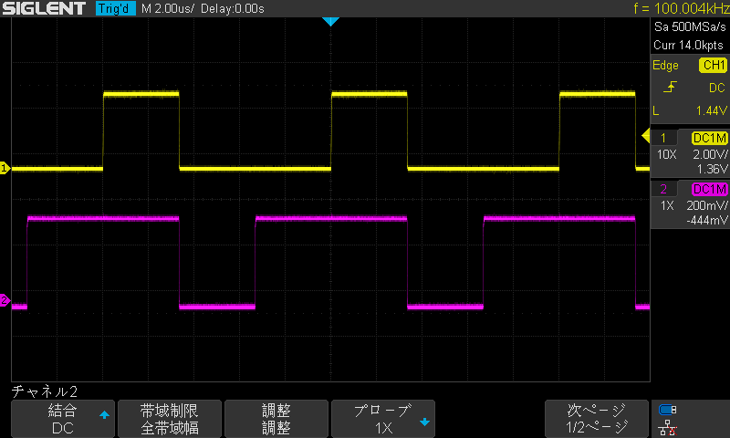

Renesas RX66T, RX72T, RX72N 汎用 PWM タイマー（GPTW）サンプル
=========



---
   
[英語版](README.md)
   
## 概要
- RX マイコン、汎用 PWM タイマー（GPTW）のサンプルプログラム。
- このデバイス（GPTW）は、RX66T、RX72T、RX72N、RX72M などに搭載されています。  
- サンプルでは、PWM 周期は 100KHz としています。 
- GPTW 出力 A、B から、異なったデューティーで 波形を出力します。
- 外部接続のシリアルターミナルからコマンドを受け付け、デューティーを設定出来ます。
- デューティーの設定は、バッファー動作を行っています。（標準動作）
- スタートすると、初期値、３３％、６６％の波形を出力します。
- RX66T/RX72T と RX72N では、利用出来る GPTW のチャネル数が異なります。
- RX66T/RX72T と RX72N では、GPTW のベースクロックが異なります。（内部で自動で計算されますが、分解能は異なります）

---

## プロジェクト・リスト
 - main.cpp
 - RX66T/Makefile
 - RX72T/Makefile
 - RX72N/Makefile

---

## ハードウェアーの準備
指定ポートにオシロスコープやロジックアナライザを接続する事で波形を観測します。   
   
テスターを接続して電圧を計測する事で、Duty に比例した電源電圧を観測する事も出来ます。
   
GPT チャネル、ポートの候補を変更する事で、他のポートに出力する事が出来ます。
   
### RX66T ボードの場合
- GPT0 の GTIOC0A (P12) ORDER::FIRST
- GPT0 の GTIOC0B (P15) ORDER::FIRST
   
### RX72T ボードの場合
- GPT0 の GTIOC0A (P12) ORDER::FIRST
- GPT0 の GTIOC0B (P15) ORDER::FIRST
   
### RX72N Envision kit
- GPT1 の GTIOC1A (PD1) ORDER::FOURTH
- GPT1 の GTIOC1B (PD0) ORDER::FOURTH
- PMod コネクタ CN6-7(PD0)、CN6-8(PD1) から出力します。
   
---

## コマンド
- a duty(0 to 1.0)
- b duty(0 to 1.0)
- help

```
Start GPTW sample for 'RX72N Envision Kit' 240[MHz]
SCI PCLK: 60000000
SCI Baud rate (set):  115200
SCI Baud rate (real): 115384 (0.16 [%])
CMT rate (set):  100 [Hz]
CMT rate (real): 100 [Hz] (0.00 [%])
GPTW1 start: freq: 100000 [Hz]
# a
A: duty: 0.330
# b
B: duty: 0.660
# b 0.5
#
```
   
-----
   
License
----

MIT
