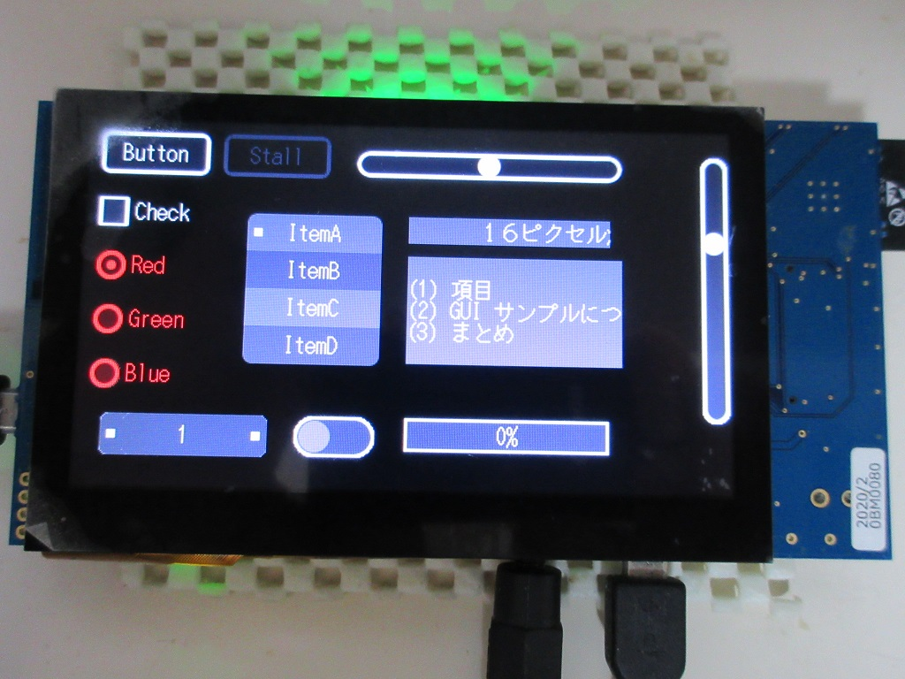

Renesas RX65N/RX72N Envision Kit GUI サンプル
=========

[English](README.md)
   
## 概要

 - C++ GUI フレームワークを利用したサンプル
 - GUI のレンダリングは、ソフトウェアーで行っているので、どんなプラットホームでも利用可能です。
 - 基本的な GUI フレームワークの利用方法や、操作に対する考え方が判ります。
    
## プロジェクト・リスト

 - main.cpp
 - RX65N/Makefile
 - RX72N/Makefile
   
### 主な widget クラスと描画クラス

 - graphics/graphics.hap
 - graphics/font.hpp
 - graphics/afont.hpp afont.cpp
 - graphics/kfont.hpp kfont.cpp
 - graphics/widget.hpp
 - graphics/widget_director.hpp
 - graphics/button.hpp
 - graphics/check.hpp
 - graphics/radio.hpp
 - graphics/slider.hpp
 - graphics/menu.hpp
 - graphics/text.hpp
 - graphics/textbox.hpp
   
## ビルド方法

 - ターゲットディレクトリーに移動
 - make する。
 - GUI_sample.mot ファイルをマイコンに書き込む。

## GUI widget フレームワークの概要

- 比較的小さな、液晶用に、機能を絞った GUI を提供します。
- ソフトウェアーで描画を行う事で、汎用的で、ハードウェアーの依存を少なくします。
- C++17 を使い、少ない手順で通常やりたい事が出来るように工夫しています。
- 小メモリーで、小さなフットプリントでも実装が出来るように工夫しています。
- 基本的に記憶割り当てを使わないようにしています。
- シンプルで見やすい表示を行い、リッチな表示も可能になるようにしています。
- リアルタイム描画（1/60）を基本とした管理。

-----
   
License
----
   
MIT open source license   
