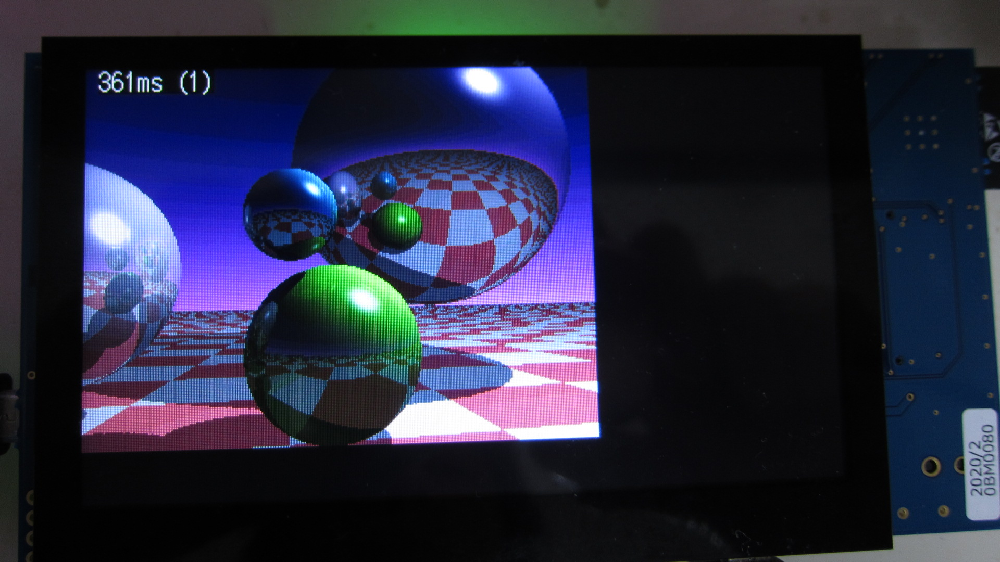
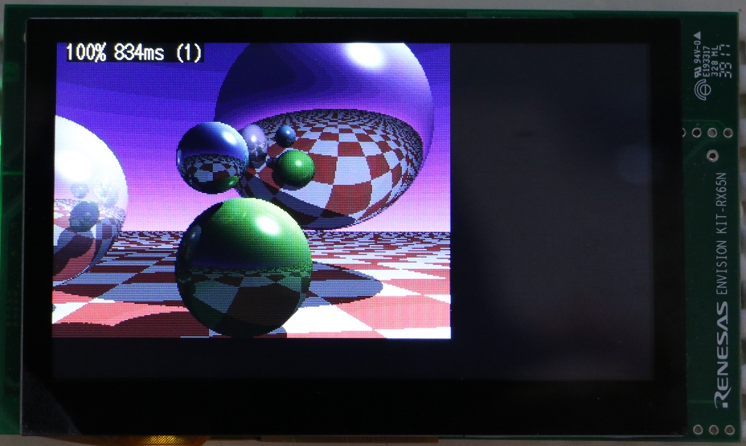
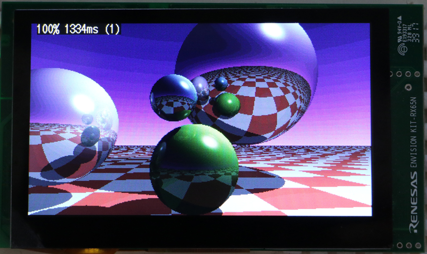

Ray tracer sample
=========
   
[Japanese](READMEja.md)

 
   
- Raytracer 320x240, for RX65N Envision kit/RX72N Envision kit
- Raytracer 480x272 for RX65N Envision kit   
※Rendering from a previous version (slightly faster due to optimization in the latest code) RX65N
   
---
   
## Overview
Ray tracing rendering program using RX microcontroller
   
## Project list
- main.cpp
- raytracer.hpp
- RX140/Makefile
- RX220/Makefile
- RX231/Makefile
- RX24T/Makefile
- RX26T/Makefile
- RX62N/Makefile
- RX631/Makefile
- RX64M/Makefile
- RX71M/Makefile
- RX65N/Makefile
- RX66T/Makefile
- RX72T/Makefile
- RX72N/Makefile
   
## Hardware preparation (general)
- If the base crystal is different, change the typedef parameter.
- Makefile declares the set frequency for each module.
- RX140:  48MHz (12MHz)
- RX220:  32MHz (Internal-OSC)
- RX231:  54MHz (12MHz)
- RX62N:  96MHz (12MHz)
- RX631:  96MHz (12MHz)
- RX24T:  80MHz (10MHz)
- RX26T: 120NHz (12MHz)
- RX64M: 120MHz (12MHz)
- RX71M: 240MHz (12MHz)
- RX65N: 120MHz (12MHz)
- RX66T: 160MHz (10MHz)
- RX72T: 192MHz (16MHz)
- RX72N: 240MHz (16MHz)
- Connect the indicator LED to the specified port.
- Connect the USB serial signal and the SCI1 (RX24T, RX66T, RX64M, RX71M) port of the setting.
- RX65N Envision kit uses the attached LCD (480x272).
- RX24T, RX66T, RX72T are 8-bit connection (R61505W LCD Controller)
- RX64M, RX71M are 16-bit connection (R61505W LCD Controller)
- Refer to "main.cpp" for the connection port with the R61505W LCD.
- RX72N Envision kit uses the attached LCD (480x272).
   
## Prepare hardware resources (optional)
- Connect a USB serial converter to the port specified in SCI.
- Connect the RXD terminal on the microcontroller side and the TXD of USB serial.
- Connect the TXD terminal on the microcontroller side and the RXD of USB serial.
- In the RX72N Envision Kit, the CN8 connector is a USB serial connection.
   
## Build method
- Move to each platform directory and make.
- Write the raytracer_sample.mot file to the microcontroller.
   
## Action
- Draw with raytracing at 320x240 resolution (if you have drawing hardware).
- Render time displayed on LCD and console (milliseconds)
- LED flashes at 0.25 second intervals.
- TX (send) and RX (receive) are performed on the port specified in SCI.
- Check with TeraTerm.
- TeraTerm serial settings: 115200 baud, 8-bit data, 1 stop, no parity.
- In RX65N/RX72N Envision kit, press SW2 on the back side to change the number of samplings and resolution.
   
## Remarks
   
- The process of sending font drawing to the LCD by the port bus is quite large.
- In the original code, the rendering time is displayed on the LCD for each line, but it is commented out.
   
## Rendering time 320x240, sampling number: 1
   

- gcc-8.3.0 (202004)
- gcc-14.2.0 (202607)
   
|Microcontroller|Core|FPU|fsqrt|Frequency [MHz]|Drawing method|Time(gcc-8.3.0) [ms]|Time(gcc-14.2.0) [ms]|
|-------|:---:|:---:|:---:|:---:|-----|:---:|:---:|
|RX140  |RXv2|O|O|48  |8 bits, port-bus |2372|2239|
|RX220  |RXv1|X|X|32  |8 bits, port-bus |291425|390344|
|RX231  |RXv2|O|O|54  |8 bits, port-bus |1732|1726|
|RX62N  |RXv1|O|X|96  |8 bits, port-bus |1875|3868|
|RX631  |RXv1|O|X|96  |8 bits, port-bus |1896|3895|
|RX24T  |RXv2|O|O|80  |8 bits, port-bus |1147|1148|
|RX26T  |RXv3|O|O|120 |8 bits, port-bus |692 ||
|RX65N  |RXv2|O|O|120 |Frame Memory     |782 |733|
|RX64M  |RXv2|O|O|120 |16 bits, port-bus|700 |728|
|RX66T  |RXv3|O|O|160 |8 bits, port-bus |558 |579|
|RX72T  |RXv3|O|O|192 |8 bits, port-bus |447 |463|
|RX71M  |RXv2|O|O|240 |16 bits, port-bus|410 |425|
|RX72N  |RXv3|O|O|240 |Frame Memory     |365 |342|
   
---
   
License
---

Reference (Ray Tracer): http://www.cs.cmu.edu/~ph/

Other: MIT
