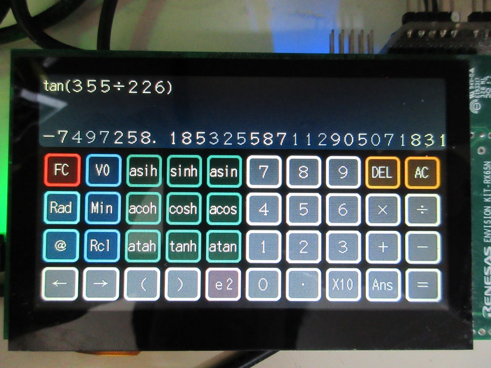

Renesas RX Microcontroller
=========

   
[Japanese](READMEja.md)
   
## Overview
   
This is a program by Renesas RX microcontroller and its compiler rx-elf-gcc, g++.   
I am currently using Renesas GNU-RX gcc 8.3.0 as my main development tool.   
GNU-RX supports RXv3 and DFPU, and has excellent optimization.   

Currently, a dedicated writing program has been implemented that has been tested on Windows, OS-X, and Linux.   
Development is now possible in multiple environments.   

Currently supported and tested devices:   
|Series|MinV|MaxV|MHz|Core|FPU|TFU|DFPU|Operation check|rx_prog|Linker file|
|---|:-:|:-:|:-:|:-:|:-:|:-:|:-:|:-:|:-:|---|
|[RX110](RX110)|1.8|3.6|32|RXv1|－|－|－|||R5F51103/4/5|
|[RX111](RX111)|1.8|3.6|32|RXv1|－|－|－|||R5F51115/6/7|
|[RX113](RX113)|1.8|3.6|32|RXv1|－|－|－|||R5F51136/8|
|[RX130](RX130)|1.8|5.5|32|RXv1|－|－|－|||R5F51305/6|
|[RX140](RX140)|1.8|5.5|48|RXv2|Yes|－|－|〇|〇|R5F51403/5/6|
|[RX13T](RX13T)|2.7|5.5|32|RXv1|Yes|－|－|||R5F513T3/5|
|[RX210](RX210)|1.62|5.5|32|RXv1|－|－|－|||R5F52108/B|
|[RX220](RX220)|1.62|5.5|32|RXv1|－|－|－|〇|〇|R5F52206|
|[RX231](RX231)|1.8|5.5|54|RXv2|Yes|－|－|〇|〇|R5F52316/7/8|
|[RX23W](RX23W)|1.8|5.5|54|RXv2|Yes|－|－|||R5F523W7/8|
|[RX23T](RX23T)|2.7|5.5|40|RXv2|Yes|－|－|||R5F523T5|
|[RX24T](RX24T)|2.7|5.5|80|RXv2|Yes|－|－|〇|〇|R5F524T8/A|
|[RX24U](RX24U)|2.7|5.5|80|RXv2|Yes|－|－|||R5F524UB/E|
|[RX261](RX26x)|1.6|5.5|64|RXv3|Yes|ー|ー|||R5F52618|
|[RX26T](RX26T)|2.7|5.5|120|RXv3|Yes|V2|ー|〇|〇|R5F526TF|
|[RX621](RX62x)|2.7|3.6|100|RXv1|Yes|－|－|〇|〇|R5F56218|
|[RX62N](RX62x)|2.7|3.6|100|RXv1|Yes|－|－|〇|〇|R5F562N7/8|
|[RX631](RX63x)|2.7|3.6|100|RXv1|Yes|－|－|〇|〇|R5F5631F|
|[RX63N](RX63x)|2.7|3.6|100|RXv1|Yes|－|－|〇|〇|R5F563NE|
|[RX63T](RX63T)|3.3|5|100|RXv1|Yes|－|－|〇|〇|R5F563T6|
|[RX64M](RX64M)|2.7|3.6|120|RXv2|Yes|－|－|〇|〇|R5F564MF/G/J/L|
|[RX71M](RX71M)|2.7|3.6|240|RXv2|Yes|－|－|〇|〇|R5F571MF/G/J/L|
|[RX651](RX65x)|2.7|3.6|120|RXv2|Yes|－|－|〇|〇|R5F5651E|
|[RX65N](RX65x)|2.7|3.6|120|RXv2|Yes|－|－|〇|〇|R5F565NE|
|[RX66N](RX66N)|2.7|3.6|120|RXv3|Yes|V1|Yes|||R5F566ND/N|
|[RX660](RX660)|2.7|5.5|120|RXv3|Yes|－|－|||R5F56609|
|[RX671](RX671)|2.7|5.5|120|RXv3|Yes|－|－|||R5F5671C/E|
|[RX72N](RX72N)|2.7|3.6|240|RXv3|Yes|V1|Yes|〇|△|R5F572ND/N|
|[RX72M](RX72M)|2.7|3.6|240|RXv3|Yes|V1|Yes|△|△|R5F572MD/N|
|[RX66T](RX66T)|2.7|5.5|160|RXv3|Yes|－|－|〇|〇|R5F566TA/E/F/K|
|[RX72T](RX72T)|2.7|5.5|200|RXv3|Yes|V1|－|〇|〇|R5F572TF/K|
    
- The directory structure is updated daily.
- Some features are still under construction.
- The project consists of a Makefile and related headers and source code, and includes dedicated startup routines and linker scripts.

---
**Please make a request if you want us to support other RX devices. (Conditions below)**
- Become a support member of hirakuni45 GitHub.
- Lend us a board with the RX microcontroller you are requesting support for.
- You agree to release newly added files related to the RX microcontroller under the MIT license.

**If you do not know how to use the framework**
- Create a GitHub account and post in Discussions.
- You can also become a support member to get extensive support.

**If you have a problem with the framework or need a fix**, please create a Github account and post a note in Discussions.
- Create a Github account and post in Issues.
- If you have a modification request, post it in Discussions.
- If you have a pull request, please write the contents in Issues and Discussions in advance.

---

    
Space Invaders Emulator, NES Emulator, for RX65N/RX72N Envision kit   
    
WAV/MP3 Audio Player, File selector, for RX65N/RX72N Envision kit   
    
functional calculator, DX7 Emulator

<a href="http://www.youtube.com/watch?v=frRI-cbzGus" target="_blank"></a>   
YouTube: NES Emulator for RX65N Envision kit
   
Device control classes with template design patterns provide flexible and concise functionality.   
Due to its functionality, it does not require difficult or complicated settings or code generation by separate programs.   
   
```C++
// LED flashing program
#include "common/renesas.hpp"

namespace {
//  typedef device::PORT<device::PORT0, device::bitpos::B7> LED;  // LED connection port, Active HIGH
    typedef device::PORT<device::PORT0, device::bitpos::B7, false> LED;  // LED connection port, Active LOW
}

int main(int argc, char** argv);

int main(int argc, char** argv)
{
    SYSTEM_IO::boost_master_clock();

    LED::OUTPUT();
    while(1) {
        utils::delay::milli_second(250);
        LED::P = 1;
        utils::delay::milli_second(250);
        LED::P = 0;
    }
}
```
   
In order to complete the process from dependency rule generation to compilation and linking, usually with a single "make" command,
 I do not need it.   
No need for a dedicated boot program or loader I can write and execute.   
For development, we recommend using "Visual Studio Code" that can be used on multiple platforms.   
   
---

## RX Project, Library List

- For device I/O operations, dedicated headers are provided utilizing template class libraries implemented in C++.
- We also provide a full set of utilities and class libraries. 

|directory|contents|
|---|---|
|[all_project_build.sh](./all_project_build.sh)|build all projects (shell script) |
|[/RX110](./RX110)|RX110 specific device definition class, linker script|
|[/RX111](./RX111)|RX111 specific device definition class, linker script|
|[/RX130](./RX130)|RX130 specific device definition class, linker script|
|[/RX13T](./RX13T)|RX13T specific device definition class, linker script|
|[/RX140](./RX140)|RX140 specific device definition class, linker script|
|[/RX210](./RX210)|RX210 specific device definition class, linker script|
|[/RX220](./RX220)|RX220 specific device definition class, linker script|
|[/RX231](./RX231)|RX231 specific device definition class, linker script|
|[/RX23W](./RX23W)|RX23W specific device definition class, linker script|
|[/RX23T](./RX23T)|RX23T specific device definition class, linker script|
|[/RX24T](./RX24T)|RX24T specific device definition class, linker script|
|[/RX24U](./RX24U)|RX24U specific device definition class, linker script|
|[/RX26x](./RX26x)|RX260/RX261 specific device definition class, linker script|
|[/RX26T](./RX26T)|RX26T specific device definition class, linker script|
|[/RX62x](./RX62x)|RX621/RX62N dedicated device definition class, linker script|
|[/RX63x](./RX63x)|RX631/RX63N specific device definition class, linker script|
|[/RX63T](./RX63T)|RX63T specific device definition class, linker script|
|[/RX64M](./RX64M)|RX64M dedicated device definition class, linker script|
|[/RX65x](./RX65x)|RX651/RX65N specific device definition class, linker script|
|[/RX660](./RX660)|RX660 specific device definition class, linker script|
|[/RX66N](./RX66N)|RX66N specific device definition class, linker script|
|[/RX66T](./RX66T)|RX66T dedicated device definition class, linker script|
|[/RX671](./RX671)|RX671 specific device definition class, linker script|
|[/RX71M](./RX71M)|RX71M dedicated device definition class, linker script|
|[/RX72N](./RX72N)|RX72N dedicated device definition class, linker script|
|[/RX72M](./RX72M)|RX72M dedicated device definition class, linker script|
|[/RX72T](./RX72T)|RX72T dedicated device definition class, linker script|
|[/RX600](./RX600)|RX microcontroller common device definition class|
|[/common](./common)|shared classes, headers, etc.|
|[/rxlib](./rxlib)|zlib, png, mad, gmp, mpfr libraries|
|[/FreeRTOS](./FreeRTOS)|FreeRTOS for various RX microcontrollers and simple samples|
|[/ff14](./ff14)|ChaN's fatfs source code and handler for RX microcontrollers|
|[/chip](./chip)|various device specific control driver libraries such as I2C, SPI, etc|
|[/graphics](./graphics)|Graphics drawing related classes|
|[/gui](./gui)|Graphics user interface related classes (GUI Widget)|
|[/sound](./sound)|sound and audio related classes|
|[/usb](./usb)|USB handler, manage class|
|[/tinyusb](./tinyusb)|TinyUSB source code|
|[/rxprog](./rxprog)|RX microcontroller, Flash program writing tool (for Windows, OS-X, Linux)
|[LICENSE](./LICENSE)|license description file|

---

## Sample Projects (Applications)

|Directory|RX220|RX631|RX63T|RX62N|RX24T|RX66T|RX72T|RX64M|RX71M|RX65N|RX72N|Contents|
|---------|:---:|:---:|:---:|:---:|:---:|:---:|:---:|:---:|:---:|:---:|:---:|---|
|[/FIRST_sample](./FIRST_sample)|〇|〇|〇|〇|〇|〇|〇|〇|〇|〇|〇|LED blinking Sample Program|
|[/SCI_sample](./SCI_sample)|〇|〇|〇|〇|〇|〇|〇|〇|〇|〇|〇|serial communication Sample Program|
|[/MTU_sample](./MTU_sample)|－|－|－|〇|〇|〇|〇|〇|〇|〇|〇|Multi-Function Timer Pulse Unit Sample Program|
|[/CAN_sample](./CAN_sample)|－|〇|－|〇|－|〇|〇|〇|〇|△|〇|CAN Communication Sample Program|
|[/FLASH_sample](./FLASH_sample)|－|－|－|－|〇|〇|〇|〇|〇|〇|〇|Internal data flash operation sample|
|[/FreeRTOS](./FreeRTOS)|〇|〇|－|〇|〇|〇|〇|〇|〇|〇|〇|FreeRTOS Basic operation sample|
|[/GPTW_sample](./GPTW_sample)|－|－|－|－|△|〇|〇|－|－|△|〇|GPTW PWM Sample Program|
|[/I2C_sample](./I2C_sample)|〇|〇|－|〇|〇|〇|〇|〇|〇|〇|〇|I2C Device Access Sample|
|[/RAYTRACER_sample](./RAYTRACER_sample)|－|〇|－|〇|〇|〇|〇|〇|〇|〇|〇|Ray Tracing Benchmark|
|[/SDCARD_sample](./SDCARD_sample)|－|－|－|－|〇|〇|〇|〇|△|〇|〇|SD Card Operation Sample|
|[/SIDE_sample](./SIDE_sample)|－|－|－|－|－|－|－|－|－|〇|〇|Envision Kit, Space Invaders emulator|
|[/NESEMU_sample](./NESEMU_sample)|－|－|－|－|－|－|－|－|－|〇|〇|Envision Kit, NES emulator|
|[/GUI_sample](./GUI_sample)|－|－|－|－|－|－|－|－|－|〇|〇|GUI Sample、Graphics User Interface (Soft rendering, using DRW2D engine)|
|[/AUDIO_sample](./AUDIO_sample)|－|－|－|－|－|－|－|〇|△|〇|〇|MP3/WAV Audio Player (FreeRTOS)|
|[/SYNTH_sample](./SYNTH_sample)|－|－|－|－|〇|〇|〇|〇|〇|〇|〇|FM sound synthesizer emulator|
|[/CALC_sample](./CALC_sample)|－|〇|－|〇|－|〇|〇|〇|〇|〇|〇|Function calculator samples (gmp, mpfr libraries)|
|[/DSOS_sample](./DSOS_sample)|－|－|－|－|－|－|－|－|－|△|〇|Digital Storage Oscilloscope Samples|
|[/PSG_sample](./PSG_sample)|－|〇|－|〇|－|〇|〇|〇|〇|〇|〇|Pseudo PSG Sound Source Performance Samples|
|[/TUSB_HOST_sample](./TUSB_HOST_sample/)|－|－|－|－|－|－|－|－|－|〇|〇|TinyUSB/Host Samples|

*Please consider directories and files that are not in the above list but exist when checked out as work in progress.

---

### rxlib directory

- Open source libraries built for RX microcontrollers

[rxlib](./rxlib) See also

---

### common directory

- Various utilities
- Convenience Classes
- Common files for each microcontrollers

[common](./common) See also

---

### chip directory

- Template driver classes for various IC manufacturers (I2C, SPI, and various other interfaces)
- In C++, the use of templates can be used to generalize operations using interfaces such as I2C and SPI.
- The headers in the chip directory are dedicated to the initialization and control of each IC and are not concerned with the interface definition.
- The context of the interface (control pins) is given by reference.
- Since there is no definition of interfaces, the creation is very versatile and highly flexible.

[chip](./chip) See also

---

### graphics directory

 - Classes related to screen rendering

[graphics](./graphics) See also

---

### gui directory

- GUI Widget Classes

[gui](./gui) See also

---

### sound directory

 - Classes related to sound

[sound](./sound) See also

---

### ff14 directory

- Mr. ChaN's FatFs source code set
- MMC Driver Class (SPI)
- If SDHI interface is available, real mode driver can also be selected.

[ff14](./ff14) See also

---

### KiCAD directory

- For KiCAD, parts files, etc.

[KiCAD_lib](./KiCAD_lib) See also

---

### legacy directory

- Files not currently supported, etc.

[legacy](./legacy) See also

---

## Installation and features of Renesas GNU-RX
   
The former KPIT support for the GNU toolchain has been replaced by [Open Source Tools for Renesas](https://llvm-gcc-renesas.com/en/) has added a new GNU tools.      
   
As the latest (as of July 2020) GNU toolchain for RX microcontrollers,   
 - binutils-2.24
 - gcc-8.3.0
 - newlib-3.1.0
 - gdb-7.8.2

You can download a toolchain for RX microcontrollers based on the above files.      
   
The tool can be downloaded by anyone who registers, and there is no binary limit.   
It also seems to have optimizations in RX microcomputers and support for the latest cores.   
Since gcc is based on 8.3.0, it supports C++17.   
It has deeper optimizations than normal gcc and supports the latest CPU cores.   
All projects using the C++ framework published here are compileable.   

They are also providing support.（CyberTHOR Studios Limited）   

To use this tool from MSYS2, set the command path to ".bash_profile" after installing the toolchain.   
When compiling open source libraries, etc., there is a problem with path strings containing "spaces" or 2-byte codes.   
To avoid this problem, it is recommended to copy the directory to "/usr/local" and use that path.   

```bash
# rx-elf path
# PATH=$PATH:/usr/local/rx-elf/bin
PATH=$PATH:/C/'Program Files (x86)'/'GCC for Renesas RX 8.3.0.202002-GNURX-ELF'/rx-elf/rx-elf/bin
```

Features in Renesas GNU-RX 8.3.0：

- RXv3 Core Support
- Generation of double-precision floating-point instructions
- RX72N Built-in trigonometric function unit (TFU) support

---

The difference between CC-RX:   
In terms of compiler optimization, CC-RX seems to be superior to GNU-RX in the CoreMark benchmark.   
It's hard to imagine why such a big difference would occur, but if you know the internal structure of the CPU, you might be able to achieve it...   
   
|Compiler|RX core|CoreMark (MHz)|Rate|
|---|:-:|:-:|:-:|
|CC-RX (V3.02)|RX72N|5.21|1.00|
|GNU-RX (8.3.x)|RX72N|3.59|0.69|
|||||
|CC-RX (V3.02)|RX65N|4.37|1.00|
|GNU-RX (8.3.x)|RX65N|3.22|0.74|
   
The above values are quite exciting, but when running actual applications, we do not feel such a big difference in sensory perception.   
- The big difference seems to occur in the case of applications that use a lot of instructions that require a relatively large number of CPU cycles, such as multiplication and division.   
- For applications that use a lot of floating point instructions, GNU-RX may be faster.
   
No matter how good CC-RX is, it's not worth the cost for hobbyists, and if it doesn't support C++11, it's not practical to use.   
In addition, the above benchmarks are based on CoreMark, so you need to evaluate it with actual applications to know what it really is.   
   
---
## RX Development environment preparation (Windows、MSYS2)
   
 - On Windows, install the MSYS2 environment in advance.   
 - MSYS2 has msys2, mingw32, mingw64 and 3 different environments, but gcc for RX microcontroller
   Because it is necessary to build of, do with msys2.   
1. MSYS2 is a UNIX-based application development environment.
2. MINGW32 is an environment for i686 that the exception model of gcc is not war related to SEH because of Borland patent.
3. MINGW64 is an environment for developing Windows-based applications.   
 - If you have installed any software other than Microsoft's anti-virus software, please disable it.
1. The GCC build may take an unusually long time or may fail to build.   

 - MSYS2 upgrade

```bash
   pacman -Sy pacman
   pacman -Syu
```
   
- Open the console again. (You should see a message as you reopen the console)   
   
```bash
   pacman -Su
```
- The update is done multiple times, then follow the instructions on the console.
- You need to reopen the console several times.

- Install gcc, texinfo, gmp, mpfr, mpc, diffutils, automake, zlib, tar, make, unzip, git commands etc
```bash
   pacman -S gcc
   pacman -S texinfo
   pacman -S mpc-devel
   pacman -S diffutils
   pacman -S automake
   pacman -S zlib
   pacman -S tar
   pacman -S make
   pacman -S unzip
   pacman -S zlib-devel
   pacman -S git
```
   
---
## RX Development environment preparation (OS-X)
   
- In OS-X, install macports in advance.   
  brew is not recommended because it has less flexibility   
- Depending on the version of OS-X, you may need to install X-Code, Command Line Tools, etc. in advance   
 - macports upgrade   
```bash
   sudo port -d self update
```
- As you probably know, in the early stage of OS-X, llvm starts by calling gcc.
- However, llvm can not currently build gcc cross compilers.
- So, I will install gcc on macports, I will use the 5 series version.
```bash
   sudo port install gcc5
   sudo ln -sf /opt/local/bin/gcc-mp-5  /usr/local/bin/gcc
   sudo ln -sf /opt/local/bin/g++-mp-5  /usr/local/bin/g++
   sudo ln -sf /opt/local/bin/g++-mp-5  /usr/local/bin/c++
```
- You may need to reboot.
- For now, please check.
```bash
   gcc --version
```
   
```bash
   gcc (MacPorts gcc5 5.4.0_0) 5.4.0
   Copyright (C) 2015 Free Software Foundation, Inc.
   This is free software; see the source for copying conditions.  There is NO
   warranty; not even for MERCHANTABILITY or FITNESS FOR A PARTICULAR PURPOSE.
```
   
 - Install texinfo, gmp, mpfr, mpc, diffutils, automake command etc
```bash
   sudo port install texinfo
   sudo port install gmp
   sudo port install mpfr
   sudo port install libmpc
   sudo port install diffutils
   sudo port install automake
```
   
---
## RX Development environment preparation (Ubuntu)

- There are multiple Linux environments, so here we will write the case for the "Ubuntu 16.04 LTS" environment.
   
- Install texinfo, gmp, mpfr, mpc, diffutils, automake command etc
```bash
   sudo apt-get install texinfo
   sudo apt-get install libgmp-dev
   sudo apt-get install libmpfr-dev
   sudo apt-get install libmpc-dev
   sudo apt-get install diffutils
   sudo apt-get install automake
   sudo apt-get install zlib1g-dev
```
   
---
## RX Development environment construction
   
- The RX compiler (rx-elf-gcc, g++) uses "gcc-7.5.0".   
- Download "binutils-2.34.tar.gz".   
- Download "gcc-7.5.0.tar.gz".   
- Download "newlib-2.4.0.tar.gz".   
- There are multiple versions of binutils, gcc and newlib, but some combinations   
  It has been found that ineligible binaries (which have subtle problems with operation) will be built.
- This bug occurs when using Renesas network stack (net_T4).
- It is not possible to identify the cause why such malfunction occurs.
- Here is a list of combinations that we have investigated.
```
   binutils-2.27, gcc-4.9.4, newlib-2.2.0 ---> OK
   binutils-2.27, gcc-5.5.0, newlib-2.2.0 ---> OK
   binutils-2.27, gcc-5.5.0, newlib-2.4.0 ---> OK
   binutils-2.27, gcc-6.4.0, newlib-2.4.0 ---> OK
   binutils-2.28, gcc-6.4.0, newlib-2.4.0 ---> OK
   binutils-2.30, gcc-6.4.0, newlib-2.4.0 ---> OK (old current)
   binutils-2.30, gcc-6.4.0, newlib-3.0.0 ---> NG
   binutils-2.34, gcc-7.5.0, newlib-2.4.0 ---> OK (new current)
```
- Using the latest gcc seems to be faster code, especially for C++.
   
---
#### build binutils-2.34
```bash
   cd
   tar xfvz binutils-2.34.tar.gz
   cd binutils-2.34
   mkdir rx_build
   cd rx_build
   ../configure --target=rx-elf --prefix=/usr/local/rx-elf --disable-nls
   make
   make install     OS-X,Linux: (sudo make install)
```

-  Pass PATH to /usr/local/rx-elf/bin (edit .bash_profile and add path)

```bash
   PATH=$PATH:/usr/local/rx-elf/bin
```

- Open the console again.

```bash
   rx-elf-as --version
```

- Execute the assembler command and check if the path is valid.
  
#### Build C compiler
```bash
    cd
    tar xfvz gcc-7.5.0.tar.gz
    cd gcc-7.5.0
    mkdir rx_build
	cd rx_build
    ../configure --prefix=/usr/local/rx-elf --target=rx-elf --enable-languages=c --disable-libssp --with-newlib --disable-nls --disable-threads --disable-libgomp --disable-libmudflap --disable-libstdcxx-pch --disable-multilib --enable-lto
    make
    make install     OS-X,Linux: (sudo make install)
```
  
#### Build newlib
```bash
    cd
    tar xfvz newlib-2.4.0.tar.gz
	cd newlib-2.4.0
    mkdir rx_build
    cd rx_build
    ../configure --target=rx-elf --prefix=/usr/local/rx-elf
	make
    make install     OS-X: (sudo make install)
```
- In Linux environment, sudo command does not recognize the path of binutils set up locally.
"Make install" will fail, so write the following script and execute it.
```bash
#!/bin/sh
# file: rx_install.sh

PATH=${PATH}:/usr/local/rx-elf/bin
make install
```
   
```bash
    sudo rx_install.sh
```
   
#### Build C++ compiler
```bash
    cd
    cd gcc-7.5.0
    cd rx_build
    ../configure --prefix=/usr/local/rx-elf --target=rx-elf --enable-languages=c,c++ --disable-libssp --with-newlib --disable-nls --disable-threads --disable-libgomp --disable-libmudflap --disable-libstdcxx-pch --disable-multilib --enable-lto --with-system-zlib
    make
    make install     OS-X,Linux: (sudo make install)
```
---
   
 - The built compiler collection is listed in the link below. (MSYS2 only)   
http://www.rvf-rc45.net/Renesas_GNU_Tools/ 

---
## Get RX Framework Source Code
```bash
    git clone https://github.com/hirakuni45/RX.git
```
   
---
### Boost installation used by RX framework

- In the past, boost was installed for mingw64 using pacman in the MSYS2 environment.
- However, as the version of boost advanced, we found that this boost caused problems.
- Therefore, we put the boost archive in the proper location and handle it.
- This method is used in the MSYS2 environment.
- Since boost uses 1.74.0, please download it in advance (place it in D:³ Download). (boost_1_74_0.tar.gz)

```bash
cd /c/
tar xfvz /d/Download/boost_1_74_0.tar.gz
```

---
## RX Build all projects
```bash
    sh all_project_build.sh [clean]
```
--- 
## How to write program to RX microcontroller

There are several ways, but the easiest and least expensive way is to use the serial interface
It is a method of writing.   
- However, the writing speed is not very fast.   
   
In case of RX microcontroller with built-in USB interface, you can boot and connect with USB, but the driver Seems to only support the Windows version.
- The circumstances around here may be wrong as we have not investigated in detail.   
   
The most common, because not all RX microcontrollers have built-in USB interface We will show you how to write using serial interface.
   
- Writing at the serial interface is reasonably fast but easy and secure, and easy to connect.   
   
- The hardware manual describes the connection with the serial port and switching to boot mode.
  Please refer to it.   
- Normally, setting MD terminal to L or H allows switching between program and internal ROM execution.   
- It is also necessary to control the state of the UB terminal.   
- If you use a USB serial conversion module etc., it is easy to get power.   

1. RXD serial reception   
2. TXD serial transmission   
3. VCC power (5V or 3.3V)   
4. GND power 0V   
- As 3.3V can only extract a limited current, a regulator is always required.   
- Details on the connection method, boot mode settings, etc. can be found in the hardware manual for each device.   
   
## Construction of flash programmer for RX microcontroller
- Currently, flash writing to RX63T, RX24T, RX64M, and RX71M is confirmed.
- Since the reset is not controlled, it is necessary to assert the reset signal at the time of writing.
- In the current version, only erase, write and compare operations are implemented.
- Code protection ID settings and operations are not implemented yet.
- In the RX24T and RX63T, the erase operation is ignored because the erase is performed automatically when the connection is established.
   
- Build rxprog in MSYS2 environment.
- Copy the built executable file to "/usr/local/bin".
- Pass the PATH to /usr/local/bin.
```bash
    cd rxprog
    make
    make install
```
```
Renesas RX Series Programmer Version 0.90b
Copyright (C) 2016,2018 Hiramatsu Kunihito (hira@rvf-rc45.net)
usage:
rx_prog [options] [mot file] ...

Options :
    -P PORT,   --port=PORT     Specify serial port
    -s SPEED,  --speed=SPEED   Specify serial speed
    -d DEVICE, --device=DEVICE Specify device name
    -e, --erase                Perform a device erase to a minimum
    -v, --verify               Perform data verify
    -w, --write                Perform data write
    --progress                 display Progress output
    --device-list              Display device list
    --verbose                  Verbose output
    -h, --help                 Display this
```
- Edit rx_prog.conf and set the COM port to connect and the baud rate.
- Ports and baud rates can be set for each of Windows, OS-X and Linux environments.
- You can write a standard serial port in "rx_prog.conf", and you should set it according to your environment.
- Each project's "Makefile" contains a script that can be written using "make run".
   
rx_prog.conf:
```
port_win   = COM12
port_osx   = /dev/tty.usbserial-DA00X2QP
port_linux = /dev/ttyUSB0
speed_win = 230400
speed_osx = 230400
speed_linux = 230400
```
---
## Development using Renesus RX72N Envision Kit


   
---
## Programming environment using C++ framework
   
- The following is an example program to communicate with SCI in C++.   
1. The port of SCI is defined by "port_map.hpp", and there is more than one port to select
There is no need to make complicated settings if you set "second candidate" or "third candidate".   
2. The baud rate can be set as an integer, and is automatically calculated internally from the set frequency.   
3. Even if you use interrupts, you can use them without polling (polling).   
4. Transmission and reception are performed through a fixed length FIFO class, and the size can be freely defined.   
5. The sci_putch and sci_getch functions are called from POSIX file functions, so they can be linked externally.   
6. The above functions are accessed from stdout, stdin, stderr descriptors, so you can also use the printf function, but for various reasons we do not recommend using "utils :: format", which is the size It is smaller, more flexible, convenient and safe.   
```C++
#include "common/renesas.hpp"
#include "common/fixed_fifo.hpp"
#include "common/sci_io.hpp"
#include "common/format.hpp"

namespace {
//  Use SCI9
    typedef device::SCI9 SCI_CH;

    typedef utils::fixed_fifo<char, 512> RXB;  // RX (RECV) buffer definition at 512 bytes
    typedef utils::fixed_fifo<char, 256> TXB;  // TX (SEND) buffer definition at 256 buyes

    typedef device::sci_io<SCI_CH, RXB, TXB> SCI;
//    When selecting a second candidate for the SCI port
//    typedef device::sci_io<SCI_CH, RXB, TXB, device::port_map::option::SECOND> SCI;
    SCI     sci_;
}

extern "C" {
    // standard output, called from "syscalls.c"（stdout, stderr）
    void sci_putch(char ch) { sci_.putch(ch); }

    void sci_puts(const char* str) { sci_.puts(str); }

    // standard input, called from "syscalls.c"（stdin）
    char sci_getch(void) { return sci_.getch(); }

    uint16_t sci_length() { return sci_.recv_length(); }
}

int main(int argc, char** argv);

int main(int argc, char** argv)
{
    SYSTEM_IO::boost_master_clock();

    {  // Start SCI
       uint8_t intr = 2;        // Interrupt level
       uint32_t baud = 115200;  // baudrate
       sci_.start(baud, intr);
    }

    //-----
    {  // main、SCI output
       utils::format("Start SCI\n");
    }

    // to loop
    while(1) ;
}
```
---

Translated with www.DeepL.com/Translator (free version)

---

## License

[MIT](../LICENSE)

```
Copyright (c) 2017 2019, Hiramatsu Kunihito
All rights reserved.

Redistribution and use in source and binary forms, with or without
modification, are permitted provided that the following conditions are met:
* Redistributions of source code must retain the above copyright notice, 
  this list of conditions and the following disclaimer.
* Redistributions in binary form must reproduce the above copyright notice, 
  this list of conditions and the following disclaimer in the documentation 
  and/or other materials provided with the distribution.
* Neither the name of the <organization> nor the　names of its contributors 
  may be used to endorse or promote products derived from this software 
  without specific prior written permission.

THIS SOFTWARE IS PROVIDED BY THE COPYRIGHT HOLDERS AND CONTRIBUTORS "AS IS" AND
ANY EXPRESS OR IMPLIED WARRANTIES, INCLUDING, BUT NOT LIMITED TO, THE IMPLIED
WARRANTIES OF MERCHANTABILITY AND FITNESS FOR A PARTICULAR PURPOSE ARE
DISCLAIMED. IN NO EVENT SHALL <COPYRIGHT HOLDER> BE LIABLE FOR ANY
DIRECT, INDIRECT, INCIDENTAL, SPECIAL, EXEMPLARY, OR CONSEQUENTIAL DAMAGES
(INCLUDING, BUT NOT LIMITED TO, PROCUREMENT OF SUBSTITUTE GOODS OR SERVICES;
LOSS OF USE, DATA, OR PROFITS; OR BUSINESS INTERRUPTION) HOWEVER CAUSED AND
ON ANY THEORY OF LIABILITY, WHETHER IN CONTRACT, STRICT LIABILITY, OR TORT
(INCLUDING NEGLIGENCE OR OTHERWISE) ARISING IN ANY WAY OUT OF THE USE OF THIS
SOFTWARE, EVEN IF ADVISED OF THE POSSIBILITY OF SUCH DAMAGE.
```
