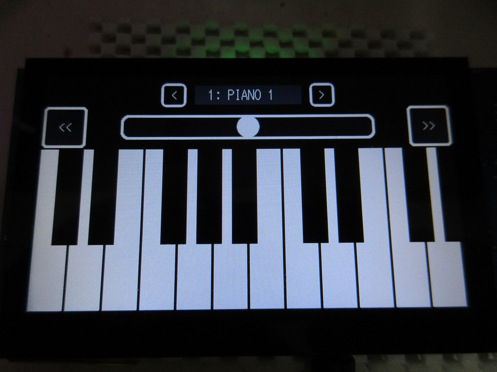
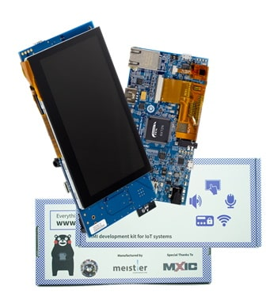
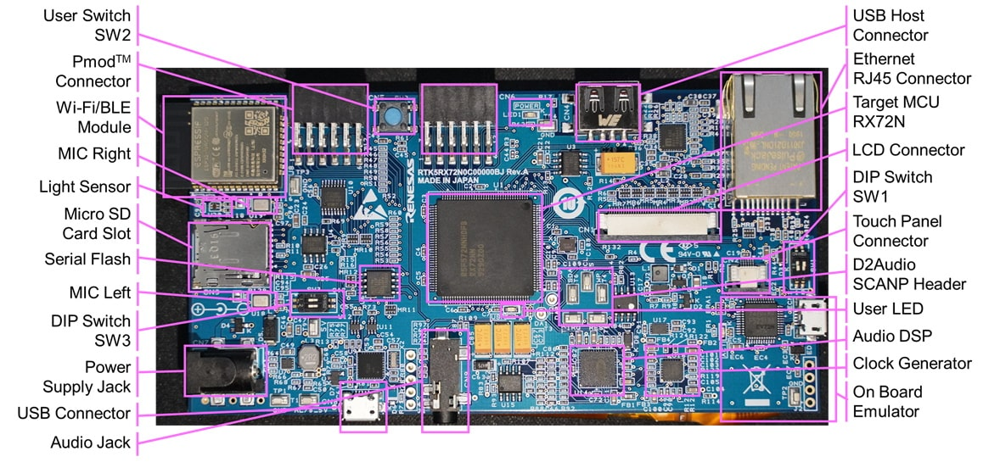

Renesas RX Microcontroller
=========


[英語版](README.md)

## 概要

 これはルネサス RX マイコンと、そのコンパイラである rx-elf-gcc,g++ によるプログラムです。  
 ※現在、Renesas GNU-RX gcc 8.3.0 をメインに使って開発しています。    
   
 現在は、Windows、OS-X、Linux で動作確認が済んだ、専用書き込みプログラムも実装してあり、   
 複数の環境で、開発が出来るようになっています。   
 - 現在サポートされ、動作確認済みデバイスは RX62N、RX24T、RX66T, RX72T、RX64M、RX71M, RX65N, RX72N となっており、   
 デバイスクラスを日々拡張しています。
 - 今後のサポート予定として、RX72M があります。
 - ディレクトリー構成など日々アップデートしています。
 - RX63T は、現在はサポートしていません。(legacy フォルダーにあります。) 
   
 **他の RX デバイスをサポートして欲しい場合にはリクエストを下さい。（以下条件）**
 - GitHub のサポートメンバーである事。
 - サポート要求の RX マイコンが載っているボードを貸し出す事。
 - 新規に追加された RX マイコンの関連ファイルは MIT ライセンスで公開されます。

 プロジェクトは、Makefile、及び、関連ヘッダー、ソースコードからなり、専用のスタートアップ   
 ルーチンやリンカースクリプトで構成されています。
   
    
Space Invaders Emulator, NES Emulator, for RX65N Envision kit   
    
WAV/MP3 Audio Player, ファイル選択 for RX65N Envision kit   
<a href="http://www.youtube.com/watch?v=fdcX3VAOFLM" target="_blank"></a>    
関数電卓、DX7 エミュレータ   
<a href="http://www.youtube.com/watch?v=frRI-cbzGus" target="_blank"></a>   
YouTube: NES Emulator for RX65N Envision kit   
   
 テンプレートデザインパターンによるデバイス制御クラスは、柔軟で、簡潔、自在な機能を提供します。   
 その機能性により、難解で複雑な設定や、別プログラムによるコード生成を必要としません。   
```C++
// LED flashing program
#include "common/renesas.hpp"

namespace {
//  typedef device::PORT<device::PORT0, device::bitpos::B7> LED;  // LED connection port, Active HIGH
    typedef device::PORT<device::PORT0, device::bitpos::B7, false> LED;  // LED connection port, Active LOW
}

int main(int argc, char** argv);

int main(int argc, char** argv)
{
    SYSTEM_IO::boost_master_clock();

    LED::OUTPUT();
    while(1) {
        utils::delay::milli_second(250);
        LED::P = 1;
        utils::delay::milli_second(250);
        LED::P = 0;
    }
}
```
通常「make」コマンド一発で、従属規則生成から、コンパイル、リンクまで完了する為、IDE を   
必要としません。  
その為、専用のブートプログラムやローダーは必要なく、作成したバイナリーをそのまま ROM へ   
書いて実行できます。   
開発にはマルチプラットホームでも使える、「Visual Studio Code」の利用を推奨します。 
   
---

## RX プロジェクト、ライブラリ・リスト

- デバイス I/O 操作では、C++ で実装されたテンプレート・クラス・ライブラリーを活用して専用のヘッダーを用意してあります。
- ユーティリティー、クラス・ライブラリーの充実も行っています。   

|ディレクトリ|内容|
|---|---|
|[all_project_build.sh](./all_project_build.sh)|全てのプロジェクトをビルド(シェル・スクリプト)|
|[/rxlib](./rxlib)|zlib, png, mad, gmp, mpfr ライブラリ|
|[/RX600](./RX600)|RX マイコン共通デバイス定義クラス|
|[/RX24T](./RX24T)|RX24T 専用デバイス定義クラス、リンカースクリプト|
|[/RX62x](./RX62x)|RX621/RX62N 専用デバイス定義クラス、リンカースクリプト|
|[/RX64M](./RX64M)|RX64M 専用デバイス定義クラス、リンカースクリプト|
|[/RX71M](./RX71M)|RX71M 専用デバイス定義クラス、リンカースクリプト|
|[/RX65x](./RX65x)|RX651/RX65N 専用デバイス定義クラス、リンカースクリプト|
|[/RX66T](./RX66T)|RX66T 専用デバイス定義クラス、リンカースクリプト|
|[/RX72T](./RX72T)|RX72T 専用デバイス定義クラス、リンカースクリプト|
|[/RX72N](./RX72N)|RX72N 専用デバイス定義クラス、リンカースクリプト|
|[/FreeRTOS](./FreeRTOS)|FreeRTOS の RX マイコン各種対応版と簡単なサンプル|
|[/ff14](./ff14)|ChaN 氏作成の fatfs ソースコードと RX マイコン向けハンドラ|
|[/common](./common)|共有クラス、ヘッダーなど|
|[/chip](./chip)|I2C、SPI、など各種デバイス固有制御ドライバ・ライブラリ|
|[/graphics](./graphics/)|グラフィックス描画関係クラス、GUI Widget|
|[/sound](./sound)|サウンド、オーディオ関係クラス|
|[/usb](./usb)|USB 関係クラス|
|[/tinyusb](./tinyusb)|TinyUSB ソースコード|
|[/rxprog](./rxprog)|RX マイコン、フラッシュプログラム書き込みツール（Windows、OS-X、Linux 対応）|
|[LICENSE](./LICENSE)|ライセンス表記ファイル|

---

### サンプル・プロジェクト（アプリケーション）

|ディレクトリ|RX62N|RX24T|RX66T|RX72T|RX64M|RX71M|RX65N|RX72N|内容|
|-----------|:---:|:---:|:---:|:---:|:---:|:---:|:---:|---|
|[/FIRST_sample](./FIRST_sample)|〇|〇|〇|〇|〇|〇|〇|〇|LED 点滅プログラム|
|[/SCI_sample](./SCI_sample)|〇|〇|〇|〇|〇|〇|〇|〇|シリアル通信サンプルプログラム|
|[/CAN_sample](./CAN_sample)|〇|－|〇|〇|〇|〇|△|〇|CAN 通信サンプルプログラム|
|[/FLASH_sample](./FLASH_sample)|－|〇|〇|〇|〇|〇|〇|〇|内臓データフラッシュ操作サンプル|
|[/FreeRTOS](./FreeRTOS)|〇|〇|〇|〇|〇|〇|〇|〇|FreeRTOS 基本動作確認サンプル|
|[/GPTW_sample](./GPTW_sample)|－|△|〇|〇|－|－|△|〇|GPTW PWM サンプルプログラム|
|[/I2C_sample](./I2C_sample)|－|〇|〇|〇|〇|〇|〇|〇|I2C デバイス・アクセス・サンプル|
|[/RAYTRACER_sample](./RAYTRACER_sample)|〇|〇|〇|〇|〇|〇|〇|レイトレーシング・ベンチマーク|
|[/SDCARD_sample](./SDCARD_sample)|－|〇|〇|〇|〇|△|〇|〇|SD カードの動作サンプル|
|[/SIDE_sample](./SIDE_sample)|－|－|－|－|－|－|〇|〇|Envision Kit, Space Invaders エミュレーター|
|[/NESEMU_sample](./NESEMU_sample)|－|－|－|－|－|－|〇|〇|Envision Kit, NES エミュレーター|
|[/GUI_sample](./GUI_sample)|－|－|－|－|－|－|〇|〇|GUI サンプル、Graphics User Interface (ソフトレンダリング、DRW2D エンジン利用)|
|[/AUDIO_sample](./AUDIO_sample)|－|－|－|－|〇|△|〇|〇|MP3/WAV オーディオプレイヤー (FreeRTOS)|
|[/SYNTH_sample](./SYNTH_sample)|－|〇|〇|〇|〇|〇|〇|〇|FM 音源シンセサイザー・エミュレータ|
|[/CALC_sample](./CALC_sample)|－|－|△|△|△|△|〇|〇|関数電卓サンプル (gmp, mpfr ライブラリ)|
|[/DSOS_sample](./DSOS_sample)|－|－|－|－|－|－|△|〇|デジタルストレージオシロスコープサンプル|
|[/PSG_sample](./PSG_sample)|－|△|△|△|〇|〇|〇|〇|疑似 PSG 音源演奏サンプル|
|[/TUSB_HOST_sample](./TUSB_HOST_sample/)|－|－|－|－|－|－|〇|〇|TinyUSB/Host サンプル|
   
※上記リストに無いけど、チェックアウトすると存在するディレクトリーやファイルは、作業中と考えて下さい。

---

### rxlib ディレクトリー

- RX マイコン用にビルドしたオープンソース系ライブラリ

[rxlib](./rxlib) 参照

---

### common ディレクトリー

- 各種ユーティリティー
- 便利クラス
- 各マイコン共通ファイル

[common](./common/) 参照

---

### chip ディレクトリー

- 各種 IC メーカー用テンプレートドライバークラス（I2C、SPI など色々なインターフェース）
- C++ では、テンプレートを上手く使う事で、I2C や SPI などのインターフェースを使った操作を一般化する事が出来ます。
- chip ディレクトリーにあるヘッダーは、各 IC の初期化や、制御に特化していて、インターフェースの定義は関知していません。
- インターフェース（制御ピン）のコンテキストは、参照で与える構成になっています。
- インターフェースの定義が無いので、非常に汎用性があり、自由度が高い創りになっています。

[chip](./chip) 参照

---

### graphics ディレクトリー

 - 画面の描画に関係するクラス

[graphics](./graphics) 参照

---

### sound ディレクトリー

 - サウンドに関係するクラス

[sound](./sound) 参照

---

### ff14 ディレクトリー

- ChaN 氏の FatFs ソースコード一式
- MMC ドライバークラス（SPI）
- SDHIインターフェースが使える場合は、リアルモードドライバーも選択出来ます。

[ff14](./ff14) 参照

---

### KiCAD ディレクトリー

- KiCAD 用、部品ファイルなど

[KiCAD_lib](./KiCAD_lib) 参照

---

### legacy ディレクトリー

- 現在はサポートしていないファイルなど

[legacy](./legacy) 参照

---

## Renesas GNU-RX (8.3.0) のインストールと機能紹介
   
以前の KPIT による GNU ツールチェインのサポートに代わり、[Open Source Tools for Renesas](https://llvm-gcc-renesas.com/ja/) が新たに、RX マイコン用 GNU ツールを提供しています。   
   
RX マイコン用 最新（2020/07 現在）GNU ツールチェインとして、   
 - binutils-2.24
 - gcc-8.3.0
 - newlib-3.1.0
 - gdb-7.8.2

をベースとしたＲＸマイコン用ツールチェインをダウンロード可能となっています。   
   
このツールは、登録すれば誰でもダウンロードする事が出来、容量制限もありません。   
また、ＲＸマイコンにおける最適化や、最新のコアに対するサポートも行っているようです。   

- gcc は 8.3.0 ベースなので、C++17 に対応しています。
- 通常の gcc より深い最適化と、最新 CPU コアに対応しています。
- ここで公開している C++ フレームワークを使ったプロジェクトも全てコンパイル可能となっています。

サポートも行っているようです。（CyberTHOR Studios Limited）   

MSYS2 からこのツールを利用するには、ツールチェインをインストール後、「.bash_profile」に、コマンドパスを設定して下さい。

```
# rx-elf path
# PATH=$PATH:/usr/local/rx-elf/bin
PATH=$PATH:/C/'Program Files (x86)'/'GCC for Renesas RX 8.3.0.202002-GNURX-ELF'/rx-elf/rx-elf/bin
```

Renesas GNU-RX 8.3.0 に搭載された機能：

- RXv3 コアサポート
- 倍精度浮動小数点命令の生成
- RX66T/RX72T/RX72N/RX72M 内蔵 TFU（三角関数演算器）のサポート

---

CC-RX との違い：   

- コンパイラの最適化において、CoreMark によるベンチマークでは、CC-RX は、GNU-RX よりかなり優秀なようです。   
- 普通に考えると、このような大きな差が生まれる理由は考え辛いですが、CPU 内部の構造を知っていれば、達成出来るのかもしれません・・
- 良く調べていませんが、CC-RX では、整数を使った行列計算における積和演算を DSP 命令に置き換える事が出来るのかもしれません。   
   
|コンパイラ|RXコア|CoreMark (MHz)|比率|
|---------|------|--------------|---|
|CC-RX (V3.02)|RX72N|5.21|1|
|GNU-RX (8.3.x)|RX72N|3.59|0.69|
|||||
|CC-RX (V3.02)|RX65N|4.37|1|
|GNU-RX (8.3.x)|RX65N|3.22|0.74|
   
上記の数値は、かなり刺激的な値ですが、実際のアプリを動かした場合、感覚的にこのような大きな差は感じません。  
- この数値だけ見て、やはり gcc は駄目なコンパイラだと言う人がいますが、適切な評価をしていません。 
- 掛け算や割り算などの比較的 CPU サイクルが多い命令を多用したアプリの場合に大きな差が生まれるようです。   
- 浮動小数点命令などが多いアプリの場合には、GNU-RX の方が速い場合もあるようです。
   
- CC-RX がどんなに優れていても、「有償」では、ホビーにはコスト的に見合わないと思われます。
- 海外の組み込みマイコンを販売しているメーカー（主に ARM 系）は、gcc や LLVM ベースのオープンソースを使ったコンパイラを公開しています。
- 上記のベンチマークは、CoreMark での事なので、実際のアプリで評価しないと本当のパフォーマンスは判りません。
- C++11 もサポート出来ないとなると、オープンソース系 C++ ライブラリ、ツールキットもコンパイル出来ません。
- C++ 以前に POSIX 系の C 言語ベースのオープンソースも、そのままではコンパイル出来ません。（ソースにかなり手を入れる必要がある）
   
---
## RX 開発環境準備（Windows、MSYS2）
   
 - Windows では、事前に MSYS2 環境をインストールしておきます。
 - MSYS2 には、msys2、mingw32、mingw64 と３つの異なった環境がありますが、RX マイコン用 gcc    
   の構築を行う必要があるので、msys2 で行います。      
※MSYS2 は UNIX 系アプリの開発環境。   
※MINGW32 は gcc の例外モデルが Borland 特許の関係で SEH ではなく dwarf な i686 向け環境。   
※MINGW64 は Windows 系アプリケーション開発の環境。
 - マイクロソフト製ウィルス対策ソフト以外をインストールしている場合は無効にして下さい。
 - gcc 構築に異常に時間がかかったり（数十分で終わる事が１日かかる場合もある）、ビルドに失敗する場合があります。   
 - 最新の MSYS2 環境（2022 年10月）では、生成した実行バイナリーをより詳しく精査する為か、より多くの時間がかかるようです。
   
---
   
 - msys2 のアップグレード

```
pacman -Sy pacman
pacman -Syu
```

 - コンソールを開きなおす。（コンソールを開きなおすように、メッセージが表示されるはずです）

```
pacman -Su
```
 - アップデートは、複数回行われ、その際、コンソールの指示に従う事。
 - ※複数回、コンソールを開きなおす必要がある。

 - gcc、texinfo、gmp、mpfr、mpc、diffutils、automake、zlib、tar、make、unzip、git コマンドなどをインストール
 - 必ず、一つづつ進めて下さい
```
pacman -S gcc
pacman -S texinfo
pacman -S mpc-devel
pacman -S diffutils
pacman -S automake
pacman -S zlib
pacman -S tar
pacman -S make
pacman -S unzip
pacman -S zlib-devel
pacman -S git
```
   
### VSCode のインストールをお勧め

- テキストエディターは、好みの問題があり、未だに古い手慣れた物を使っている人がいます
- それが悪いとは言いませんが「最高」だとは言えないと思います
- 新しい最新の環境は優れているものです
- vi、emacs 派などは非常に嗜好が強いアプリケーションですが、拡張機能を導入する事で、ほぼ同じキーバインドに出来ます
- C# や、Windows アプリのプログラミングで Visual Studio を好む人もいます
- Unity の editor が最高だと言う人もいます
- どれも、フリーで利用出来るアプリです
- 自分は、vscode が色々な意味で優れていると感じますので、お勧めします
- R8C/RL78/RX マイコンのフレームワークを使った開発では、ある程度インテリセンスが利き、便利です
- github のアーカイブには、vscode の環境ファイルも含まれています
- マークダウンをプレビューしたり、色々な拡張機能が豊富で、インストールも簡単です
- MSYS2 のコンソールを直接ドッキングして操作する事が出来ます（make を直接実行できます）

### git 関係コマンドは何を使うべきか？

- windows に MSYS2 環境をインストールした場合、MSYS2 に git も入れると思います
- ですが、それとは別に、「Git For Windows」もあります
- MSYS2 の git と併用が可能です
- MSYS2 に敢えて git を入れずに、Git For Windows をメインに使う事も考えられます
- どの選択が正しいか、現在、まだ判断が出来ません、自分は併用しています
- 併用した場合の注意として、クローンしたり新規に作成したリポジトリの操作は、統一する必要があります
- クローンを MSYS2 で行い、コミットを Git For Windows で行うなどは決してやっては駄目です
- Git For Windows をインストールすると、MSYS2 とは異なるコンソールも増えて多少複雑になります
- vscode は git の存在が標準なので、vscode を使う場合、標準で、Git For Windows をインストールする必要もあります

### MSYS2 環境の修正

- 素の MSYS2 環境は、何かと使いづらい事もあるので、以下の修正を行うとより良く使えると思います
- 環境ファイルは、/c/msys64/home/ユーザー名 にあります。

```
Uranus-W10.~ % ls -a
./  ../  .bash_history  .bash_logout  .bash_profile  .bashrc  .inputrc  .lesshst  .profile
```

- テキストファイルの修正は、最近では VSCode で行っています


- .bashrc の修正
- コメントの '#' を外して有効にします
   
- ls コマンドの出力をカラー化する
- 好みの環境を選択して下さい

```
# Some shortcuts for different directory listings
alias ls='ls -hF --color=tty'                 # classify files in colour
# alias dir='ls --color=auto --format=vertical'
# alias vdir='ls --color=auto --format=long'
# alias ll='ls -l'                              # long list
# alias la='ls -A'                              # all but . and ..
# alias l='ls -CF' 
```

- .bash_profile の末尾に追加する
- カレントディレクトリが表示される

```
# prompt
PS1='\h.\w % '
```

---
## RX 開発環境準備（OS-X）

 - OS-X では、事前に macports をインストールしておきます。（brew は柔軟性が低いのでお勧めしません）
 - OS−X のバージョンによっては、事前に X−Code、Command Line Tools などのインストールが必要になるかもしれません）
 - 最近の OS-X 環境を知らないので、情報が古く、アップデートしていません

 - macports のアップグレード

```
   sudo port -d self update
```

 - ご存知とは思いますが、OS−X では初期段階では、gcc の呼び出しで llvm が起動するようになっています。
 - しかしながら、現状では llvm では、gcc のクロスコンパイラをビルドする事は出来ません。
 - そこで、macports で gcc をインストールします、バージョンは５系を使う事とします。
```
sudo port install gcc5
sudo ln -sf /opt/local/bin/gcc-mp-5  /usr/local/bin/gcc
sudo ln -sf /opt/local/bin/g++-mp-5  /usr/local/bin/g++
sudo ln -sf /opt/local/bin/g++-mp-5  /usr/local/bin/c++
```
 - 再起動が必要かもしれません。
 - 一応、確認してみて下さい。
```
   gcc --version
```
   
```
gcc (MacPorts gcc5 5.4.0_0) 5.4.0
Copyright (C) 2015 Free Software Foundation, Inc.
This is free software; see the source for copying conditions.  There is NO
warranty; not even for MERCHANTABILITY or FITNESS FOR A PARTICULAR PURPOSE.
```
   
 - texinfo、gmp、mpfr、mpc、diffutils、automake コマンドなどをインストール
```
sudo port install texinfo
sudo port install gmp
sudo port install mpfr
sudo port install libmpc
sudo port install diffutils
sudo port install automake
```

---
## RX 開発環境準備（Ubuntu）

Linux 環境は、複数あるので、ここでは「Ubuntu 16.04 LTS」環境の場合を書いておきます。

 - texinfo、gmp、mpfr、mpc、diffutils、automake コマンドなどをインストール
```
sudo apt-get install texinfo
sudo apt-get install libgmp-dev
sudo apt-get install libmpfr-dev
sudo apt-get install libmpc-dev
sudo apt-get install diffutils
sudo apt-get install automake
sudo apt-get install zlib1g-dev
```

---
## RX 開発環境構築

 - RX 用コンパイラ（rx-elf-gcc,g++）は gcc-7.5.0 を使います。   
 - binutils-2.34.tar.gz をダウンロードしておく。   
 - gcc-7.5.0.tar.gz をダウンロードしておく。   
 - newlib-2.4.0.tar.gz をダウンロードしておく。   
 - binutils, gcc, newlib には複数のバージョンがありますが、組み合わせによっては   
   不適格なバイナリー（微妙に動作に問題がある）がビルドされる事が判っています。   
 - この不具合は、ルネサスのネットワークスタック（net_T4）を使った場合に起こります。
 - 何故そのような動作不良を起こすのかは、原因を特定出来ていません。
 - 現状で調査した組み合わせを列挙しておきます。


|binutils|gcc|newlib|結果|
|---|---|---|---|
|binutils-2.27|gcc-4.9.4|newlib-2.2.0|OK|
|binutils-2.27|gcc-5.5.0|newlib-2.2.0|OK|
|binutils-2.27|gcc-5.5.0|newlib-2.4.0|OK|
|binutils-2.27|gcc-6.4.0|newlib-2.4.0|OK|
|binutils-2.28|gcc-6.4.0|newlib-2.4.0|OK|
|binutils-2.30|gcc-6.4.0|newlib-2.4.0|OK (old current)|
|binutils-2.30|gcc-6.4.0|newlib-3.0.0|NG|
|binutils-2.34|gcc-7.5.0|newlib-2.4.0|OK (new current)|

```
 - 最新の gcc を使った方がより高速なコードになるようで、C++ の場合に特に効果が大きいです。
   
---
   
#### binutils-2.34 をビルド

```
cd
tar xfvz binutils-2.34.tar.gz
cd binutils-2.34
mkdir rx_build
cd rx_build
../configure --target=rx-elf --prefix=/usr/local/rx-elf --disable-nls
make
make install     OS-X,Linux: (sudo make install)
```

 -  /usr/local/rx-elf/bin へパスを通す（.bash_profile を編集して、パスを追加）

```
PATH=$PATH:/usr/local/rx-elf/bin
```

 -  コンソールを開きなおす。

```
rx-elf-as --version
```
   
```
GNU assembler (GNU Binutils) 2.34
Copyright (C) 2020 Free Software Foundation, Inc.
This program is free software; you may redistribute it under the terms of
the GNU General Public License version 3 or later.
This program has absolutely no warranty.
This assembler was configured for a target of `rx-elf'.
```

 -  アセンブラコマンドを実行してみて、パスが有効か確かめる。
  
#### C コンパイラをビルド

```
cd
tar xfvz gcc-7.5.0.tar.gz
cd gcc-7.5.0
mkdir rx_build
cd rx_build
../configure --prefix=/usr/local/rx-elf --target=rx-elf --enable-languages=c --disable-libssp --with-newlib --disable-nls --disable-threads --disable-libgomp --disable-libmudflap --disable-libstdcxx-pch --disable-multilib --enable-lto
make
make install     OS-X,Linux: (sudo make install)
```
  
#### newlib をビルド

```
cd
tar xfvz newlib-2.4.0.tar.gz
cd newlib-2.4.0
mkdir rx_build
cd rx_build
../configure --target=rx-elf --prefix=/usr/local/rx-elf
make
make install     OS-X: (sudo make install)
```
 - Linux 環境では、sudo コマンドで、ローカルで設定した binutils のパスを認識しないので、
「make install」が失敗します、その為、以下のようなスクリプトを書いて実行します。
```
#!/bin/sh
# file: rx_install.sh

PATH=${PATH}:/usr/local/rx-elf/bin
make install
```
   
```
sudo rx_install.sh
```
   
---
     
#### C++ コンパイラをビルド
```
cd
cd gcc-7.5.0
cd rx_build
../configure --prefix=/usr/local/rx-elf --target=rx-elf --enable-languages=c,c++ --disable-libssp --with-newlib --disable-nls --disable-threads --disable-libgomp --disable-libmudflap --disable-libstdcxx-pch --disable-multilib --enable-lto --with-system-zlib
make
make install     OS-X,Linux: (sudo make install)
```

---
   
 - ビルドしたコンパイラーコレクションを以下のリンクに上げてある。（MSYS2のみ）   
http://www.rvf-rc45.net/Renesas_GNU_Tools/ 

---
   
## RX フレームワークのソースコードを取得
   
```
git clone https://github.com/hirakuni45/RX.git
```
   
### RX フレームワークが利用している boost のインストール

- 以前は、boost のインストールにおいて、MSYS2 環境では、pacman を使って、mingw64 用の boost をインストールしていました。
- しかし、boost のバージョンが進んで、この boost では、不具合が発生する事が判りました。
- そこで、boost のアーカイブを、適切な位置に入れて扱うようにします。
- この方法は MSYS2 環境の場合に発生します。
- boost は、1.74.0 を使いますので、事前にダウンロード（D:￥Download へ配置）して下さい。（boost_1_74_0.tar.gz）

```
cd /c/
tar xfvz /d/Download/boost_1_74_0.tar.gz
```
   
## RX 全プロジェクトのビルド
   
```
sh all_project_build.sh [clean]
```
   
--- 
   
## RX デバイスへのプログラム書き込み方法

幾つかの方法がありますが、最も簡単で、コストがかからない方法は、シリアルインターフェースを使って   
書き込む方法です。   
※但し、書き込み速度は、あまり上がりません。   
USB インターフェース内臓の RX マイコンの場合は、USB でブートして接続する事もできますが、ドライバー   
は、Windows 版しか対応しないようです。（この辺りの事情は詳しく調査していない為間違っているかもしれません）   
   
また、全ての RX マイコンが USB インターフェースを内臓しているわけでは無い為、もっとも一般的な、   
シリアルインターフェースを使って書き込む方法を紹介します。   
シリアルインターフェースでの書き込みは、速度はそれなりですが、簡単確実で、接続も簡単。   
   
※シリアルポートとの接続、ブートモードへの切り替えについては、ハードウェアマニュアルに書かれていま   
すので参考にして下さい。   
通常、ＭＤ端子を、Ｌ又はＨにする事で、プログラムと内臓ＲＯＭの実行を切り替えできます。   
   
※USB シリアル変換モジュールなどを使うと、電源も取れて簡単です。   
※（秋月電子、シリアル変換モジュール）http://akizukidenshi.com/catalog/g/gK-06894/   
※（CP2102 シリアル変換モジュール）https://www.amazon.co.jp/%E3%80%90%E3%83%8E%E3%83%BC%E3%83%96%E3%83%A9%E3%83%B3%E3%83%89%E5%93%81%E3%80%91USB%E2%86%92TTL-%E3%82%B3%E3%83%B3%E3%83%90%E3%83%BC%E3%82%BF%E3%83%BC%E3%83%A2%E3%82%B8%E3%83%A5%E3%83%BC%E3%83%AB-%E3%82%A2%E3%83%80%E3%83%97%E3%82%BF%E3%83%BC-CP2102-%E3%82%B7%E3%83%AA%E3%82%A2%E3%83%AB%E5%A4%89%E6%8F%9B/dp/B008RF73CS/ref=sr_1_1?ie=UTF8&qid=1477589109&sr=8-1&keywords=%EF%BD%83%EF%BD%90%EF%BC%92%EF%BC%91%EF%BC%90%EF%BC%92
(1) RXD シリアル受信   
(2) TXD シリアル送信   
(3) VCC 電源（５Ｖ又は３．３Ｖ）   
(4) GND 電源 ０Ｖ   
※３．３Ｖは限られた電流しか取り出せない為、必ずレギュレーターが必要です。   
※中国製の格安なモジュールは、品質が安定していない為、お勧めしません、それらの事   
項を理解していて対処出来る人だけ利用すると良いと思います。   
   
 - 接続方法、ブートモードの設定などは、各デバイスのハードウェアー・マニュアルに詳細があります。   
   
## RX フラッシュプログラマーの構築

 - 現在、RX63T、RX24T、RX64M、RX71M へのフラッシュ書き込みを確認しています。
 - リセットは、制御していないので、書き込み時にリセット信号をアサートする必要があります。
 - 現在のバージョンでは、消去、書き込み、比較 の動作のみ実装されています。
 - コードプロテクトの ID 設定や比較などは未実装です。
 - RX24T、RX63T では、接続が確立した時に、消去が自動で行われる為、消去動作は無視されます。
 - rx_prog のビルドには「boost_1_74_0」が必要です。（boost インストール項目を参照）
 - rxprog のビルド（MSYS2）
 - ビルドした実行ファイルは、/usr/local/bin に配置します。

```
cd rxprog
make
make install
```

 - /usr/local/bin にパスを通しておく。
 - rx_prog.conf を編集して、接続する COM ポート、ボーレートの設定をする。
 - /dev/ttyS10 -> COM11 に相当します。（数字に＋１する）
 - 「rx_prog.conf」には、標準のシリアルポートを記述できます、自分の環境に合わせて設定しておくと良いでしょう。
 - ポートの設定は、開発環境の違いに対応できるように、Windows、OS-X、Linux と環境別のポートを設定できます。
 - 各プロジェクトの「Makefile」には、「make run」で書き込めるスクリプトが設定されています。
   
---
   
## Renesus RX72N Envision Kit を使った開発



2020年4月、RX72N の販売が始まり、それを内蔵する評価ボードも発売されました。

### RX65N との主な違い
- 以前に発売された、RX65N Envision Kit に比べて、色々な面で高機能で高性能となっています。
- CPU のコアが Rxv2 から RXv3 になり、最大クロックが 120MHz から 240MHz になりました。
- 内蔵メモリの大幅増量（ROM: 4MB、RAM: 512K+512K）
- RXv3 コアでは、倍精度浮動小数点演算をサポートしています。（GNU-RX 8.3.0 が必要）
- 三角関数演算器が追加されました。（GNU-RX 8.3.0 が必要）
- D2 オーディオデバイスにより、48KHz/16ビットステレオのオーディオ出力をサポート
- ESP32 による、WiFi、Bluetooth 無線接続が可能
- SDHI インターフェースによる SD カードアクセスが可能(マイクロ SD コネクター装備)
- 10/100 Ethernet をサポート
- ステレオデジタルマイク
- 照度センサ

~~※価格は据え置き~~
~~※Chip One Stop: 4600円~~

---
## 何故、独自の開発環境（フレームワーク）を使うのか？

ルネサス社の純正コンパイラ CC-RX は、現段階では、C++11 でさえ対応していません。   
又、ルネサス社が提供する gcc ベースの IDE 環境を使う事が出来ますが、私は、IDE が嫌いです。   
※ルネサス社には独自の「開発環境」に対する考え方がありますが、必ずしも、それが、自分のス   
タイルに合うとは限りません。   
   
自分は、昔ながらの CUI 環境の方が手っ取り早く、操作性や見通しが良く扱いやすいです。   
VSC、gcc、make、があれば十分なのです。   
また、歴史的に、開発ツールは「有償であるべきである」との考えがあります。（サポートも含む）   
しかしながら、現代においては、数十万円のコンパイラに投資して製品を開発する事が出来るのは   
大量生産が可能な機器に絞られると思います、それゆえ、gcc で開発をするのは、当然の結果と言   
えるのだと思えます。   
他社は、当たり前のように gcc や LLVM などの高品質コンパイラを無償公開しており、それが当然の流れになっています。
※公開してある「Makefile」には独自の工夫がしてあり、最小限の編集で、プロジェクトをビルド   
出来るように自動化の為のスクリプトが入れてあります。   
※通常の「Makefile」は、従属規則を書くのは「自動」ではありません、新規にファイルを追加し   
たら、それに伴って、従属規則を更新しなければなりません。   
また、ソースファイルにインクルードしているローカルなファイルを変更した場合にもこれを怠る   
と、関係するソースファイルが適切にコンパイルされず、古いオブジェクトをリンクしてしまう事   
があります。   
この「Makefile」では、「従属規則」の生成は、ほぼ自動化してあり、そのようなトラブルが起こ   
る事を最小限にする事が出来ます。   
※事前に、何かファイルを生成したりする必要が全く無いように工夫してあります。   
ユーザーは、ターゲット名、リンクするソースを適宜編集するだけです。   
後は「make」と打てば、従属規則（どのソースがどのヘッダーをインクルードしているか？）は自動   
で生成します。   
また新しい C++ では、ヘッダーと実装を分ける必要がほぼ無くなる為、Makefile を編集してソースを追加
する事がほぼ無くなります。   
   
---
   
次の問題は、ルネサス社が提供する、ハードウェアー定義、デバイスドライバーです。   
これらは、多くの場合、ルネサス社の標準コンパイラ向けのコードで、gcc ではコンパイルできな   
い場合があり、また、Ｃ言語をベースにした物であり、不満があります。   
また、公開されているデバイスドライバーも、ファイル名、構成、見通し、など、かなり不満があ   
ります。   
※C++ から、C 言語の関数を呼ぶ事は可能なのだから、自分でわざわざデバイスドライバーを作る   
のは、無意味だと言った人もいますが、その人の考え方と、私は根本的に異なります。   
「より良い」と思う物を作りたいだけです。   
Arduino は C++ がベースとは言え、C++ の優れた機能をあまり活用していません C++ を前面にし   
た、新しい試みを開拓したいと思っていました。   
   
最初にルネサス社のマイコンを始めた段階で、まず gcc の構築から初めて、十分実用になる事を確   
認しました。   
次に、C++ の理解を深める学習の一環で、デバイス定義をクラス化して、C++ ぽく、デバイスにアク   
セスするクラスを実装しました。   
デバイスドライバも、より簡単に、少ない手順で、使いたいので、多くを独自に実装しています。   
※ルネサス社が提供する、ハードウェアー定義の「iodefine.h」は、独自の環境でしかコンパイルす   
る事ができず、また、可読性が非常に悪いです、本来モジュール定義コードに詳細なハードウェアー   
マニュアルを添付すべきと思っているくらいです。   
※ビットフィールドを定義する方法は、C++ 標準化委員会では、「バイト」単位では認めていても、それ   
以外は規約違反（バイトオーダーで表現が異なる為）です。   
私が提供する C++ ベースのデバイス定義クラスは、C++17 以降なら、どの環境でも、特殊な定義無し   
で完全にコンパイルする事が可能です。      
   
※ルネサス社純正コンパイラは、独自の拡張がされており、それらは標準化委員会が定めた規約から   
逸脱する場合もあるように思います、そのような独自拡張されたコンパイラ向けに書かれたソースは   
他のコンパイラではそのままコンパイル出来ない場合もあり、あまりメリットを感じません。   
   
「gcc 環境ではまともなデバッグが出来ない」
と言う人がいますが、本当にそうでしょうか？   
確かに IDE には、見た目と操作性が良い GUI があり、そのような場合は時間の短縮になる場合もあ   
りますが、自分の経験では、そのような環境がどうしても必要と感じた事はほぼ無く、シュミレータ   
ーを使ったり、PC 上でエミュレーションするなど、工夫次第でどうにでもなります。   
   
---
## 何故、C++ なのか？
   
コンピューター言語は、マシンの為にあるのでは無く、人間の可読性の為に存在すると思っています。   
それなら、マシンに媚びた構成では無く、より人間が理解しやすく間違いが少ない方が良いと思いま   
す。   
C++ は、C 言語に文法が似ていますが全く異なったコンピュータ言語です。   
※多くの C 言語プログラマーがこの事実を受け入れないでいます、C++ を習得するには、全く新しい   
言語を習得する覚悟と時間（コスト）が必要だと思います。（それに見合う価値があると思います）   
   
RX72M は 240MHz で動作し、1MB のメモリを内蔵しています、この「進化」はこれからも加速して   
いく事と思います、そんな状況なのに、何故、開発者がマシンに寄った環境に甘んじて開発を行わな   
ければいけないのでしょうか？   
C++ での実装は、それらに対する一つの回答です、また、コンパイラの進化により、ますます最適化が   
加速する事と思います。   
   
---
   
☆以下は C++ 的 LED を点滅するプログラム例です。      
- マイコンのクロック設定は、RXxxx/clock_profile.hpp を参照。
- LED の接続ポートは、PORT0、B7、アクティブ Low（LED を吸い込みで接続）   
- 点滅間隔は 0.25 秒      
※他、シリアル通信、ＳＤカードアクセスなど豊富なサンプルがあります。   
```C++
#include "common/renesas.hpp"

namespace {
    typedef device::PORT<device::PORT0, device::bitpos::B7, false> LED;  // Active-Low
}

int main(int argc, char** argv);

int main(int argc, char** argv)
{
    SYSTEM_IO::boost_master_clock();

    LED::DIR = 1;
    while(1) {
        utils::delay::milli_second(250);
        LED::P = 1;  // Light On
        utils::delay::milli_second(250);
        LED::P = 0;  // Light Off
    }
}
```
   
---
   
☆以下は C++ 的 SCI で通信するプログラム例です。   
- SCI の設定に関する部分のみで、他は LED 点滅プログラムと共通です。   
- SCI の標準ポートは、port_map.hpp により定義されており、選択するポートが複数ある場合   
「第二候補」や「第三候補」を設定すればよく、面倒な設定を行う必要はありません。   
- ボーレートは整数で設定すれば良く、内部で、設定周波数から自動的に計算されます。   
- 割り込みを使う場合でも、使わない場合（ポーリング）でも使う事が出来ます。   
- 送信、受信は、固定長 FIFO クラスを通して行われ、サイズは、自由に定義する事が出来ます。   
- sci_putch、sci_getch 関数は、POSIX のファイル関数から呼ばれるので、外部からリンクできるようにしておきます。   
- 上記関数は、stdout、stdin、stderr ディスクリプタからアクセスされます、従って、printf 関数も使う事が出来ます。
- printf は色々な理由で推奨しません「utils::format」を使って下さい、その方がサイズが小さくなり、自由度が大きく便利で安全です。   

```C++
#include "common/fixed_fifo.hpp"
#include "common/sci_io.hpp"
#include "common/format.hpp"

namespace {

//  SCI9 を使用
    typedef device::SCI9 SCI_CH;

    typedef utils::fixed_fifo<char, 512> RXB;  // RX (RECV) バッファの定義
    typedef utils::fixed_fifo<char, 256> TXB;  // TX (SEND) バッファの定義

    typedef device::sci_io<SCI_CH, RXB, TXB> SCI;
// SCI ポートの第二候補を選択する場合
//	typedef device::sci_io<SCI_CH, RXB, TXB, device::port_map::option::SECOND> SCI;
    SCI     sci_;
}

extern "C" {

    // syscalls.c から呼ばれる、標準出力（stdout, stderr）
    void sci_putch(char ch) { sci_.putch(ch); }

    void sci_puts(const char* str) { sci_.puts(str); }

    // syscalls.c から呼ばれる、標準入力（stdin）
    char sci_getch(void) { return sci_.getch(); }

    uint16_t sci_length() { return sci_.recv_length(); }
}

int main(int argc, char** argv);

int main(int argc, char** argv)
{
    SYSTEM_IO::setup_system_clock();

	{  // メイン、SCI 開始
       uint8_t intr = 2;        // 割り込みレベル
       uint32_t baud = 115200;  // ボーレート
       sci_.start(baud, intr);
	}

	//-----
	{  // メイン、SCI 出力
       utils::format("Start SCI\n");
	}

	// 永久ループ
	while(1) ;
}
```
   
-----
   
License
----

[MIT](../LICENSE)
