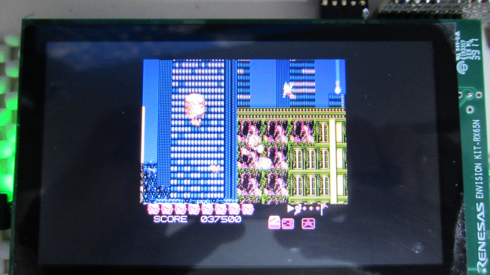
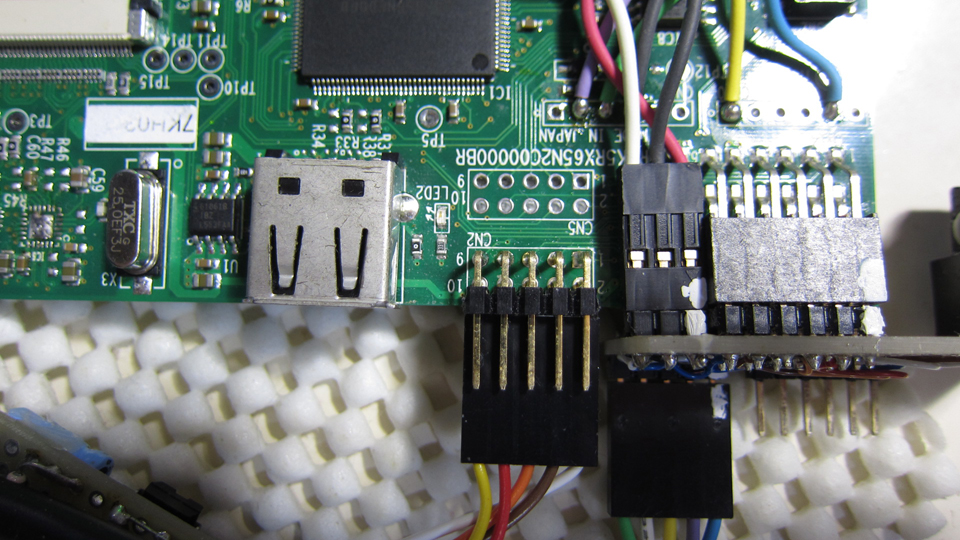

Renesas Envision Kit RX65N NES Emulator
=========
   
[Japanese](READMEja.md)
   
## Overview
   

   
NES (NES) emulator realized with 'Envision Kit RX65N'
   
## Project list
 - main.cpp
 - nesemu.hpp
 - emu/* [NES Emulator source code]
 - Makefile
 - nesemu_stable.mot (Compiled Motorola format file)
   
## Preparing the hardware
 - Preparing the SD card interface

 
 
 - NES (compatible) pad connection
For NES Pads:   
CN2( 2) P60 - White: Vcc (Power、Usually +5V, but use at +3.3V)   
CN2( 4) P61 - Brown: GND (Power、0V)   
CN2( 6) P62 - Orange: P/S (Parallel, shift switching)   
CN2( 8) P65 - Red: CLK (Clock)   
CN2(10) P73 - Yellow: OUT (Serial output)   


 - Audio connection (output from DA0 and DA1, GND level is 1.65V)


 - P03_JOY_RIGHT_IRQ11 (DA0) Left output
 - P05_IRQ13_SW (DA1) Right output   
   Mono with NES specifications
 - Pmod (10) PB6_RXD9_PMOD_10 ---> Use RXD signal
 - Pmod ( 9) PB7_TXD9_PMOD_9  ---> Use TXD signal
 - RXD/TXD: 115200 Baud, 8-bits, 1-Stop, No-Parity (Internal operation display etc.)
   
## Prepare resources
 - Write a file in “xxx.nes” format to the SD card.
   
## Build method
 - Make.
 - Write the nesemu.mot file.
   
## Method of operation
 - Press the “SELECT” and “START” buttons simultaneously for about 2 seconds.
 - A menu is displayed. Select with the up and down buttons and confirm with the A button.
 - “Select NES File”, filer opens.
 - "Load State x" Load NES state (change the slot with left / right buttons 0-9)
 - "Save State x" Save NES state (change the slot with left / right buttons 0-9)
 - Reset “Reset” NES
 - Exit the "Close Menu" menu
   
### Filer operations
 - Move the file name focus with the up and down buttons.
 - In the "xxx.nes" file, press the right button to select (game starts).
 - If it is a directory, change to that directory.
 - To go back to the directory, press the left button.
 - Press A to display file information. (Press again to return)
 - Press B to close the filer.
   
## Monitor function via serial terminal connection
By connecting a USB serial device to SCI9, you can use the terminal software for easy operation.
The following commands are supported

```
# help
    dir [xxx]       list current directory
    pwd             current directory path
    cd [xxx]        change current directory
    nes filename    Emulations for NES
    pause           Pause Emulation (toggle)
    reset           Reset NES Machine
    save [slot-no]  Save NES State (slot-no:0 to 9)
    load [slot-no]  Load NES State (slot-no:0 to 9)
    info            Cartrige Infomations
    call-151        Goto Monitor
```
   
With call-151, you can move to the monitor function and perform a memory dump inside the NES.

```
#call-151
$fff8.ffff
FFF8- FF FF 0C E2 20 E0 20 E0
$e020l
E020- 78       SEI
E021- D8       CLD
E022- A2 4D    LDX  #$4D
E024- 9A       TXS
E025- A9 10    LDA  #$10
E027- 8D 00 20 STA  $2000
E02A- AD 02 20 LDA  $2002
E02D- 10 FB    BPL  $E02A
E02F- A2 00    LDX  #$00
E031- 8A       TXA
E032- 95 00    STA  $00,X
E034- 9D 00 02 STA  $0200,X
E037- 9D 00 06 STA  $0600,X
E03A- 9D 00 07 STA  $0700,X
E03D- E8       INX
E03E- D0 F2    BNE  $E032
E040- A2 00    LDX  #$00
E042- BD 05 01 LDA  $0105,X
E045- DD 10 E0 CMP  $E010,X
E048- D0 0B    BNE  $E055
$0.
0000- 00 00 00 00 00 00 00 00  00 00 00 00 00 00 00 00
$0:1 2 3 4
$0.
0000- 01 02 03 04 00 00 00 00  00 00 00 00 00 00 00 00
$exit
#
```

## Restriction
 - Emulation is possible up to a total of programs and bitmaps of 2MBits (256K bytes).
 - Even with the same configuration, you may not be able to start up a mapper (bank switching device).
 - The function by the NES state does not seem to work correctly depending on the mapper (the mapper state cannot be saved).
   
## Reference video
<https://www.youtube.com/watch?v=frRI-cbzGus>
   
-----
   
License
----

MIT

and

NES Emulator for G.P.L.
