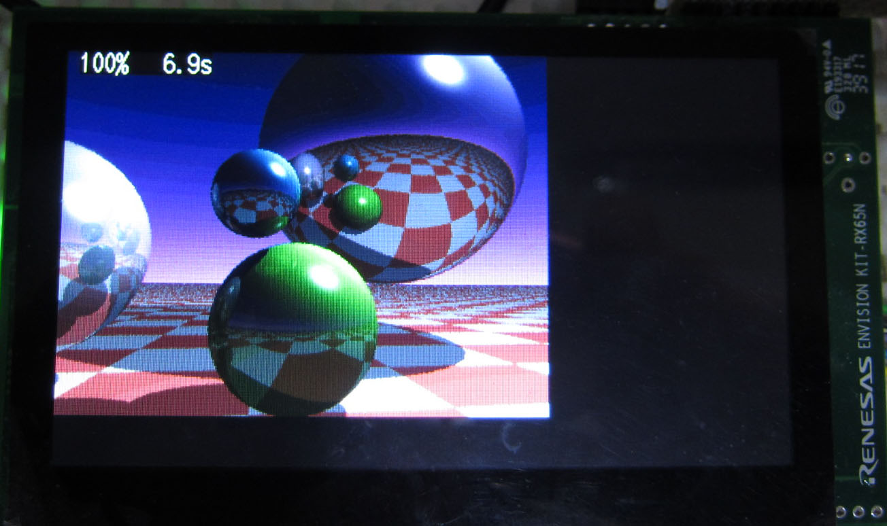
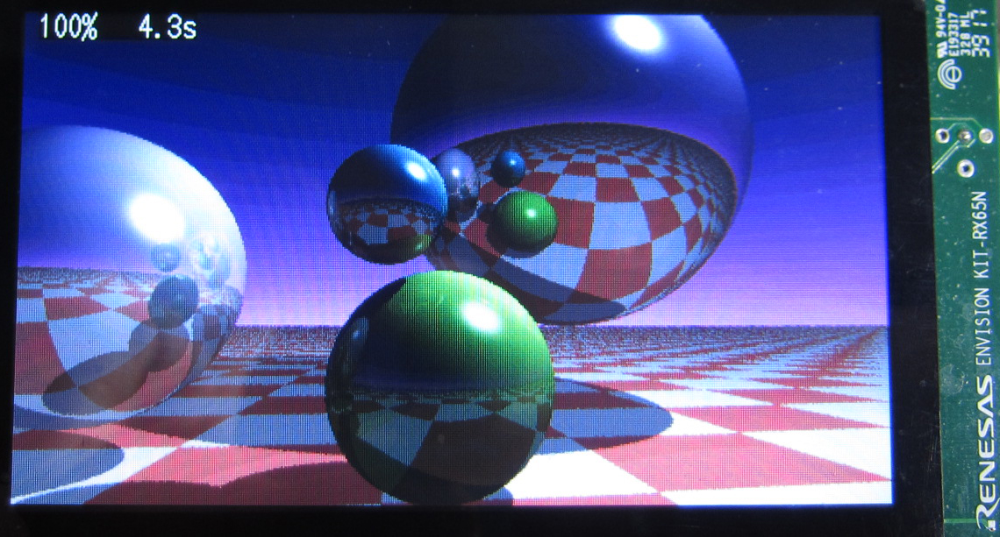

Renesas Envision Kit RX65N ガジェット
=========

## 概要
Envision Kit RX65N を使ったレイ・トレーサー
   
## プロジェクト・リスト
 - main.cpp
 - Makefile
 - raytracer.hpp
      
## ビルド方法
 - make する。
 - raytracer.mot ファイルを書き込む。   

## 操作と動作
 - SW2 を押すと、画面をクリアして、再度レンダリングを行う。
 - レンダリングを行う度に、フルスクリーン（480x272）と（320x240）を切り替える。

## 備考
 - 元となるソースコードは、Arduino 環境でベンチマークを行う事が主眼なので、オリジナルの実装をなるべく変更しないようにしています。
※sqrt() 関数は、sqrtf に変更しています。

## 謝辞
 - macsbug さん<https://macsbug.wordpress.com/2016/12/27/raytracing-with-esp32/>のコードを流用させて頂きました。
   
-----
   
License
----

MIT
