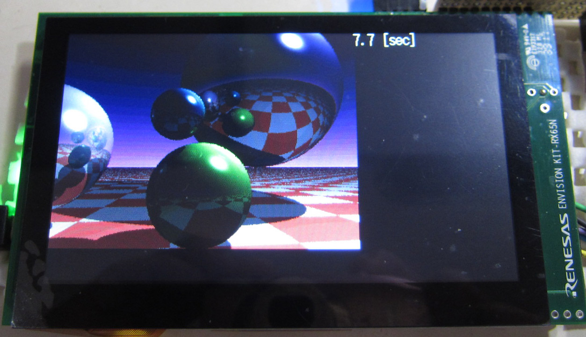

Renesas Envision Kit RX65N ガジェット
=========

## 概要
Envision Kit RX65N を使ったレイ・トレーサー
   
## プロジェクト・リスト
 - main.cpp
 - Makefile
 - raytracer.hpp
      
## ビルド方法
 - make する。
 - raytracer.mot ファイルを書き込む。   

## 操作
 - SW2 を押すと、画面をクリアして、再度レンダリングを行う。
   
-----
   
License
----

MIT
