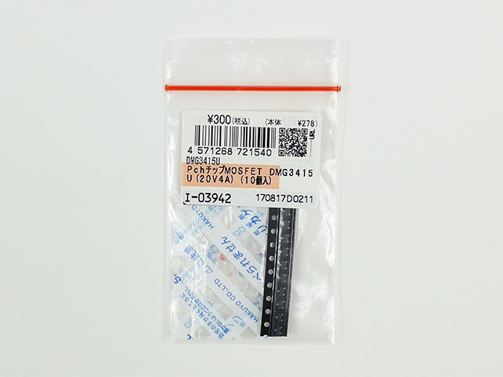
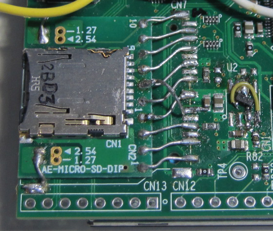
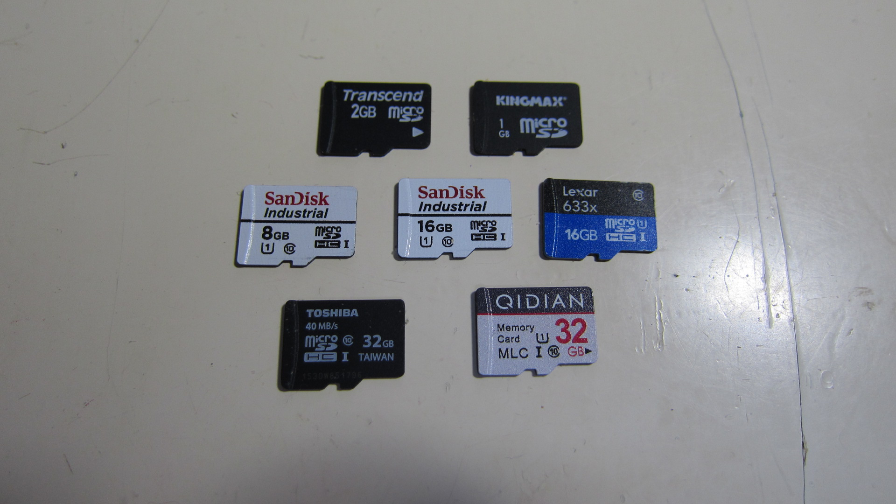

Renesas RX24T, RX64M, RX65N SD-CARD access sample
=========

[Japanese](READMEja.md)

## Overview

SD card access, sample program   

- Use FatFs (Version ff13c) for file system
- Sample using SPI (SPI mode) or SD built-in SDHI (SD mode)
- Directory listing (dir)
- Change directory (cd)
- Display directory path (pwd)
- Capacity and free space display (free)
- Time setting and display (time)
- Write to SD card, time measurement (write)
- Read from SD card, time measurement (read)

※The “time” command works when RTC is supported.

### SPI mode :

- It can be used when there is no SDHI peripheral.
- If you cannot use RSPI, you can use soft SPI.

※In the case of Soft SPI, the speed does not come out, but there is a convenience that you can collect and use the remaining ports.   

[C++ template header ( ff13c/mmc_io.hpp )](https://github.com/hirakuni45/RX/tree/master/ff13c/mmc_io.hpp?ts=4)

### SD mode :

- It can be used when there is an SDHI peripheral.

[C++ template header ( RX600/sdhi_io.hpp )](https://github.com/hirakuni45/RX/tree/master/RX600/sdhi_io.hpp?ts=4)

### By target device：

|Target|Interface|RTC|
|---------|---------------|---|
|RX24T|RSPI|△|
|RX64M|Soft SPI|○|
|RX65N|SDHI|△|

※RTC is used to record the time when writing a file.   
※RX24T can use RTC with I2C connection.   
※RX64M uses the built-in RTC.   
※The RX65N Envision Kit disables the built-in RTC, but you can use an I2C-connected RTC.   

## SDHI built-in device in RX microcontroller

The devices that incorporate SDHI in major RX microcontroller are as follows.

|Device|Core|SDHI|Default BPS|High Speed BPS|
|------------|-----|-|---------|---------|
|R5F524Txxxxx|RX24T|×|-|-|
|R5F564MxDxxx|RX64M|○|10M|15M|
|R5F564MxHxxx|RX64M|○|10M|15M|
|R5F564MxCxxx|RX64M|×|-|-|
|R5F564MxGxxx|RX64M|×|-|-|
|R5F565xxAxxx|RX65x|×|-|-|
|R5F565xxBxxx|RX65x|○|12.5M|25M|
|R5F565xxDxxx|RX65x|○|12.5M|25M|
|R5F565xxExxx|RX65x|×|-|-|
|R5F565xxFxxx|RX65x|○|12.5M|25M|
|R5F565xxHxxx|RX65x|○|12.5M|25M|
|R5F571MxDxxx|RX71M|○|10M|15M|
|R5F571MxHxxx|RX71M|○|10M|15M|
|R5F571MxCxxx|RX71M|×|-|-|
|R5F571MxGxxx|RX71M|×|-|-|

※Other RX microcontrollers have devices that incorporate SDHI peripherals.   
※The clock frequency is twice that of BPS.   

### RX65N Envision Kit


**The RX65N Envision Kit is equipped with R5F565NEDDFB and can use SDHI.**

---

## Preparing the hardware

SD card pin assignments and functions   

### RX24T (RSPI-A)

|Port name|LFQFP100|SD pin|SD function|Remarks|
|---|---|---|---|---|
|P22/MISOA|66|DAT0(7)|SO|pull-up(22K)|
|P23/MOSIA|65|CMD(2)|SI||
|P24/RSPCKA|64|CLK(5)|SCLK|damping-register(22)|
|P65|69|DAT3(1)|SELECT||
|P64|70|-|Power CTRL|active-low|
|P63|74|-|CardDetect|active-low|

### RX65N (SDHI) for RX65N Envision Kit

The RX65N Envision Kit does not have an SD card socket and power supply control IC, so it must be mounted.   

Since SD card sockets are difficult to obtain and can be purchased at a high cost, we will use micro SD boards that can be purchased at Akizuki Electronics.   
For power supply control ICs, general-purpose MOS-FETs were used because of availability and cost.   
- Original SD card socket "SD / MMC card socket: 101-00565-64 (manufactured by AMPHENOL COMMERCIAL PRODUCTS)"
- Original SD card power supply gate IC "ISL61861BIBZ"
- Power control is possible even without it, but it is controlled for the time being.
- “ISL61861BIBZ” has a power supply voltage check function, but it is omitted.

<a href="http://akizukidenshi.com/catalog/g/gK-05488/" target="_blank">Akizuki Electronics, Micro SD slot board</A>   
   
<a href="http://akizukidenshi.com/catalog/g/gI-03942/" target="_blank">Akizuki Electronics, Pch chip MOSFET DMG3415U (20V4A)</A>   





- Write protect is not used.
- The SD card control signals and bus are pulled up, and the pull-up voltage is supplied from the power supply control.
- This is a pretty “important” part.
- If the pull-up is always performed, current flows through the pull-up resistor when the SD card is powered off.
- This may result in a delicate voltage being supplied to the SD card, which may fail when reinitializing.
- The clock signal and command signal have resistors in series for impedance matching.
- The pull-up resistor is omitted only for the clock signal, but there is a truck.
- It may be possible to mount a resistor in some cases, but I don't think it is necessary.

### RX64M (Soft SPI)

|Port name|LFQFP176|SD pin|SD function|Remarks|
|---|---|---|---|---|
|PC3(MISO)|83|DAT0(7)|SO|pull-up(22K)|
|P76(MOSI)|85|CMD(2)|SI||
|P77(SPCK)|84|CLK(5)|SCLK|damping-register(22)|
|PC2|86|DAT3(1)|SELECT||
|P82|79|-|Power CTRL|active-low|
|P81|80|-|CardDetect|active-low|

---

## Difference between SD mode and SPI mode

|Mode|CLK|CMD|D0|D1|D2|D3|CRC|
|---|---|---|---|---|---|---|---|
|SPI Mode|CLK(SCLK)|Din(MOSI)|Dout(MISO)|×|×|CS|Unnecessary|
|SD Mode|Clock|Bidirectional|D0|D1|D2|D3|Necessary|


The big difference in SD mode：
- The command control line (CMD) is separated from the R / W data bus (D0 to D3).
- The CMD control line is bidirectional.
- When receiving the response of the command, it is necessary to control the direction of the control line.
- Error detection by CRC.
- In SPI, some responses are also omitted, and the specifications are different.
- SPI also eliminates CRC error checking.
- SDHC and SDXC cards have a mode to lower the power supply voltage (1.8V) and achieve a higher transfer speed.
- Features such as clock and data delay matching.   
  ※It is not supported because it cannot be handled by the SD microcontroller SDHI.   
  Does not support 1.8V port voltage and limits clock speed limit   

**The SD card voltage range is typically 2.7V to 3.6V.**   
**In SD mode, 4-bit bus and 1-bit bus can be selected, but it seems that some cards do not support 1-bit bus.**   

## SPI mode initialization process

See: [mmc_io.hpp / disk_initialize(BYTE drv)](https://github.com/hirakuni45/RX/blob/master/ff13c/mmc_io.hpp?ts=4)

## SD mode initialization process overview

Cards with less than 1GB capacity require a different initialization process, but recently, such cards are already difficult to obtain and are not supported.   
Even with 1GB cards, older cards may require a different initialization process and will fail to initialize.   

- SD card power on
- Wait until the power supply stabilizes (the implementation waits for 1 second)
- Initialize SDHI and set initialization clock speed (400KHz or less)
- Insert 74 dummy clocks
- Send CMD0, 0x00000000
- Wait 1 ms
- Send CMD8, 0x000001AA
- Confirm that 0x1AA is returned in the lower 12 bits
- Send ACMD41, 0x40FF8000
- In response, repeat until B31 becomes “1” (If it is “0” even if thrown for 1 second, an error)
- If B30 is “1” in the response, block access (4GB or more card)
- Send CMD2, 0x00000000 (card identification command)
- Get card ID returned in response
- Send CMD3, 0x00000000 (read RCA)
- Get RCA (B31-B16) returned in response
- Send CMD7, RCA (card selection)
- CMD16, 512 (Set the block size to 512)
- Send ACMD6, 0x00000002 (change bus width to 4 bits)
- Change SDHI bus width to 4 bits
- Boost SDHI clock speed

CMD8 0x100： Supply voltage range (2.7V to 3.6V)   
CMD8 0x0AA： Check pattern   
ACMD41 0x40000000： HCS bit   
ACMD41 0x00FF8000： Power supply voltage range
ACMDxx sends CMD55 and CMDxx. (In SDHI, set the ACMD bit to "1")   

See [RX600/sdhi_io.hpp / disk_initialize(BYTE drv)](https://github.com/hirakuni45/RX/blob/master/RX600/sdhi_io.hpp?ts=4) for detailed instructions

## Sector, read / write

The FatFs function prototype is as follows, and exchanges data in sector units (512 bytes).   

```
    //-----------------------------------------------------------------//
    /*!
        @brief  Read sector
        @param[in]  drv     Physical drive nmuber (0)
        @param[out] buff    Pointer to the data buffer to store read data
        @param[in]  sector  Start sector number (LBA)
        @param[in]  count   Sector count (1..128)
     */
    //-----------------------------------------------------------------//
    DRESULT disk_read(BYTE drv, BYTE* buff, DWORD sector, UINT count) noexcept

    //-----------------------------------------------------------------//
    /*!
        @brief  Write sector
        @param[in]  drv     Physical drive nmuber (0)
        @param[in]  buff    Pointer to the data to be written
        @param[in]  sector  Start sector number (LBA)
        @param[in]  count   Sector count (1..128)
     */
    //-----------------------------------------------------------------//
    DRESULT disk_write(BYTE drv, const BYTE* buff, DWORD sector, UINT count) noexcept
```

At initialization, if B30 is “0” in the response of ACMD41, it becomes the real address, so “sector” must be multiplied by 512.   
※1GB, 2GB SD card

```
    // Convert LBA to byte address if needed
    if(!(card_type_ & CT_BLOCK)) sector *= 512;
```

The command is different for single sector and multiple sectors.

```
    // read command
    command cmd = count > 1 ? command::CMD18 : command::CMD17;

    // write command
    command cmd = count > 1 ? command::CMD25 : command::CMD24;
```

In SDHI, the built-in buffer is 512 bytes and is stored in 32-bit units. Therefore, it is necessary to devise when the storage destination is not in 32-bit units.

```
    if((reinterpret_cast<uint32_t>(buff) & 0x3) == 0) {
        uint32_t* p = static_cast<uint32_t*>(buff);
        for(uint32_t n = 0; n < (512 / 4); ++n) {
            *p++ = SDHI::SDBUFR();
        }
        buff = static_cast<void*>(p);
    } else {
        uint8_t* p = static_cast<uint8_t*>(buff);
        for(uint32_t n = 0; n < (512 / 4); ++n) {
            uint32_t tmp = SDHI::SDBUFR();
            std::memcpy(p, &tmp, 4);
            p += 4;
        }
        buff = static_cast<void*>(p);
    }
```

In addition, the built-in buffer arrangement is assumed to be little-endian, so if you want to run the RX microcontroller in big-endian (though it seems unusual), you need to SWAP, but it is provided as a hardware function. The

```
#ifdef BIG_ENDIAN
    debug_format("Turn SWAP mode for Big Endian\n");
    SDHI::SDSWAP = SDHI::SDSWAP.BWSWP.b(1) | SDHI::SDSWAP.BRSWP.b(1);
#endif
```

"BIG_ENDIAN" is defined by "[common/byte_order.h](../common/byte_order.h)" .

## Speed ​​comparison



### SPI Mode RX24T (RSPI)
```
QIDIAN MLC 32GB (SDHC) Class10
Write Open:  0 [ms]
Write: 250 KBytes/Sec
Write Close: 21 [ms]

Read Open:  1 [ms]
Read: 444 KBytes/Sec
Read Close: 0 [ms]
```

### SPI Mode RX64M (Soft SPI)
```
QIDIAN MLC 32GB (SDHC) Class10
Write Open:  0 [ms]
Write: 150 KBytes/Sec
Write Close: 15 [ms]

Read Open:  2 [ms]
Read: 237 KBytes/Sec
Read Close: 0 [ms]
```

### SD Mode RX65N Envision Kit (SDHI)
```
QIDIAN MLC 32GB (SDHC) Class10
WriteOpen:  0 [ms]
Write: 430 KBytes/Sec
WriteClose: 5 [ms]

ReadOpen:  0 [ms]
Read: 1024 KBytes/Sec
ReadClose: 0 [ms]

-----------------------------
Lexar 633x 8GB (SDHC) Class10
WriteOpen:  170 [ms]
Write: 210 KBytes/Sec
WriteClose: 12 [ms]

ReadOpen:  2 [ms]
Read: 1272 KBytes/Sec
ReadClose: 0 [ms]

-------------------------------------
SanDisk Industrial 8GB (SDHC) Class10
WriteOpen:  3 [ms]
Write: 330 KBytes/Sec
WriteClose: 98 [ms]

ReadOpen:  1 [ms]
Read: 1706 KBytes/Sec
ReadClose: 0 [ms]

--------------------------------------
SanDisk Industrial 16GB (SDHC) Class10
WriteOpen:  6 [ms]
Write: 388 KBytes/Sec
WriteClose: 5 [ms]

ReadOpen:  2 [ms]
Read: 1199 KBytes/Sec
ReadClose: 0 [ms]

-----------------------------------------
TOSHIBA 40MB/s Taiwan 32GB (SDHC) Class10
WriteOpen:  1 [ms]
Write: 200 KBytes/Sec
WriteClose: 46 [ms]

Open:  1 [ms]
Read: 1065 KBytes/Sec
ReadClose: 0 [ms]
```

Since the test is in units of 512 bytes, I think that it is much faster when running continuously.   
The current implementation is based on polling and software transfers, interrupts and DMA are not used, and there is little tuning.   

---

## How to use

Drivers and hardware definitions use C ++ templates.   
You can easily switch between “SD mode with SDHI” and “SPI mode with soft SPI” as shown below.   

```
    // Definition part

    // Specify "device::NULL_PORT" when card power control is not used.
//  typedef device::NULL_PORT SDC_POWER;
    typedef device::PORT<device::PORT6, device::bitpos::B4> SDC_POWER;

#ifdef USE_SDHI
    // RX65N Envision Kit SDHI port uses candidate THIRD
    typedef fatfs::sdhi_io<device::SDHI, SDC_POWER, device::port_map::option::THIRD> SDC;
    SDC         sdc_;
#else
    // SPI definition for Soft SDC (SPI)
    typedef device::PORT<device::PORT2, device::bitpos::B2> MISO;  // DAT0
    typedef device::PORT<device::PORT2, device::bitpos::B0> MOSI;  // CMD
    typedef device::PORT<device::PORT2, device::bitpos::B1> SPCK;  // CLK

    typedef device::spi_io2<MISO, MOSI, SPCK> SPI;  ///< Soft SPI definition

    SPI         spi_;

    typedef device::PORT<device::PORT1, device::bitpos::B7> SDC_SELECT;  // DAT3 card selection signal
    typedef device::PORT<device::PORT2, device::bitpos::B5> SDC_DETECT;  // CD card detection

    typedef fatfs::mmc_io<SPI, SDC_SELECT, SDC_POWER, SDC_DETECT> SDC;   // Hardware definition

    SDC         sdc_(spi_, 35000000);
#endif

    // Main part

    // Service called by frame
    while(1) {
        render_.sync_frame();

...

        sdc_.service();
    }
```

## Reference links and materials

[SD Association](https://www.sdcard.org/index.html)   

for Japanese :

[ELM ChaN MMC/SDCの使いかた](http://elm-chan.org/docs/mmc/mmc.html)

[Kingston Technology microSDHC メモリカードフラッシュストレージメディア](https://www.kingston.com/datasheets/SDCIT-specsheet-8gb-32gb_jp.pdf)

[RXファミリ SDモード SDメモリカードドライバ・アプリケーションノート](https://www.renesas.com/jp/ja/doc/products/mpumcu/apn/rx/002/r01an4233jj0203-rx.pdf)

[アルテラ SD/MMC コントローラ](https://www.intel.co.jp/content/dam/altera-www/global/ja_JP/pdfs/literature/hb/cyclone-v/cv_54011_j.pdf)

## License

[MIT](../LICENSE)
