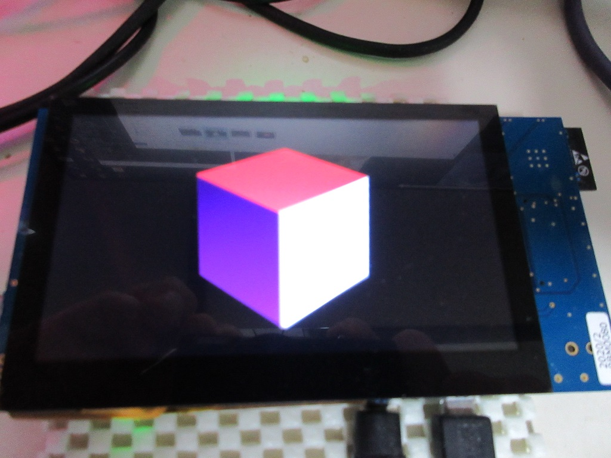

Renesas RX72N Tiny GL サンプル
=========

[English](README.md)
   
---
   
## 概要
- RX72N Drw2d エンジンを使った、TinyGL のサンプル
- RX72N のセカンドメモリーが 512K バイトあるので、480x272 でダブルバッファを利用
- ダブルバッファを活用したページフリッピングのサンプル

## プロジェクト・リスト
- main.cpp
- RX72N/Makefile
      
## ビルド方法
- RX72N プラットホームディレクトリーに移動、make する。
- tgl_sample.mot ファイルを書き込む。
   
## 動作
      
License
---

MIT
