<div style="page-break-before:always"></div>

# C++ で紡ぐＲＸマイコンＤＩＹ


---
## はじまり

昨今、ホビーでも仕事でも、強力なＰＣがある状況では、何でもやりたい事が出来てしまいます。   
今のＰＣは一昔前のスーパーコンピューターより強力な演算能力、メモリー、二次記憶を持っています。   
昔、数億円していたものが現在では数万円で誰でも買えて、使う事が出来るのです。   
コンピューターのプログラムを学びたいと思えば、ネットにアクセスして、どんな情報でも殆ど揃っている状況です。   

ＰＣは、生活に密着した環境で、低価格と性能を進化させてきました、携帯電話（スマートフォン）も、ＰＣとは異なる環境を得て発達してきました。   
もはや、ＰＣと携帯電話に物理的な違いは殆どありません、ただ、携帯電話は、情報を受け取るのには優れていますが、何かを創作するプラットホームとしては利便性が良くありません。   
また、別の分野として「組み込みマイコン」と呼ばれるものがあります。   
家電、自動車、インフラ、などのように普段はあまり気がつかない部分で裏方で作業をしています。   
身の回りの電化製品には当然のようにマイコンが組み込まれて、様々な作業をこなし、生活に介入して豊かにしています。   
昨今、組み込み系マイコンを使って、色々な物を作る事が出来る環境が整い、多くの人がＤＩＹを楽しんでいます。   
それは、小さいロボットであったり、時間になったら電灯を点けるだけだったり、創造の産物です。   

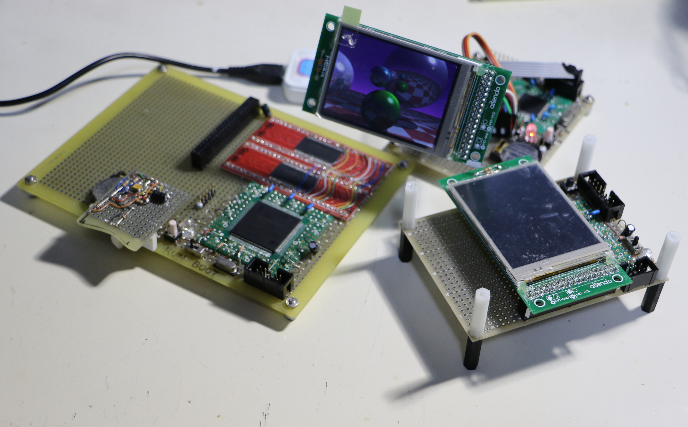

「組み込みマイコン」は、非常に小さい規模で使われるマイクロコンピューターで、ＰＣとは異なる作業を分担をしており、比較的単純な物からそれなりに複雑な物まで、色々な作業をしています。   
ＰＣのように多くの電力を使わないし、規模が小さい物は低価格なので、気軽に使われています。   
１個、数十円の物も普通に流通しています。   

ＰＣ上でアプリケーションを作成するのと同様に、組み込みマイコンでもプログラミングを行う作業は必須です。   
ＰＣ上のアプリケーションでは、プログラムを作成すれば、直に動作を確認できますが、組み込みマイコンの場合、作成したプログラムを組み込みマイコン上にロードして動作させるので、間接的で、その手順や仕組みを理解する必要があります。   
   
---
## どんなプログラミング言語を習得すべきなのか？


コンピュータ言語を習得する場合、どの言語を選べば良いのでしょうか？   
※入門者の人にこのような質問を良く聞かれます。   
   
やり方は人それぞれで、その人の能力や性格にもよると思いますが、自分の考え方から紹介してみようと思います。   
   
大雑把に、二つの異なるアプローチを考えてみます。   
- 気の向くまま、様々な言語を少しづつかじって、広く浅く色々やってみる   
- 一つの言語だけをとことん追求して、狭く深く追求する   
   
これら二つのアプローチは、ビルの高さとそこから見える景色に例える事が出来ると思います。   
   
「広く浅く」の場合、色々なビルに登る事で、広範囲な知識や経験を獲得する事が出来ます。   
一方「狭く広く」では、一つのビルだけに登る事で、一つの分野に特化した十分な知識を得られます。   
   
色々なビルに登って景色を眺めてみると、確かに色々な景色を眺める事は出来ますが、低い場所から眺める景色は所詮制限されたものです、高い場所から眺める景色とは全く異なります。   
一方、高い場所から眺める景色は広大で、遠くまで見渡せます。   
   
私が薦めたいのは、まず、一つの言語をとことん追求して、ある程度の高さまで登ってしまう事です、一度、ある程度の高さまで達すると、別のビルの同じ高さから眺める景色と大して変わりません。   
※一つの言語をある程度学んでいれば、異なった言語の習得にかかる労力は少ないと感じます。   
   
高い場所に登るには、時間が必要で、一朝一夕には到達しない事を覚悟する必要があります。   
「人」の能力には個人差があり、短い時間で「結果」を出す人もいますが、それは一握りの人たちです。   
ゆっくり歩こうが速く歩こうが、目標があればやがて目的地に到達します。   
「プログラミングを習得するのに何をすれば良いですか？」と質問する人がいますが、このような思考の人は、まず間違いなくプログラマーに向いていません。   
目標、目的があれば、何をすれば良いかなど、自ずと判る筈です、「習得」したいと思った瞬間から何かアクションを起こすハズです。 
   
※近道をしたいのかもしれませんが、「聞けば」手に入る物でもありません。   
   
---
## マイコンに最大の仕事をさせるプログラミング言語とは？
   
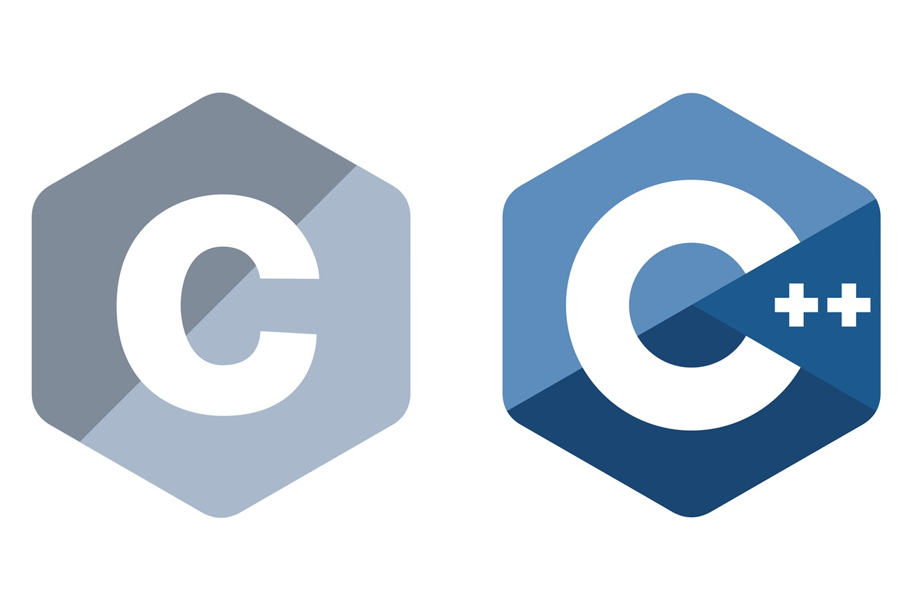
   
コンピュータをもっとも効率的に動かせる言語はアセンブラかもしれません。   
「かもしれない」と疑問形なのは、アセンブラは確かにマイコンの最下層の言語でこれ以上下位の制御機構はありません、しかしながら、機能を実装したり、改良する場合には適切とは言えない面もあります。   
人には直接的では無く、簡単と思える操作でも、非常に細かく噛み砕いて命令する必要があり、多くの手順を実装する必要があります。   
これは、巨大で複雑なプログラム（手順）を実装する事を困難にし、改良する場合も効率が良くありません。   
また、アセンブラは「方言」が強く、異なったマイコン間で互換性はほぼありません、これは、「手順」の再利用をほぼ不可能にします。   
   
「高級言語」は、以上の欠点を補う目的で発展してきました、人間に直感的な架空の言語をコンピュータのプログラムによってアセンブラ命令に翻訳します。   
通常これをコンパイルと呼び、翻訳機をコンパイラと呼びますます。   
   
昨今、コンパイラの技術的進歩が大きく、非常に効率の高いアセンブラ命令を翻訳するようになってきました。   
場合によっては、人間がアセンブラで直接実装するより効率的な命令を生成する場合もあります。   
この事実は、もはや、アセンブラを使う事なく、最高性能をもったプログラムを高級言語で書ける事を意味します。   
   
Ｃ言語は（歴史については「ぐぐって」）、アセンブラより人間に直感的な形態でありながら、よりコンピュータに近い効率的な言語として発達してきた経緯があります。   
組み込みマイコンの製造者は、マイコンの設計と同じくらいの優先度でＣコンパイラにも投資してきました。   
   
しかし、Ｃ言語には、仕様上の制約があります、あきらかに構造的に間違った手順でも、エラーをすり抜けて動作しないアセンブラ命令をコンパイルしてしまいます。   
また、より人間の思考に近いと言っても、マシンに寄った仕様である為、人間のミスを誘発しやすい場合もあります。   
そこで、もっと構造的で、「思考」をより表現しやすく、厳密で、間違いを指摘しやすいプログラム言語としてＣ＋＋が生まれました。   
Ｃ＋＋は、Ｃ言語をベースに開発が進められた為、Ｃ言語と共通の仕様が多くありますが、Ｃ言語とは全く異なったプログラミング言語となっています。   
またコンパイラも、Ｃ＋＋独自の進化を遂げています、根本的にＣコンパイラとは異なる手順を使って翻訳します。   
Ｃ、Ｃ＋＋の言語仕様に沿って書かれたプログラムは、異なったマイコンであっても、Ｃ、Ｃ＋＋コンパイラがあれば、同じようにコンパイルして動かす事が出来ます。   
   
Ｃ＋＋で実装する構造的なプログラムは、Ｃ言語で実装するプログラムより効率的なアセンブラ命令を生成する事さえ出来るようになりました。   
   
### **現在、マイコンをもっとも効率的に動かせる（最大の仕事をさせる）コンピューター言語はＣ＋＋と言えます。**   
   
※一部、コンピュータの理解が中途半端な輩が、「Ｃ＋＋は終わっている」とか言っている人がいて、笑ってしまいますが、コンパイラとインタプリタの違いさえ理解出来ない連中の言う事をまともに聞く必要はありません。   
   
もちろん、リソース（主にＲＡＭ）さえあれば、C# や Python などのインタープリターを動かす事も出来るでしょう。   
しかし、インタープリターではどんなに上手く作っても、C や C++ より高速に、効率的に動かす事は出来ません。   
   
Ｃ＋＋の別の側面として STL や boost などのテンプレートライブラリの存在があります。   
しかしながら、これらライブラリを上手に扱うのは、スクラッチからプログラムを開発するスキルとは全く別のスキルが必要です。   
再利用を効率良く実践する為には、それに添った頭の切り替えが必要となっており、これがＣ＋＋を敬遠する理由に挙げられると思います。   
Arduino がＣ言語習得者に受け入れられているのは、逆説的にこれらテンプレートライブラリを活用していない（AVR では STL をサポートしていない）為とも言えます。   
※熟練したＣ＋＋プログラマが、STL や boost を駆使して、大掛かりと思えるプロジェクトを一瞬で解決した事象を何度も見ています。   
   
---
## ＲＸマイコンについて
   
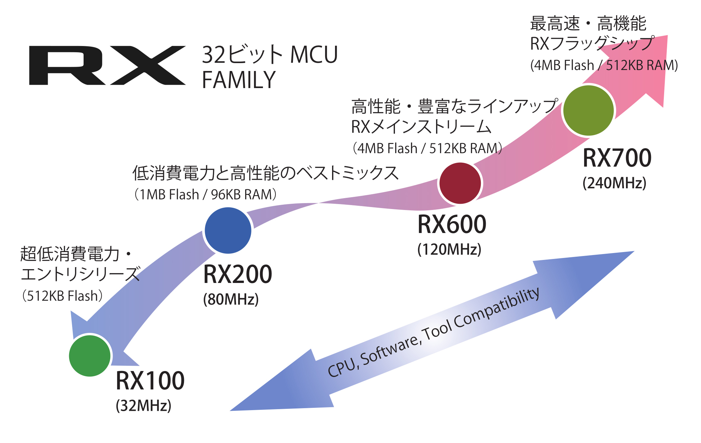
   
ＲＸマイコンはルネサス社が開発している組み込み系マイコンで、日本製です。   
   
非常に良く練られた設計で、改良が続いており、組み込みマイコンの中では、高い性能を出せるマイコンと思われます。   
ライバルはＡＲＭでしょうが、同じ周波数、消費電力でベンチマークすると圧倒的に優位にたてるものと思います。   
ただ、製造しているスケールが小さく、ＡＲＭほど普及していないのも事実です。（単価も多少高い）   
それでも、高性能を理解して、選択しているエンジニアは増えています。   
   
ＲＸマイコンは、コストにおいて、競合他社のＡＲＭに比べて、一見すると安いわけではありません。   
しかし、使ってみると、ＡＲＭの同等価格帯の製品などに比べても非常に性能が高い事をあらためて確認出来ると思います。   
※ RaspberryPi などに使われている ARM と比べる人がいますが、「適材適所」というものがあり、RaspberryPi はその機能から、組み込みマイコンというよりＰＣや携帯に近いものです。   
※当然ながら、消費電力や処理の内容により、ＲＸマイコンの方が適切な場合があります。   
※ただ、もの凄く沢山作られており、そのスケールメリットで価格は、非常に安いです。   
   
大雑把に言って、100MHz の RX マイコンと同等なのは 200MHz の ARM と言えると思います。   
特に RX600 や RX700 シリーズ（RX24T）では、32 ビットの浮動小数点を使った場合に非常に高い性能を出す事が出来ますので、そのようなアプリケーションには最適と言えます。   
また、消費電力辺りの処理性能では、ＲＸマイコンより優れたマイコンを探すのは難しいと言えます。   
   
用途に応じて、色々なシリーズが用意されており、入手性も問題ありません。   
   
もちろんＡＲＭや、ＰＩＣ３２など他のマイコン（主に海外製）の方が優れている部分はいくらでもあるでしょうが、**日本人なのだから、純粋に日本製のマイコンを使う事に意味がある**と感じています。   
   
---
## ＲＸマイコンにおける最高の開発環境とはどんなものか？
   
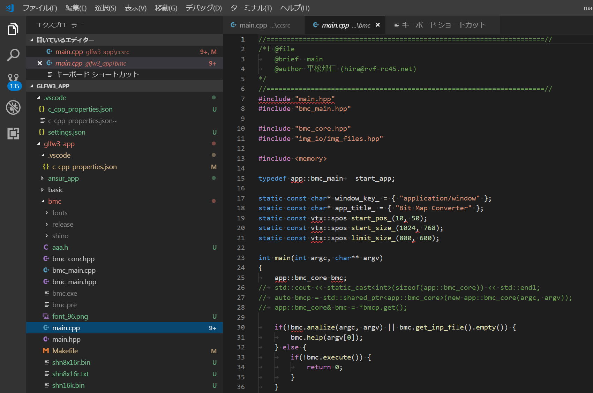   
   
 - 最新の C++ をサポートしている事（C++17、C++20、・・・)   
 - boost をコンパイルできる事   
 ※Ｃ＋＋の先駆的な開発者のコミュニティ、およびそのコミュニティによって公開されているオープンソースのソフトウェアライブラリ
 - 誰でも自由に制限無しに使える事   
 - コンパイラの性能が高い事（最適化）   
 - 色々なプラットホームで同じように使える事（Windows、Mac、Linux など）   
   
### **現在、これら条件を満たした開発環境は GNU Tools であるところの gcc(g++) と言う事になります。**   
※ gcc は、ＲＸマイコンをサポートしており、ルネサスの他のＣＰＵ（ＲＬ７８、Ｒ８Ｃ）用もあります。   
他にＬＬＶＭベースのコンパイラがあり、そのうちこれらにもＲＸマイコン用が出現すると思われます。   
   
---
## オープンソースのコンパイラを利用する意味
   
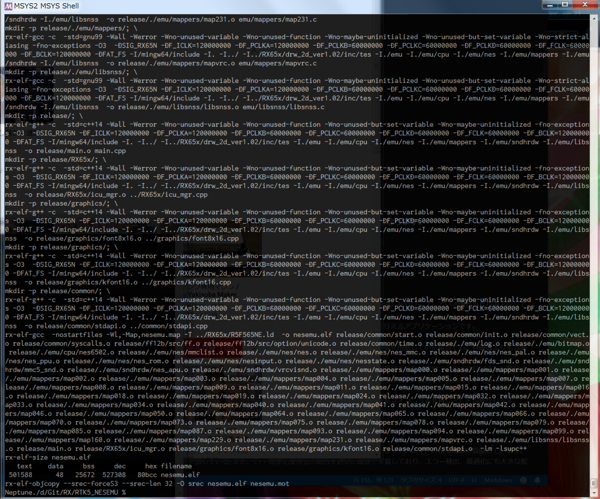   
   
マイコンの製造会社は、マイコンのプログラム開発をより効率的に進められるようにＩＤＥ（統合開発環境）をリリースしている事が当たり前となっています。   
ＩＤＥとは、プログラムの作成、コンパイル、デバッグ、実マイコンへのプログラム転送などを統合して行えるアプリケーションです。   
コンパイラも独自に開発している場合があります。   
   
ただし、このアプリケーションは有償（コンパイラ）の場合が多く（開発には莫大なコストがかかっている）、無料版を用意していた場合でも、有償版より劣る制限を設けている事が普通です。   
※とあるメーカーでは有償版のコンパイラは２０万円くらいします、数万個単位で売るような製品でもない限り、このようなコストを償却する事は出来ません、また、大手のメーカー（マイコンを沢山使うメーカー）には無償で貸し出す場合がありますが、個人や、数百セットくらいのスケールでは大きなパイプでも無い限り、無償で貸し出すような事はしていません。   
   
結局、ＤＩＹでメーカー純正のコンパイラを使う事は、ほぼ不可能と言えます、この辺りの事情は、海外製マイコン（ＡＲＭなど）とは異なります。   
   
Ｃ＋＋は、独自に発展して来ましたが、言語仕様は熱心なＣ＋＋ユーザーや団体が策定しています。   
オープンソースで有名な GNU Tools は、かなり古くからＣコンパイラをオープンソース化しています。   
また、Ｃ＋＋コンパイラも率先してリリースしています。   
   
gcc はサポートしている CPU の種類において群を抜いており、gcc の開発に関わっている人々も莫大な数となっています、みんな無償で貢献しています。(一部の人は、メーカーに雇われて開発に参加している)   
また、C++ 標準化委員会の勧告を適切に最速で実装しており、エラー検出、最適化にも大きな配慮がなされています。   
その意味では、メーカーが開発しているコンパイラより優れています。   
とあるマイコンメーカーは独自のコンパイラ開発を諦めて、gcc の開発に貢献（資金や人材提供）しています。   
   
私も、より良い物を作るにはその考え方に賛成ですが、大手メーカーでは、過去の資産を捨てる判断が難しく、ライセンス、自前の開発部隊の維持など色々な問題で、未だに独自コンパイラの開発を諦めていません。   
   
昨今、LLVM と呼ばれる、gcc とは異なった実装のオープンソースコンパイラも出てきており、選択枠も増えて来ました。   
ただ、ＲＸマイコン用オープンソースの LLVM ベースのコンパイラはまだ無い為、gcc、g++ コンパイラを使っていきます。   
ルネサス社は無料サポートとして、GNU Tools（RX Toolchain）を利用可能にしています、これらは、IDE から呼ばれる事を前提に改良された物で、gcc のオリジナルとは少しだけ異なっています。   
デバッグ環境なども揃っていますが、自分はいくつかの点で不満なので自分でツールをビルドして使っています。   
 - アクティベーションが必要な事（登録は無料）   
 - Mac 環境はサポートされない事   
 - gcc の最新バージョンを積極的にリリースしない事（リリースに大きな遅延がある）   
   ※現在 gcc の最新版は 7.3.x 系ですが、4.8.x 系がカレントになっている。   
 - IDE をベースにしている事   
   ※コマンドラインで使う事もできるが・・   
 - 純粋な gcc では無い事（裏で、独自のパスを設けて、目に見えない部分がある事）   
  ※スタートアップや、ブートストラップに起因する処理、デバイス固有定義の生成、デバッグコードの埋め込み、エミュレータとの連携など色々   
 - I/O デバイス固有定義ファイル「iodefine.h」は、Ｃ言語の規約に違反した実装方法を採用しており、また、極めて冗長で、可読性が悪い。   
   ※バイトサイズ以外のビットフィールド定義    
 - I/O デバイス固有定義ファイル「iodefine.h」は、ＩＤＥツールが生成するもので、特別な仕組みが必要となっている。   
   
gcc、g++ を自分でビルドしてみると、開発にはほとんど不利益が無い事が確認出来ました、逆に利点が多い事があります。   
 - 最新の gcc で、C++14、C++17、（C++20）を使う事が出来る。   
   ※現在 gcc-6.4.0 系を使用   
 - RX 以外のプラットホームにも移行がスムーズに行える。   
   ※特別、固有の事をしていない、構造が同じなので、他プラットホームへの移行や、応用がスムーズに行える。   
 - スタートアップからの動作が明確。   
 - 全てを詳細に公開でき、隠蔽する部分が全くない。   
 - 最適化において、メーカー製コンパイラと比べても遜色ない品質。   
   
---
## デバッグ環境について
   
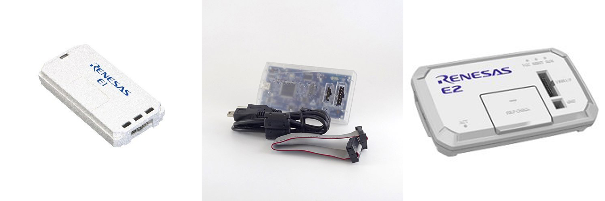
   
メーカー純正のＩＤＥでは、デバッグに関しては、非常に手厚いサポートと、機能を提供しています。   
それが、絶対的に必要なのかは意見が別れるところですが、ＤＩＹレベルでは、無くても、工夫次第でなんとでもなります。   
ステップ実行出来ない事が余り不利益にならない。（これは初心者には厳しい話かもしれません）   
   
ソースレベルデバッガーとエミュレータ（ハードレベルデバッガー的なもの）の組み合わせは、非常に強力で柔軟な開発環境を提供してきました。   
一旦この環境が浸透してしまうと、精神的にも、肉体的（物理的）にもこの環境から抜け出せない開発者が多く発生してしまい、応用したり工夫する力、想像や推定など、基本的な能力が衰退してしまいました。   
   
エミュレータ（J-TAG）は、定められた手順で、マイコン内部の状態を物理的にスキャンする事が可能です。   
ほとんどの技術者は、エミュレータによる開発環境が無い現場を敬遠して、これが無いと「まともな開発」は出来ないものと認識している人が多数いる現実があります。   
   
一方、何かの組み込み開発で、ソフトウェアーやハードウェアーの不具合から、想定した動作をしない状態に陥ると、「まともな開発環境」が無い状態から抜け出せない開発者が多数います、また、このような状況を目の当たりにしている為、「まともな開発環境が無い」世界に恐れを抱いているのです。   
この「恐れ」は、経験不足や、想像力の欠落などからくるものですが、それさえ認識していない人が多くいる事に大変危機感を持っています。   
   
「まともなデバッグ環境が無い」事は、マイナス要因ではありますが、決定的な要因ではありません。   
ただ、これらのデバッグ手法に熟練している事で、奇妙で微妙な不具合を短時間で発見できる場合もありますので、一概に「悪い」とも言えません。   
   
一番簡単で、昔から行われている方法は、シリアル接続によるデバッグです。   
シリアル接続まで正常に機能するようになれば、動作が怪しい部分や、変数の内容をシリアル出力すれば、かなり詳細な内部動作の様子を確認できます。   
   
通常はそれでほぼ十分です。   
   
ただ、その都度、内臓フラッシュメモリを書き換える必要があり、プログラムの構造によっては、文字出力が行えない場合もあり、万能ではありません。   
   
もっと単純なのは、余っているポートを出力に設定して、文字出力の代わりに、何らかの信号を出力して、ロジックアナライザやテスターなどで確認する方法です。   
   
たとえば、以下のようなプログラムなら、ポート７のＢ０端子から、約１．１Ｖの電圧が出力されます。   
※電源が３．３Ｖの場合。   
```
    typedef device::PORT<device::PORT7, device::bitpos::B0> SIG;
    SIG::DIR = 1;
    while(1) {
        SIG::P = 1;
        utils::delay::micro_second(1);
        SIG::P = 0;
        utils::delay::micro_second(2);
    }
```
要は、無ければ無いなりに、工夫次第で何とでもなると言う事です。   
   
---
## ＲＸマイコン用Ｃ＋＋フレームワーク
   
電子工作のＤＩＹには、既に、Arduino のような優れた環境があります。   
   
ですが、「最高」とは言えないのではないかと思う事があります。   
   
もし、「最高」の「環境」があるとすればどんなものだろうか？   
   
これは、ＲＸマイコンの良さに気づいて評価している最中、Ｃ＋＋の学習と研究を兼ねて、「より良い」ＲＸマイコン用フレームワークを実装しようと思い、始めました。   
また、マイコンを「素」の状態で動かす事が出来るようにしている為、柔軟でシンプルです。   
   
それから、地道に、色々な実装をして、改良を続け、実用レベルの段階に来たと思えます。   
※実際にいくつかの現場で利用しており、製品開発で使っています。   
   
このフレームワークは、ＲＸマイコン用に実装しているもので、全てＣ＋＋で書かれています。   
※一部、Ｃのソースがある。   
※Ｒ８Ｃ、ＲＬ７８版も基本構造は同じで、共有できる部分は多く、ＲＸ版で学んだ事を生かせます。   
- R8C 版 　　https://github.com/hirakuni45/R8C   
- RL78 版　　https://github.com/hirakuni45/RL78   
...
興味ある方は、上記リンクを参照下さい。   
   
### **特徴として：**   
- マイコン固有のハードウェア定義を、Ｃ＋＋のテンプレートクラスライブラリで実装している。   
- 基本、gcc、g++、make があれば使う事ができる。   
- マルチプラットホームで、Windows、Mac、Linux で使う事が出来る。   
- 各種デバイスを簡潔に扱う為、デバイスドライバーをＣ＋＋により、独自実装している。   
  ※もちろん、ルネサス社が公開しているソースコードを利用する事も出来る。   
- git にソースコードの全てを公開している。   
- ＭＩＴライセンスで公開している。   
- Ｉ２ＣやＳＰＩ接続の色々なデバイスドライバーをサポートしている。   
  ※これらを参考に独自デバイスのドライバーを作ったり、Arduino 用のスケッチをポート（修正が必要）する事が出来る。   
- 今も改良を続けており、進化している。   
- 豊富なサンプルプログラムも公開している。   
- boost と同じように、ヘッダーをインクルードするだけで使える。   
  ※一部、ソースコードをリンクする必要がある。   
- ソースコードは、doxygen などで展開しやすいような構造にしてあり、詳細説明を入れてある。   
   
### **主にサポートしているＲＸマイコン：**   
- ＲＸ６４Ｍ   
  R5F564MF、R5F564MG、R5F564MJ、R5F564ML   
- ＲＸ７１Ｍ   
  R5F571MF、R5F571MG、R5F571MJ、R5F571ML   
- ＲＸ６５Ｎ   
  R5F565NE   
- ＲＸ２４Ｔ   
  R5F524T8、R5F524TA   
- ＲＸ６６Ｔ   
  R5F566TA、R5F566TE、R5F566TF、R5F566TK   
   
これらマイコンの、ハードウェアー定義が実装されており、Ｃ＋＋からアクセスできます。   
※ルネサス社が公開している「ユーザーズマニュアル　ハードウェア編」で説明している名称を使って構造的にアクセスできます。   
   
### **主にサポートしているＩ２Ｃ，ＳＰＩデバイス：**   
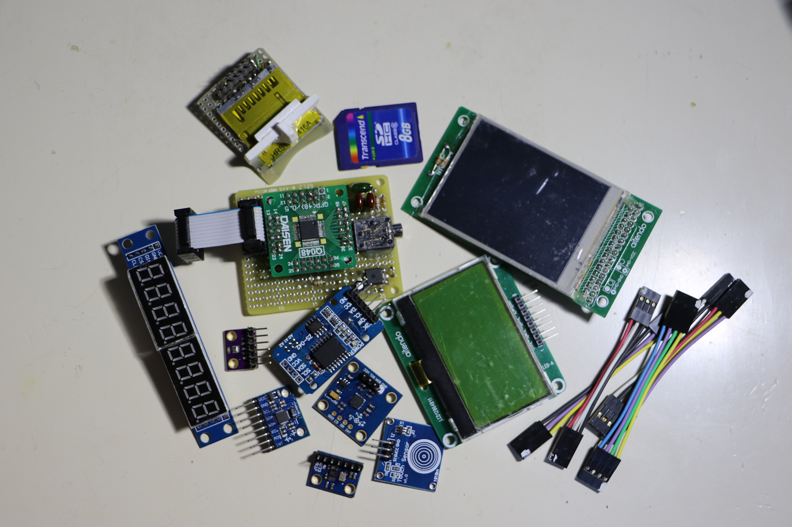
- BMP180   
  BOSCH   
  digital barometric pressure sensor   
  Interface: I2C   
   
- BMP280   
  BOSCH   
  digital barometric pressure sensor   
  Interface: I2C   
   
- DS1371   
  Maxim Integrated   
  内部バイナリー、I²Cリアルタイムクロック(RTC)    
  Interface: I2C   
   
- DS3231   
  Maxim Integrated   
  超高精度I²Cリアルタイムクロック(RTC)    
  超高精度I²C内蔵RTC/TCXO/水晶    
  Interface: I2C   
   
- EEPROM   
  各社   
  I2C EEPROM   
  I2C EEPROM（１byte、２byte address）   
  Interface: I2C   
   
- EUI_XX   
  Microchip   
  2K SPI Bus Serial EEPROMs with EUI-48 or EUI-64 Node Identity   
  25AA02E48/25AA02E64   
  Interface: SPI   
   
- LTC2348_16   
  LINEAR TECHNOLOGY   
  Octal, 16-Bit, 200ksps Differential +-10.24V Input SoftSpan ADC   
  Interface: wide SPI   
   
- MAX7219   
  Maxim Integrated   
  SPI, 8 Digits LED Driver   
  Interface: SPI   
   
- MPU6050   
  InvenSense   
  Digital Motion Processor   
  Interface: I2C   
   
- NTCTH   
  muRata   
  NTC サーミスタ   
  Interface: Analog   
   
- SH1106   
  SINO WEALTH   
  132x64 Dot Matrix OLED/PLED Segment/Common Driver with Controller   
  Interface: SPI   
   
- SSD1306   
  SOLOMON SYSTECH   
  128 x 64 Dot Matrix OLED/PLED Segment/Common Driver with Controller   
  Interface: SPI   
   
- ST7565：（ST7565R）、（ST7567）   
  Sitronix   
  65 x 132 Dot Matrix LCD Controller/Driver   
  RAM capacity : 65 x 132 = 8580 bits   
  Interface: SPI   
   
- UC1701   
  ULTRA CHIP   
  Single-Chip, Ultra-Low Power 65COM by 132SEG Passive Matrix LCD Controller-Driver   
  Interface: SPI   
   
- VS1063   
  VLSI Solution   
  MP3 / OGG VORBIS ENCODER AND AUDIO CODEC   
  Interface: SPI   
   
- phy_base   
  Ethernet default PHY device   
  LAN8720(A) 10/100M (Microchip)   
  DP83822 10/100M (Texas Instruments) for option   
  KSZ8041NL 10/100M (MICREL) for option   
  Interface: PHY   
   
- VL53L0X   
  STMicroelectronics   
  World smallest Time-of-Flight (ToF) ranging sensor   
  Interface: I2C   
   
- AD9833   
  ANALOG DEVICES   
  Programmable Waveform Generator   
  Interface: SPI   
   
- FT5206
  FocalTech   
  Capacitive Touch Panel Controller   
  Interface: I2C   
   
- R61505V/W
  Renesas SP
  TFT Display Controller Driver (262,144-color, 240RGB x 320-dot)
  Interface: BUS-8(/CS,/RD,/WR), BUS-16(/CS,/RD,/WR),SPI(/CS,MOSI,MISO,CLK)
   
1. 更新は常に続けており、それに伴い、サポートデバイスが追加されています。   
2. Ｒ８Ｃ、ＲＬ７８でも共通で使えるように配慮しています。（一部、ＲＸ専用もある）   
   
### **主なデバイスドライバー：**   
- シリアルコミュニケーションインタフェースドライバー（ＳＣＩ）   
  sci_io.hpp   
- シリアルコミュニケーションインタフェース簡易Ｉ２Ｃドライバー（ＳＣＩ）   
  sci_i2c_io.hpp   
- コンペアマッチタイマドライバー（ＣＭＴ）   
  cmt_io.hpp   
- I 2 C バスインタフェースドライバー（RIIC）   
  iica_io.hpp   
- シリアルペリフェラルインタフェースドライバー（RSPI）   
  rspi_io.hpp   
- 16 ビットタイマパルスユニットドライバー（TPU）   
  tpu_io.hpp   
- マルチファンクションタイマパルスユニットドライバー（MTU3）   
  mtu_io.hpp   
- 内臓データフラッシュ操作ドライバー
  flash_man.hpp   
- A/D コンバータドライバー   
  adc_in.hpp   
- D/A コンバータードライバー   
  dac_out.hpp   
- DMA コントローラマネージャー（DMACA）   
  dmac_mgr.hpp   
- リアルタイムクロックドライバー（RTC）   
  rtc_io.hpp   
   
### **ファイルシステム制御：**   
- FatFs によるファイルシステムを導入しており、ＳＤカードなどを利用したファイルシステムを扱う事が出来ます。   
- ＳＤカードの自動マウントをサポートする仕組みがあります。   
- POSIX のファイル関数をサポートしており、Ｃ、Ｃ＋＋のファイル操作関数が使えます。   
1. Ｃ＋＋の「iostream」を使う事も出来ますが、メモリを多く消費する為、エコクラスを用意してあります。   
2. fopen、fread、fwrite、fseek、fclose が使えます。   
   ※内部で、キャッシュの機構があります。   
- UTF-8、ShiftJIS の相互変換。   
※FatFs にある、ShiftJIS、UTF-8 の変換ライブラリを利用します。   
- ディレクトリーのリストや、カレントディレクトリー、ファイルパス操作などをサポートします。   
   
### **サポート関数、クラス：**   
- マイクロ秒、ミリ秒の時間遅延   
  ※あまり正確ではありませんが一応使えます。   
- サウンドバッファ制御   
  ※効果音を鳴らす為のバッファ制御など   
- グラフィックス   
  ※ソフトウェアーによる色々な描画をサポートしています。   
  ※ＲＸ６５Ｎに内臓の描画エンジン（ＤＲＷ２Ｄ）をサポートしています。   
- 座標テンプレートパッケージ   
  ※二次元、三次元、四次元座標をパックするテンプレートクラスをサポートしています。   
- 固定配列のテンプレートコンテナクラス   
  Ｃ＋＋ではＳＴＬコンテナを使う事で様々な場合に対応できますが、基本的に記憶割り当てを使うので、組み込みマイコンに向かない場合があります。   
  ※将来的には、ＳＴＬのコンテナを使い、独自のアロケーターを実装する方向に進むものと思いますが、8/16 ビットマイコンでは、それなりに重宝します。   
  そこで、固定容量のコンテナをいくつか用意してあります。   
- 文字列整形表示（format.hpp）   
  Ｃ＋＋では、欠陥がある printf を使いません、その代わりに、安全な文字列整形を用意してあります。   
- 文字列変換入力（input.hpp）   
  Ｃ＋＋では、printf 同様、scanf 系の関数を使いません、その代わりに、安全な文字列変換入力を用意してあります。   
   
他にも様々なクラスを用意してあります。   
   
### **Makefile だけを使ったプロジェクト管理：**   
   
このフレームワークでは、プロジェクトを管理する手法として「Makefile」を使っています。   
   
それで全てをコントロールしています。   
※限定されたカスタマイズなら簡単です。   
   
設定が必要なのは～   
- ターゲットの名前   
  プロジェクトで最終的に出来る実行ファイル名   
- ソースファイル名   
  Ｃ、Ｃ＋＋、アセンブラのソースファイル名を設定します。   
- 必要なら各種パス   
  ※インクルードパス、ライブラリーパスなど   
- 必要ならライブラリ名   
  ※リンクしているライブラリ名   
   
ツールで、色々な設定などや中間ファイルなどを設定しなくても、Makefile を編集すれば、簡単にプロジェクトのビルドが完結します。   
必要な中間ファイルや、事前に準備が必要な情報は、make の過程で自動的に作成されます。   
ターミナルから、
```
    make
```
と打つだけです。   
   
全く別のディレクトリーツリーで自分のプロジェクトを管理する場合、以下のディレクトリーをコピーします。   
1. /chip
2. /common
3. /ff12b
4. /graphics
5. /RX24T
6. /RX64M
7. /RX65x
8. /RX66T
9. /RX71M
10. /RX600
11. /sound
   
- RX24T、RX64M、RX65x、RX71M は、デバイス固有の物で、自分が使うデバイスだけコピーすれば良い。   
- ff12b、graphics、sound、も同様に、使わなければ必要ない。   
   
### **サンプルプログラム：**
- FIRST_sample   
  ＬＥＤ点滅   
- SCI_sample   
  ＳＣＩを使って通信するサンプル   
- RAYTRACER_sample   
  レイトレーシングでレンダリングするサンプル（カラー液晶を接続する必要がある）   
  
他にも色々なサンプルが用意してあります、ディレクトリーを参照下さい。   
※今後、より豊富にし、より良い物に改修していきます。
   
### **どうしてもＣ＋＋を使いたくない：**
   
「Ｃ＋＋を理解するのはハードルが高く、慣れたＣから使いたい」と言う人がいます。   
※Ａｒｄｕｉｎｏを使っているくらいなのに奇妙な話ではありますが・・・   
Ｃがそこそこ出来て、Ｃ＋＋が全く理解出来ない人は現実的にはありえないので、拡張子を「.cpp」として、Ｃ言語で実装するか、Ｃ言語から呼べるような仕組みを入れるだけです。   
```
    extern "C" {
        void init_hard(void)
        {
            ...
        }
    }
```
上記のように、Ｃから呼ぶ前提で、「main.cpp」などに関数を設けておけば、リンクしたＣ言語ソースから「init_hard」を呼ぶ事が出来ます。   
   
そのうち、Ｃ、Ｃ＋＋の違いは気にならなくなり、Ｃ＋＋で統一するようになります。   
どうしても判らない事があれば質問すれば良いと思います。   
   
---
## Ｃ＋＋に対する誤解と偏見
   
Ｃ言語を常用する開発者に多いのですが、Ｃ＋＋に対する「誤解」が非常に多い事に驚きます。   
※自分もＣ＋＋を始めた頃、「ネガティブ」な感覚を持っていました。   
   
- メモリーを多く消費する   
  ※そんな事は全くありません   
- Ｃで作った方が高速に動作する   
  ※全くの間違いです   
- アセンブラに近いＣ言語の方が最適化に有利   
  ※殆どの場合、Ｃ＋＋で「適切」に実装した方が最適化が巧妙に適用され、高速に動作します   
  ※典型的なのはソートのプログラムです、信じられないほどＣ＋＋の方が高速なコードになります。   
  ※オブジェクトをハンドリングするのに、ポインターより、イテレーターを使った方が最適化に有利です。   
- 少メモリでは動作しない   
  ※基本的に間違い   
- 記憶割り当てが必要   
  ※基本的に間違い   
- メモリーリークしやすい   
  ※基本的に間違い   
   
### **Ｃ＋＋言語習得について**   
   
Ｃ＋＋はＣ言語に文法が共通する部分も多いのですが、全く異なった言語です、Ｃ＋＋を正しく習得しない限り、Ｃ＋＋の良さは判りません。   
ただ、Ｃ＋＋の習得にはそれなりに長い時間がかかる事を覚悟する必要はあります。   
※自分は、理解力が速い方では無いので、今思い返してみると、「ゆるゆる」と習得した事もあり、まともになるまで３年くらいはかかっています。   
Ｃ言語がある程度扱えるのであれば、少しづつ、Ｃ＋＋の守備範囲を広げていけば良い訳で、あまり大きな問題はありません。   
   
ＡｒｄｕｉｎｏのベースはＣ＋＋ですが、仕様をある程度制限する事で、Ｃ言語ユーザーの多くに受け入れられています。   
それからすると、Ａｒｄｕｉｎｏが扱える人は、純粋なＣ＋＋でも大きなハードルにはならないと思えます。   
※Ａｒｄｕｉｎｏの仕様は絶妙なのかもしれません。   
   
Ｃ＋＋は難しい部分があるので、独学で学ぶ（個人の能力もあります）には限界があり、勉強会（非常に盛んに開かれています）などで、より多くを学んだ先人に Tips を学ぶ事で大きな成果を得られます。   
大抵は難しい事を積極的に使わなくても何とかなります。   
   
適切なサンプルがあれば、それをベースに、自分で考えて、改修、改良、実験する事で、学べます。   
※「適切なサンプル」は、以外と少なく、難しいところではありますが、探して、自分に「合う」物を探せばよいでしょう。   
   
また、環境があれば、識者にコードレビューしてもらう事で、正しい道に矯正してもらえます。   
   
ＰＣ上では、フリーでＣ＋＋を使う環境は色々選べます、それらを使って学習する事も出来ます。   
   
---
## 黒歴史「Embedded C++」
   

   
Ｃ＋＋を理解していない人が策定したものとしか思えない、陳腐な物になっています。   
   
Ｃ＋＋から削減された機能   
   
 - テンプレート
 - 例外処理
 - 実行時型情報
 - 多重継承
 - 名前空間
 - ワイド文字ライブラリ
 - 新しい型変換の演算子（const_cast, dynamic_cast, reinterpret_cast, static_cast）
 - mutable（const修飾の付いたオブジェクトのメンバ変数を変更可能にする）

面白いのは、「特徴」としてあげてある「仕様」は、全てと言って良いほど、「短所」でしかありません。   
※これではＣ＋＋とは呼べず、Ｃ＋－が妥当なとこでしょうｗ。
   
当時、Ｃ＋＋コンパイラを実装するにはハードルが高く、これを少しでも緩和する目的があったと思いますが、これは、末端の開発者には関係ない事柄と思います。   
   
よく考えられ、設計されたコードは、再利用しやすく、柔軟です。   
それが、このような「ＣでもＣ＋＋でも無い」が出てきてしまうと、ソースコードを共有する事は出来ないし、メリットが全くありません。   
そもそもＣ＋＋に備わっている機能を使わずに、柔軟で再利用しやすいソースコードは作るのは困難です。   
   
多かれ少なかれ、Ｃ＋＋をディスっているＣ言語信奉者は、Ｃ＋＋の事を良く知らないか、一知半解な事が多く、多くを学びません。   
これが、その最たる例です。   
Ｃ＋＋の学生には、最大の「反面教師」とする事が出来るでしょうか？   
   
---
## 開発環境を整える
   
開発のスタイルは、色々な状況により変化するものと思いますが、現在、行っていて便利と思われる開発スタイルを紹介します。   
1.  基本、コンソールベースでの開発を行うものとする。   
2.  gcc g++, make, git などのコマンドを利用する。   
3.  Visual Studio Code を使ってソースコードを作成する。   
    ※自分好みのテキストエディターでも良い。   
   
以上の点について順番に説明していきます。   
   
1. コンソール（シェル）からコマンドを入力するのに抵抗があるかもしれませんが「慣れ」です、コマンドはショートカットと同じで、インストールされているコマンドを全て実行する事が出来ます。   
ファイルの操作も行え、多くの中から特定のファイルを探したり、多くのファイル中の条件にあったファイルを操作するのも簡潔に行えます。   
Linux や、Mac では、コンソールは標準なので、Windows の場合を説明します。   
Windows10 になって、Linux のコマンドラインが使えるようになったのですが、まだ調査や実験が遅れており、Windows7 のサポートが終了するまでは、MSYS2 環境を優先します。   

2. コンパイラは「gcc g++」を使うのですが、プロジェクトをコントロールするのは「Makefile」で、「make」コマンドです。   
Makefile の記述は難解で複雑ですが、既に用意されたベースとなる物をコピーして、自分のプロジェクトで固有な部分を修正すれば大丈夫です、ある程度機能や構造が判ってくれば、機能を追加する事も可能です。   
Makefile を自動で生成する為に cmake コマンドのような物もありますが、生成の為の設定ファイルを作り、生成、と手順を踏む必要があり、これは、コードジェネレーターと同じ問題を持っています。   
Makefile の構造は複雑ですが、ベースとなる下敷きが良く精査されて作られていれば、自分用のカスタマイズも少なく、必要十分です。   

3. Visual Studio Code はオープンソースで開発されており、マルチプラットホームで、コードを書くテキストエディターの中では、極めて優秀で柔軟と思います。   
※気に入らない人は、自分が好きなテキストエディターを使えばよく、無理に使う必要はありません、ただ、インテリセンスなどの機能は便利で時間短縮にもなります、間違いも少なくなるので、試してみる事を薦めます。   
使いやすくするには多少の設定が必要です、また、内部的な動作のポリシーを理解する必要があります。   
設定の方法は WEB 上に沢山解説がありますので、参考にすると良いでしょう。   
ソース管理は「git」を使いましょう、使い方はネットに沢山あります。   
   
---
## VSCode でお勧めの設定   
VSCode では、「拡張機能」のインストールは、アプリケーションと一体になっていて、簡単にインストールしたり、アンインストールしたり出来ます。   
※マルチプラットホームで使える。   
   
- Japanese Language Pack for Visual Studio Code (Microsoft)   
  流石本家の日本語パッケージです。   
- C/C++ for Visual Studio Code (Microsoft)   
  gcc のインクルードパスの設定が必要ですが、後で説明します。   
- Emacs Friendly Keymap   
  Emacs を使っている人向けです、キーのバインドは標準的な物ですが、異なっている部分もあります、Help で確認下さい。   
  
### **VSCode 付属ターミナルの設定。**
   
ターミナル機能は、コマンドライン入力に対応するものです。   
通常、Windows の標準コンソールが開くので、MSYS2 の bash が起動するように設定します。   
「settings.json」ファイルを直接編集します。   
```
{
    "git.ignoreLegacyWarning": true,
    "git.autoRepositoryDetection": "subFolders",
    "C_Cpp.default.compilerPath": "c:\\msys64\\mingw64\\bin\\clang.exe",
    "C_Cpp.default.cppStandard": "c++14",
    "C_Cpp.default.cStandard": "c99",
    "C_Cpp.default.intelliSenseMode": "gcc-x64",
    "C_Cpp.intelliSenseEngineFallback": "Disabled",
    "files.autoSave": "afterDelay",
    // MSYS2 bash のパスと、起動設定
    "terminal.integrated.shell.windows": "C:\\msys64\\usr\\bin\\bash.exe",
    "terminal.integrated.env.windows": {
        "MSYSTEM": "MINGW64",
        "CHERE_INVOKING": "1"
    },
    "terminal.integrated.shellArgs.windows": [
        "--login"
    ],
    "terminal.integrated.cursorStyle": "line",
    "editor.renderWhitespace": "all"
}
```
上記、「terminal」キーワードの部分ですが、一応全体を載せておきます。   
   
---
## ＲＸマイコン用 gcc をビルドする
   
   
   
### ＲＸ開発環境準備（Windows、MSYS2）
   
 - Windows では、事前に MSYS2 環境をインストールしておきます。
 - MSYS2 をインストールすると、msys2、mingw32、mingw64 と３つの異なった環境がありますが、RX マイコン用 gcc の構築を行う必要があるので、msys2 で行います。   

※MSYS2 は UNIX 系アプリの開発環境。
※MINGW32 は gcc の例外モデルが Borland 特許の関係で SEH ではなく dwarf な i686 向け環境。   
※MINGW64 は Windows 系アプリケーション開発の環境。   
   
 - msys2 のアップグレード

```
   pacman -Sy pacman
   pacman -Syu
```

 - コンソールを開きなおす。（コンソールを開きなおすように、メッセージが表示されるはずです）

```
   pacman -Su
```
 - アップデートは、複数回行われ、その際、コンソールの指示に従う事。
 - ※複数回、コンソールを開きなおす必要がある。
 - gcc、texinfo、gmp、mpfr、mpc、diffutils、automake、zlib、tar、make、unzip、git コマンドなどをインストール
```
   pacman -S gcc
   pacman -S texinfo
   pacman -S mpc-devel
   pacman -S diffutils
   pacman -S automake
   pacman -S zlib
   pacman -S tar
   pacman -S make
   pacman -S unzip
   pacman -S zlib-devel
   pacman -S git
```
   
---
### ＲＸ開発環境準備（OS-X）

 - OS-X では、事前に macports をインストールしておきます。（brew は柔軟性が低いのでお勧めしません）
 - OS−X のバージョンによっては、事前に X−Code、Command Line Tools などのインストールが必要になるかもしれません）

 - macports のアップグレード

```
   sudo port -d self update
```

 - ご存知とは思いますが、OS−X では初期段階では、gcc の呼び出しで llvm が起動するようになっています。
 - しかしながら、現状では llvm では、gcc のクロスコンパイラをビルドする事は出来ません。
 - そこで、macports で gcc をインストールします、バージョンは５系を使う事とします。
```
   sudo port install gcc5
   sudo ln -sf /opt/local/bin/gcc-mp-5  /usr/local/bin/gcc
   sudo ln -sf /opt/local/bin/g++-mp-5  /usr/local/bin/g++
   sudo ln -sf /opt/local/bin/g++-mp-5  /usr/local/bin/c++
```
 - 再起動が必要かもしれません。
 - 一応、確認してみて下さい。
```
   gcc --version
```
   
```
   gcc (MacPorts gcc5 5.4.0_0) 5.4.0
   Copyright (C) 2015 Free Software Foundation, Inc.
   This is free software; see the source for copying conditions.  There is NO
   warranty; not even for MERCHANTABILITY or FITNESS FOR A PARTICULAR PURPOSE.
```
   
 - texinfo、gmp、mpfr、mpc、diffutils、automake コマンドなどをインストール
```
   sudo port install texinfo
   sudo port install gmp
   sudo port install mpfr
   sudo port install libmpc
   sudo port install diffutils
   sudo port install automake
```

---
### ＲＸ開発環境準備（Ubuntu）

Linux 環境は、複数あるので、ここでは「Ubuntu 16.04 LTS」環境の場合を書いておきます。

 - texinfo、gmp、mpfr、mpc、diffutils、automake コマンドなどをインストール
```
   sudo apt-get install texinfo
   sudo apt-get install libgmp-dev
   sudo apt-get install libmpfr-dev
   sudo apt-get install libmpc-dev
   sudo apt-get install diffutils
   sudo apt-get install automake
   sudo apt-get install zlib1g-dev
```

---
### ＲＸ開発環境構築

 - RX 用コンパイラは gcc-6.4.0 を使います。   
 - binutils-2.30.tar.gz をダウンロードしておく。   
 - gcc-6.4.0.tar.gz をダウンロードしておく。   
 - newlib-2.4.0.tar.gz をダウンロードしておく。   
 - binutils, gcc, newlib には複数のバージョンがありますが、組み合わせによっては   
   不適格なバイナリー（微妙に動作に問題がある）がビルドされる事が判っています。   
 - この不具合は、ルネサスのネットワークスタック（net_T4）を使った場合に起こります。
 - 何故そのような動作不良を起こすのかは、原因を特定出来ていません。   
 - 現状で調査した組み合わせを列挙しておきます。   
```
   binutils-2.27, gcc-4.9.4, newlib-2.2.0 ---> OK
   binutils-2.27, gcc-5.5.0, newlib-2.2.0 ---> OK
   binutils-2.27, gcc-5.5.0, newlib-2.4.0 ---> OK
   binutils-2.27, gcc-6.4.0, newlib-2.4.0 ---> OK
   binutils-2.28, gcc-6.4.0, newlib-2.4.0 ---> OK
   binutils-2.30, gcc-6.4.0, newlib-2.4.0 ---> OK (current)
   binutils-2.30, gcc-6.4.0, newlib-3.0.0 ---> NG 
```
 - 最新の gcc を使った方が最適化に有利で、より高速なコードになるようで、C++ の場合に特に効果が大きいです。   
   
---
   
### binutils-2.30 をビルド
```
   cd
   tar xfvz binutils-2.30.tar.gz
   cd binutils-2.30
   mkdir rx_build
   cd rx_build
   ../configure --target=rx-elf --prefix=/usr/local/rx-elf --disable-nls
   make
   make install     OS-X,Linux: (sudo make install)
```

 -  /usr/local/rx-elf/bin へパスを通す（.bash_profile を編集して、パスを追加）

```
   PATH=$PATH:/usr/local/rx-elf/bin
```

 -  コンソールを開きなおす。

```
   rx-elf-as --version
```

 -  アセンブラコマンドを実行してみて、パスが有効か確かめる。
  
### C コンパイラをビルド
```
    cd
    tar xfvz gcc-6.4.0.tar.gz
    cd gcc-6.4.0
    mkdir rx_build
	cd rx_build
    ../configure --prefix=/usr/local/rx-elf --target=rx-elf --enable-languages=c --disable-libssp --with-newlib --disable-nls --disable-threads --disable-libgomp --disable-libmudflap --disable-libstdcxx-pch --disable-multilib --enable-lto
    make
    make install     OS-X,Linux: (sudo make install)
```
  
### newlib をビルド
```
    cd
    tar xfvz newlib-2.4.0.tar.gz
	cd newlib-2.4.0
    mkdir rx_build
    cd rx_build
    ../configure --target=rx-elf --prefix=/usr/local/rx-elf
	make
    make install     OS-X: (sudo make install)
```
 - Linux 環境では、sudo コマンドで、ローカルで設定した binutils のパスを認識しないので、
「make install」が失敗します、その為、以下のようなスクリプトを書いて実行します。
```
#!/bin/sh
# file: rx_install.sh

PATH=${PATH}:/usr/local/rx-elf/bin
make install
```
   
```
    sudo rx_install.sh
```
   
---
     
### C++ コンパイラをビルド
```
    cd
    cd gcc-6.4.0
    cd rx_build
    ../configure --prefix=/usr/local/rx-elf --target=rx-elf --enable-languages=c,c++ --disable-libssp --with-newlib --disable-nls --disable-threads --disable-libgomp --disable-libmudflap --disable-libstdcxx-pch --disable-multilib --enable-lto --with-system-zlib
    make
    make install     OS-X,Linux: (sudo make install)
```
   
---
   
 - ビルドしたコンパイラーコレクションを以下のリンクに上げてあります。（MSYS2 のみ）   
http://www.rvf-rc45.net/Renesas_GNU_Tools/ 
   
---
   
### ＲＸマイコンＣ＋＋フレームワークの取得
   
一般的に、クローンなどの作業はホームディレクトリー上で行うのが普通です。   
しかし、最近はＯＳをＳＳＤ上に置いていて、容量が大きい作業は、ＨＤＤ上で行う場合が多くなりました。   
※コンパイルなどはＳＳＤの方が断然高速ですが・・・
MSYS2 をインストールすると、ホームディレクトリーは、Ｃドライブに置かれます、通常ＣドライブはＳＳＤなどにする場合が多く、別のディレクトリー上で行う方が利便性が多いと感じています。   
※これはドライブレターがある Windows 環境に限った話です。   
その為、自分の環境では、Ｄドライブに「Git」ディレクトリーを作成して、その下にクローンしています。   
```
    git clone git://github.com/hirakuni45/RX.git
```
   
---
### ＲＸマイコンＣ＋＋フレームワークが利用している boost のインストール
   
最近は、ＲＸマイコンの開発でも「boost」を使う事が普通になっています。   
boost は、コンパイルが必要なライブラリもありますが、ヘッダーをインクルードするだけで使えるものもあります。   
※現状、ＲＸマイコンでは、boost でライブラリが必要なものは利用していません。   
MSYS2 では、パッケージマネージャーでインストール可能なので、MSYS2 のパッケージマネージャーでインストールするのが簡単です。   
※かなり巨大なのでそれなりの時間がかかります。   
```
    pacman -S mingw-w64-x86_64-boost
```
   
---
### ＲＸマイコンＣ＋＋フレームワーク、全プロジェクトのビルド
   
このシェルスクリプトは、ディレクトリをスキャンして「Makefile」があるディレクトリを見つけると「make」コマンドを発行するものです。   
※現在、二階層までスキャンするようになっています。   
※また、ＲＸ６５系プロジェクトのビルドに際して、ＤＲＷ２Ｄエンジンライブラリの作成が必要なので、優先して最初にビルドするようにしています。   
```
    sh all_project_build.sh
```
全プロジェクトをクリーンする場合は、以下のようにします。   
```
    sh all_project_build.sh clean
```
※コンパイルエラーが出て、先に進まない場合は「Makefile」を「Makefile_」のようにリネームすれば、そのディレクトリーのプロジェクトは無視されます。   
   
---
## ＲＸマイコン、フラッシュプログラミングツール
   
ＲＸマイコンの内臓プログラムメモリーの書き換えは、ルネサス純正ツール「Renesas Flash Programmer V3.x.x」で行えますが、マルチぷラットホーム対応のプログラミングツールを用意してあります。   
**Windows、Mac、Linux に対応しています。**   
   
一般的には、ルネサス純正ツール（Ｅ１、Ｅ２、Ｅ２Ｌｉｔｅなど）を使い、J-TAG 経由で書き込みますが、これらのツールはそれなりに高価です。   
また、Windows のみサポートです、ただ、ルネサスＩＤＥとの連携で強力なデバッグ機能も有しています。   
※それには、ルネサスＩＤＥでの開発が前提です・・   
   
ＲＸマイコン始めての方は、何らかのＲＸマイコンボードを購入すると思います、その場合、通常、J-TAG 端子が用意されており、ルネサス純正ツールでの利用を前提にしていますので、この説明は不要と思いますが、どのような方法で書き換えるのかを説明しておきます。   
   
ＲＸマイコンには、「MD」端子があり、この端子を［Low」にしてリセットすると、フラッシュ書き換えモードになり、シリアルポート、又は、ＵＳＢから、フラッシュ書き換えコマンドを受け付けます。   
この機能を利用して安価に内蔵フラッシュメモリーを書き換えるツールを用意してあります。   
ユーザー側で用意するのは、ＰＣでシリアル通信を行うハードウェアーです。（通常ＵＳＢシリアルインターフェース）   
   
ＵＳＢシリアルインターフェースは色々な物が販売されていますが以下の製品を一例としてあげておきます。   
「秋月電子」、「ＦＴ２３４Ｘ　超小型ＵＳＢシリアル変換モジュール」（￥６００）   
   
マイコンとの接続方法は、ハードウェアーマニュアルの「フラッシュメモリ」、「ブートモード」に詳しく書かれています。   
   
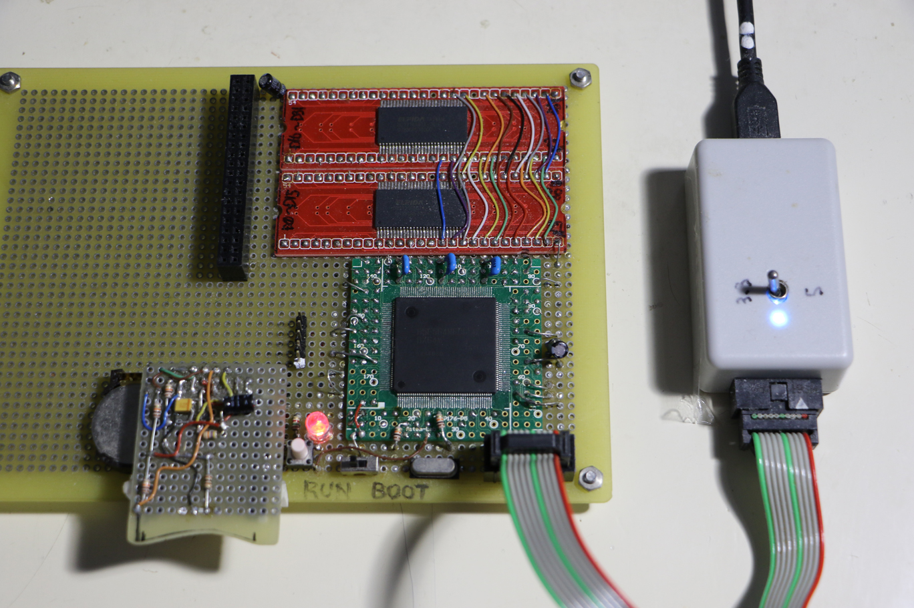
   
※ＲＵＮ／ＢＯＯＴスイッチで「ＭＤ」端子を切り替える。
   
ＲＸ６４Ｍ、ＲＸ７１Ｍの場合   
   
|ポート|状態|
|--------------------------------|-------------------------------------------------|
|MD|Low|
|PC7/UB|Low（ USB とシリアルインターフェースの切り替え）|
|PF2/RXD1（177/176ピン版）|PC Serial TXD|
|P30/RXD1（145/144/100ピン版）|PC Serial TXD|
|PF0/TXD1（177/176ピン版）|PC Serial RXD|
|P26/TXD1（145/144/100ピン版）|PC Serial RXD|
|GND|PC Serial GND|
   
ＰＣ側のシリアルインターフェース（ＵＳＢシリアルなど）との接続では、信号レベルに注意して下さい。   
**必ず「３．３Ｖ」のレベルで接続する必要があります。**   
上記製品では直接接続できると思いますが、説明書を良く確認して下さい。   
**TXD->RXD、RXD->TXD と互い接続なので注意して下さい。**
   
**ＲＸマイコンの電源をＵＳＢからとる場合は、５Ｖ－＞３．３Ｖのレギュレーターが必ず必要です。**   
**ＵＳＢシリアルチップには３．３Ｖのレギュレーターを内臓している場合がありますが、小さな電流しか流せません。**   
   
「ＲＸ全プロジェクトのビルド」が成功していれば、rxprog ディレクトリーに書き込みプログラム「rx_prog.exe」がビルドされています。   
rx_prog.exe には、設定ファイル「rx_prog.conf」があり、このファイルに、シリアルポートなどを設定しておけます。   
rx_prog.exe、rx_prog.conf を、パスが通ったディレクトリーにコピーしておきます。   
```
    make install
```
とすれば、rx_prog コマンドと設定ファイルが、/usr/local/bin へコピーされます。   
※MSYS2 のホームディレクトリーにある隠しファイル、「.bash_profile」の最後に、以下の行を追加しておきます。   
```
    PATH=/usr/local/bin:$PATH
```
追加したら、コンソールを再起動すると有効になります。   
   
このプログラムの使い方を簡単に説明しておきます。   
   
 - ＲＸマイコンの「ＭＤ、ＵＢ」端子のロジックレベルを適切に設定します。   
 - ＲＸマイコンとＵＳＢシリアルを接続します。   
 - ＵＳＢシリアルをＰＣと接続します。   
 - ＰＣのデバイスマネージャーで、ＵＳＢシリアルのポートを確認して、ポート番号をメモしておきます。   
 - ＲＸマイコンに書き込むプログラムを用意します。   
 - ＲＸマイコンの電源を入れ、リセットします。   
 - MSYS2 のコンソールから、以下のようにコマンドを入力します。   
```
rx_prog -P COM20 -d RX64M --progress --write --verify test_sample.mot
```
※ポート番号が COM20、書き込むプログラムが test_sample.mot の場合。
   
接続が正常なら、プログレスバーが表示され、プログラムが書き込めます。   
「ＭＤ」端子を「High」にして、リセットすれば、書き込んだプログラムが走ります。   
   
### Tips:
   
rx_prog.conf には、プラットホーム毎に異なるシリアルポートやボーレートを設定できるように専用のキーワードが用意されています。   
```
port_win   = COM12
port_osx   = /dev/tty.usbserial-DA00X2QP
port_linux = /dev/ttyUSB0

speed_win = 230400
speed_osx = 230400
speed_linux = 230400
```
   
rx_prog は、未完成です、ID 設定など、実装されていない機能があります。   
現状では、そのような設定が必要なら、ルネサス純正ツールを使って下さい。   
   
---
## 統合開発環境に備わっているコードジェネレーションの功罪
   
通常、ＩＤＥには、プログラミングの手助けを行う機構として、各種デバイスを簡単に扱う為の基本ソースコードを生成する機能が備わっています。   
ただ、コード生成では、マージを正しく行えないので、常に一方向で、ある程度実装したソースコードに追加して使うようなやり方は正常に機能しません。   
   
コード生成が必要なのは、フレームワークやライブラリーの仕様が複雑なので、それを補間する為のもののようですが、そんな事をしなくても、フレームワークやライブラリーの完成度を上げれば解決する問題のように思います。   
この機能が駄目な理由はいくつかありますが、一方向なので、コード生成で出てきたコードを修正した場合や異なった設定でやり直したりすると、修正したコードは通常反映（自動でマージされない）されません。   
   
また、このコード生成を行うコードは公開されておらず、自分で改造する事も出来ません。   
   
そもそも、細かい設定を色々しないと動作しないフレームワークやライブラリを何とかするべきだと思います。   
   
たとえば、シリアルコミュニケーション（SCI）を利用するのに必要な事は何でしょうか？   
1. どの SCI ポートを使うか
2. ボーレート、通信フォーマット
3. 割り込みを使うか、使わないか、使う場合の割り込みレベル
4. バッファリングの方法
   
たったのこれだけです。   
   
Arduino は、マイコンを使って何かを作る場合に、最低限の知識があればやりたい事が出来るように、なるべくシンプルな方法で実装したフレームワークと言えます。   
非常に良く考えられて設計されており、プロトタイピングを少ない手間で実現できます。   
それが、爆発的にヒットした理由の一つでもあります。   
   
ＲＸマイコン C++ フレームワークでは、C++ の機能を利用して、なるべく簡単な設定で、機能するようにしています。   
以下の例は、シリアル通信を行うサンプルを抜き出した物ですが、最低限の設定で使えるようになっています。   
   
シリアルポートの定義：
```
    typedef device::SCI1 SCI_CH;    // SCI1 をシリアルポートとして使う。
    typedef utils::fixed_fifo<char, 512> RXB;  // RX (RECV) バッファの定義（５１２バイト）
    typedef utils::fixed_fifo<char, 256> TXB;  // TX (SEND) バッファの定義（２５６バイト）

    typedef device::sci_io<SCI_CH, RXB, TXB> SCI;   // シリアルドライバーの定義
// SCI ポートの第二候補を選択する場合
//  typedef device::sci_io<SCI_CH, RXB, TXB, device::port_map::option::SECOND> SCI;
    SCI     sci_;   // シリアルドライバーの宣言（実態）
```
シリアルポートの初期化：
```
    {  // SCI の開始
        uint8_t intr = 2;        // 割り込みレベル
        uint32_t baud = 115200;  // ボーレート
        sci_.start(baud, intr);
    }
```
 - ボーレートは自動計算され、内部のデバイダなどのハードウェアーリソースを適切に設定します。   
 - 通信ポートは、上記の例では SCI1 を使っていますが、SCI1 がどのポートなのかは、デバイスの種類により異なり、また、複数のポートに設定できる為、port_map.hpp などで、定義されています。   
 - この例では、通信バッファとして、FIFO を使っていますが、サイズなどを自由に設定可能です。   
 - 通信フォーマットは８ビット１ストップビット、パリティ無しですが、start API の第三引数に設定する事で変更可能です。   
   
※詳しくは、common/sci_io.hpp を参照下さい。   
   
---
## RX65N Envision Kit の利用
   
   
   
RX65N は、速度、機能など、バランスに優れたマイコンです。   
特に、液晶表示に特化したハードウェアーや描画エンジンを持っており、GUI を使ったアプリケーションを実装するのに適しています。   
ルネサス社は、RX65N の販促目的でコストパフォーマンスに優れたガジェットとして、RX65N Envision Kit を発売しました。   
   
 - 静電容量式、マルチタッチ液晶（４８０ｘ２７２ピクセル）搭載   
 - DRW2D 描画エンジン搭載   
 - 12bits D/A 出力２チャンネル
 - 12bits A/D 入力複数チャネル
 - エミュレータ(E2Lite)を標準搭載（Mac、Linux 環境では利用出来ない）   
 - 100bps イーサーネット   
   ※トランス内臓モジュールコネクター、LAN8720A PHY デバイスなど搭載する事で利用可能   
 - SDHC 接続 SD カードインターフェース搭載（SD カードコネクター未実装）
 - 32M バイト、EEPROM 標準搭載
 - USB ホストコネクター標準搭載
   
もう一工夫必要か？
 - 内臓 D/A コンバータの出力が、内臓ＳＷ、JoyPad 入力にアサインされている。   
 ※映像を扱う機器なのだから、オーディオ出力等、もう少し配慮が必要だと思う。   
 ただ、配線を追加して、オペアンプなどを付ければ、十分オーディオとして扱える。   
 ※分解能は１２ビットだが、オーディオ再生でも十分な品質が得られる。   
 - Ethernet PHY は後付すれば利用可能だが、QFN パッケージのハンダ付けは、一般的には無理がある。   
 ※そもそも、LAN8720A のコストは百数十円程度なので、最初から実装しておいてほしい。   
   
色々、要望もありますが、入手しやすく、それなりに安価（￥５４００）で、高機能なので、初めてＲＸマイコンを始めるには良いボードと言えます。   
   
秋月電子（￥５４００）　　　　　　http://akizukidenshi.com/catalog/g/gM-13555/   
チップワンストップ（￥４０５０）　https://www.chip1stop.com/product/detail?partId=RENE-0072480&mpn=RTK5RX65N2C00000BR
   
※残念ですが、Mac や Linux では、内臓エミュレータを利用出来ないので、Windows でのみ利用可能です。   
   
初期段階で、サンプルプログラムが書き込まれていて、ＲＸ６５Ｎのパフォーマンスを確認出来ますが、一通り、遊んだら、早速、サンプルプログラムをロードして動かしてみましょう。   
   
DIY では、ESP32 を搭載した M5Stack の利用が活発です、確かに RX65N Envision Kit には Wifi や Bluetooth はありませんが・・   
- 強力な演算性能
- 大きなメモリ
- より大きなマルチタッチ液晶
- 高速なグラフィックス
- 品質の高い A/D、D/A
   
など比較にならない強みも沢山あります。   
   
※マイクロチップ社の Wifi モジュール（ATWINC1500-MR210）の準備もしています。   
   
より多くの方が、この魅力的なボードに関心を持ち、何か新しいガジェットを作って公開する事を望みます。   
   
---
### Renesas Flash Programmer V3（無償版）のインストールと設定
   
- RX65N Envision Kit の DIP スイッチを切り替えます。   
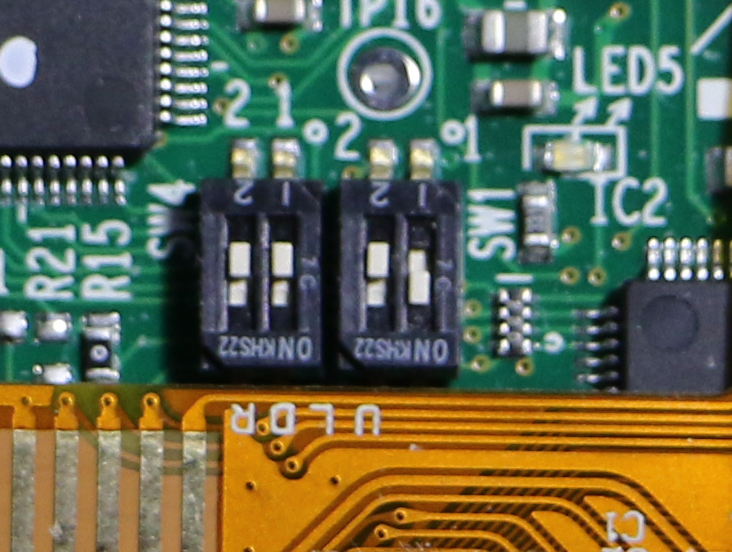   
※ＳＷ１－１を「ＯＮ」側に。   
これで、内部エミュレータが有効になります。   
※単独で動かすには、「ＯＦＦ」にします。   
   
- アプリケーションをダウンロードしてインストールします。   
https://www.renesas.com/jp/ja/software/D4000847.html   
※無償版をダウンロードします。   
- RX65N Envision Kit をＵＳＢ接続します。   
※ＰｎＰで、ドライバーがインストールされます。   
- Flash Programmer V3 を起動します。   
- 「ファイル」->「新しいプロジェクトを作成」を選びます。   
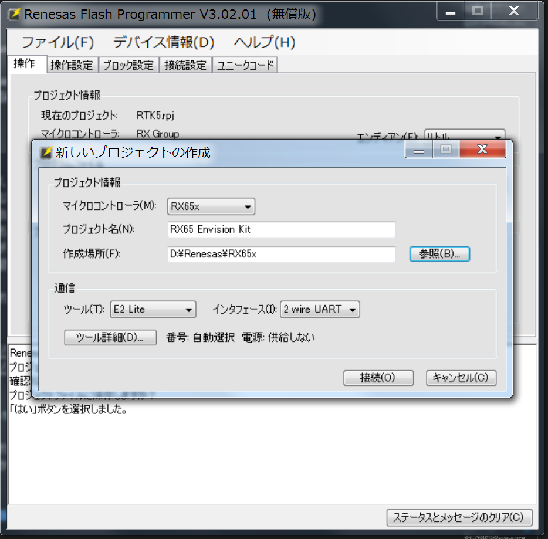   
- 「マイクロコントローラ」で、「ＲＸ６５ｘ」を選択します。   
- 「プロジェクト名」を設定します。
- 「作業場所」を設定します。（「参照」ボタンを押して、適当なフォルダーを選択。）   
- 「ツール」で、「E2 Lite」を選択します。   
- 「ツール詳細」を選択します。   
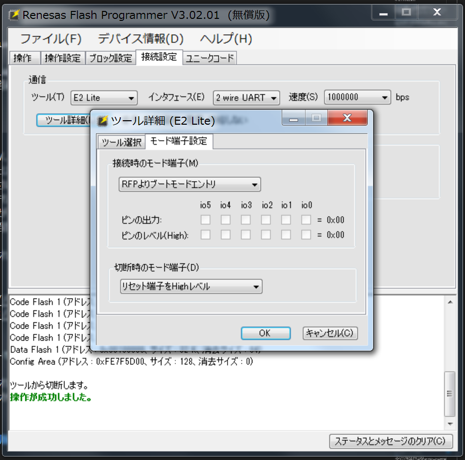   
- 「切断時のモード端子」で、「リセット端子をHighレベル」を選択します。   
※これを選択しないと、プログラムの書き込み後、ターゲットがリセットされたままになります。   
- 「ＯＫ」を押して、「ツール詳細」を終了します。   
- 「接続」ボタンを押して、RX65N Envision Kit と正常に通信出来るか確認します。   
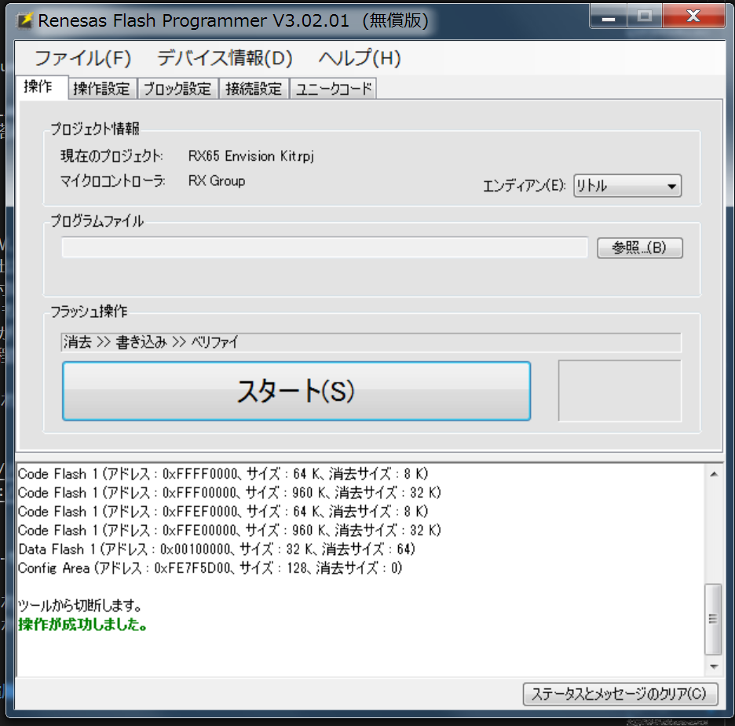   
- 「参照」ボタンを押してプログラムファイルを選択します。   
※「プログラムファイル」は、拡張子が「.mot」のファイルです。   
- 「スタート」を押すと、プログラムが、書き込まれ、起動します。   
   
---
ＲＸマイコン C++ フレームワークでは、RX65N Envision Kit 専用のサンプルプログラムをいくつか用意してあります。   
1. LED 点滅
2. レイトレーシング
3. スペースインベーダー・エミュレーター
4. ファミコン・エミュレーター
5. MP3/WAV オーディオ・プレイヤー
   
### （１）LED 点滅
   
- VSCode を起動します。   
- Terminal を開きます。   
- ディレクトリーを移動して「make」します。   
```
cd FIRST_sample/RX65N
make
```
- コンパイルがエラー無く通れば、「led_sample.mot」が出来ていると思います。   
- 「Flash Programmer V3」を起動します。   
- 「FIRST_sample/RX65N/led_sample.mot」を選択します。   
- 「スタート」ボタンを押して、プログラムを書き込みます。   
- RX65N Envision Kit ボードの裏側にある青色 LED が点滅します。   
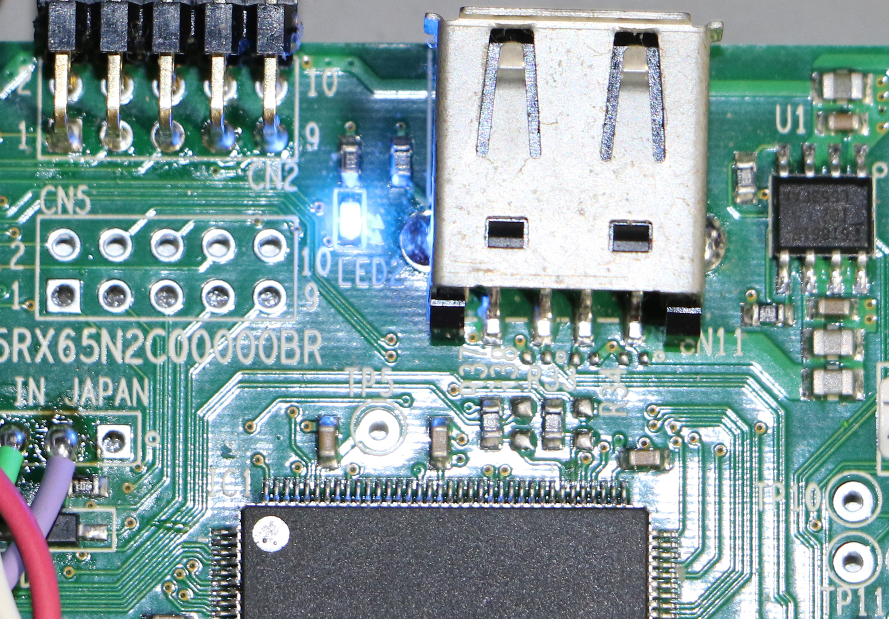   
   
---
### （２）レイトレーシング・サンプル
   
ＲＸマイコンの素晴らしい点の一つが「浮動小数点演算」のスピードです。   
それが、簡単に判るのが、レイトレーシングによるレンダリングです。   
   
- ディレクトリーを移動して「make」します。   
```
cd RTK5_RAYTRACER
make
```
- コンパイルがエラー無く通れば、「raytracer.mot」が出来ていると思います。   
- 「Flash Programmer V3」を起動して、上記ファイルを書き込みます。   
- 起動すると３２０ｘ２４０ピクセルでレンダリングされます。   
  ※左上に、描画時間「ｍｓ」が表示されています。（この場合０．８３４秒）   
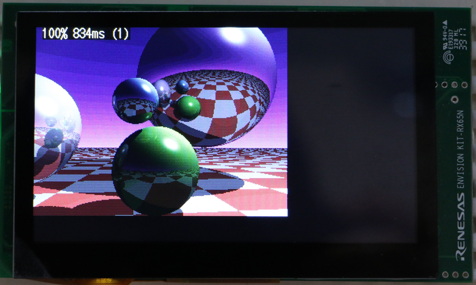   
- ＳＷ２を押す毎に、４８０ｘ２７２ピクセルでレンダリングします。   
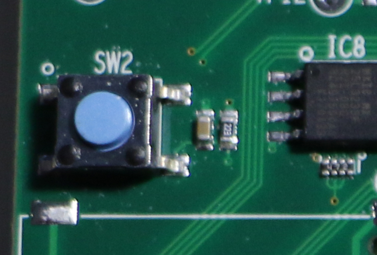   
   
- ＳＷを押す毎に、ピクセルサンプリングを１～４に変更してレンダリングします。   
  ピクセルサンプリングを大きくするとレンダリング品質が向上しますがレンダリング時間は大きくなります。   
- ＬＣＤはＲＧＢ８８８（２４ビット）ですが、インターフェースはＲＧＢ５６５（１６ビット）なので、マッハバンドが出ています。   
- ここで使ったレイトレーシングプログラムは、Arduino などで実績のあるもので、それらとレンダリング時間を比べる事で、ＲＸ６５Ｎのパフォーマンスが判ります。   
  ※詳しくは「RAYTRACE_sample/raytracer.hpp」を参照下さい。   
- 以下に参考程度に各種マイコンで、実行した場合の処理時間を記しておきます。   
  ※ただし、この時間は「ネット」で調べたもので、実際に自分で調査したものではありません。   
  ※ＥＳＰ３２の結果は、遅すぎるので、何か実装に不適切な部分がある可能性があります。   
   
 |  |マイコン      |動作周波数 |時間（ミリ秒）|
 |--|-------------|----------|-------------|
 |  |ESP32        |160MHz    |13000        |
 |  |STM32F4      |72MHz     |52000        |
 |  |STM32F756BGT6|216MHz    |620          |
   
**ＳＴＭ３２Ｆ７が、０．６２秒と、ＲＸ６５Ｎの０．８３秒に比べて高速ですが、クロック周波数は２１６ＭＨｚなので、１２０ＭＨｚのＲＸ６５Ｎは健闘しています。**   
※ＳＴＭ３２Ｆ７は、内部の構成もＲＸ６５Ｎに似ています、クロックが倍近くありますが、ライバルデバイスと言えると思えます。   
※ちなみに、２４０ＭＨｚで動作するＲＸ７１Ｍで計測すると、０．４１秒でした。   
   
---
### RX65N Envision Kit の改造
**少しの改造で、より面白いガジェットとして「使えます」ので、是非改造に挑戦してみて下さい。**   
   
---
### **ＳＤカードコネクターの取り付け**   
   
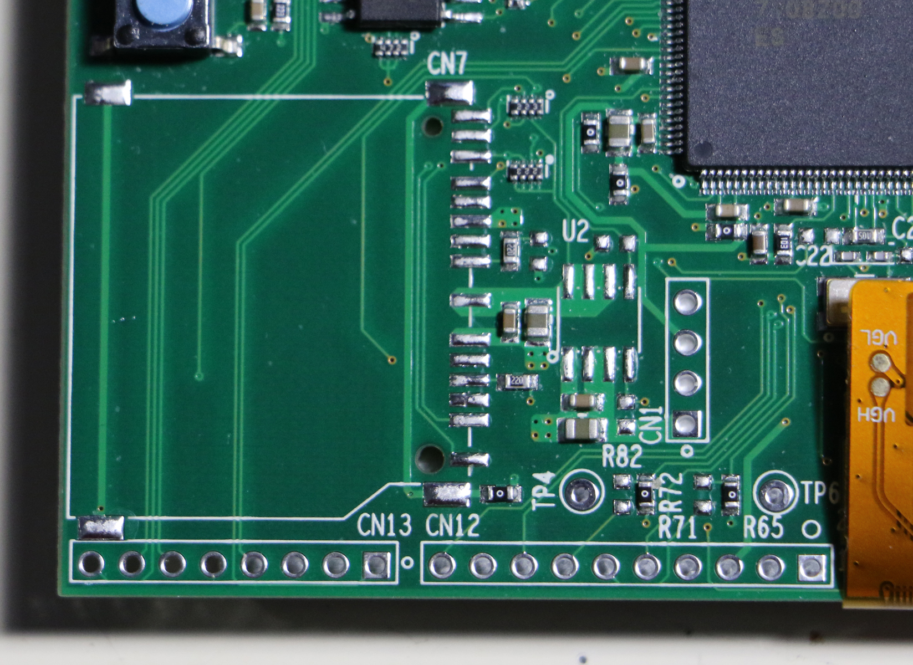   

元々、標準ＳＤカードを使うように設計されていますが、コストの関係で、未実装になっています。   
このコネクターは、「101-00565-64（AMPHENOL COMMERCIAL PRODUCTS製）」ですが、日本では入手が困難です。   
※海外のベンダーから入手できるようですが、現在製造は終了しており、在庫があっても割高です。   
   
そこで、秋月電子で販売している「マイクロＳＤカードスロットＤＩＰ化キット」（３００円）を取り付ける事を提案します。   
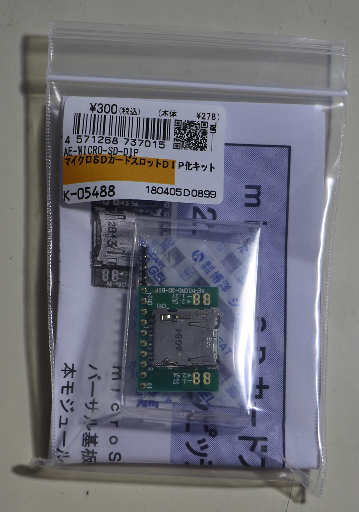   

基板は、薄手の強力両面テープで貼り付けました。（ナイスタッチを使いました。）   
   
結線は、抵抗の余ったリードを使いました。   
最初にＳＤ基板側にリードをハンダ付けして、所定の所までリードを曲げ、適切な長さにカットします。   
最後に、表面実装パッドの上からコテを当てて、リードとパッドを加熱して、少量ハンダを流せば綺麗に付きます。   
面積が大きいパッドは電源系で、熱が拡散してハンダがうまく溶けないので、過熱時間を長くします。   
   
「Ｕ２］には、ＳＤカードの電源を制御できる様に、ＦＥＴによる電源制御も付いていますが、未実装である為、より簡単にする為、とりあえずショートします。   
書き込み禁止ノッチはマイクロＳＤには無いので、ドライバー側で無視します。   

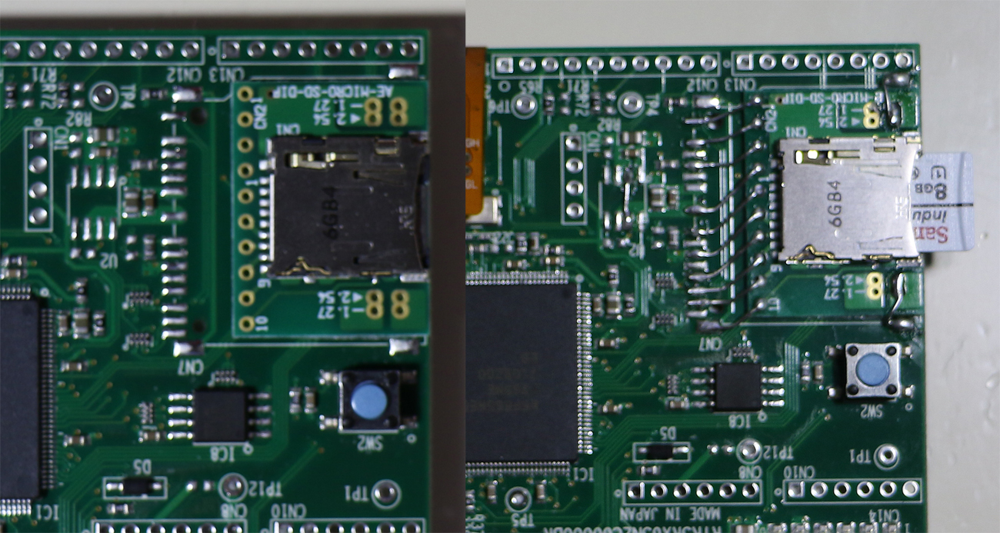   

現在、ＳＤＨＣに対応したドライバーが未完成なので、ソフトウェアーＳＰＩによるで通信をしています。   
その為、スピードがあまり速くありませんが、オーディオ再生アプリで、４８ＫＨｚ１６ビットステレオのファイルをストレス無く鳴らせるので、まぁ問題無いと思います。   
※ＳＤＨＣ対応ドライバーは出来次第リリースします。   
   
難易度は、ハンダコテを使った事が無い初心者には多少厳しいのかもしれませんが、ハンダ必須の何かキットでも作った事があるくらいなら、大多数の人は作業可能と思います。   
※例のグラボを改造するよりは、断然難易度は低いでしょう。   
   
将来的には、ＵＳＢホストの機能が標準でありますので、ＵＳＢメモリーも扱う予定です。   
   
---
### **オーディオ出力の追加**
   
ＲＸ６５Ｎには、１２ビットのＤ／Ａ出力が２チャンネルあり、０～３．３Ｖの出力が出ます。   
ただ、標準では、ＳＷ２、ＳＷ３入力に利用されています。   
※ＳＷ２はＤ／Ａとして利用中に押すと問題ですが・・
※ＳＷ３は未実装    
そこで、オペアンプを追加して、オーディオ出力の代用として使います。   
また、ＲＣを使ったローパスフィルターも付加します。   
   
本来は、外部接続の１６ビットＤ／Ａを使うべきですが、内臓１２ビットのＤ／Ａでも、かなりまともで良い音がします。   
ブラインドテストをして、聞き分け出来るか判らないレベルの品質ですと言うと少し言いすぎかもしれませんが、１２ビットでもそれくらい高品質で実用的です。   
   
Ｄ／Ａでオーディオ出力する場合、ＧＮＤレベルの電位は０～３．３Ｖの中間電圧です。   
その為、中間電圧を引いて、－１．６５Ｖ～０～＋１．６５Ｖにしなければなりません。   
色々な方法がありますが、今回採用した方法です。   

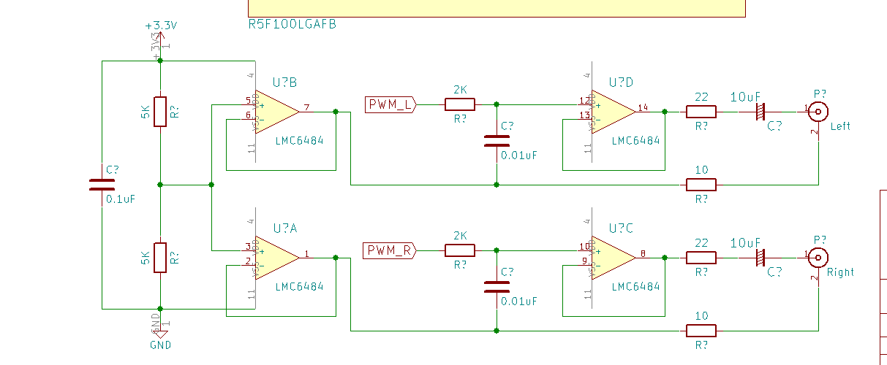   
   
上記回路は、ＰＷＭ出力を想定したものですが、ＤＩＹで共有しているので、とりあえずこのまま使っています。   
   
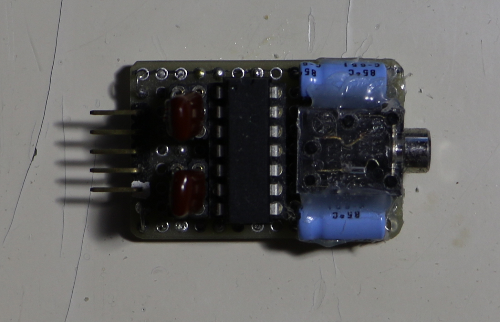   
   
とりあえず以下の４つの信号を出しておきます。   
※いつでも外せるように、ヘッダーピンに使えるコネクターを使っています。   
...
1. 黒　GND (CN1 3 AVSS)
2. 赤　Right Audio (USER SWITCH P05_IRQ13_SW) DA1   
3. 白　Left Audio (Joystick P03_JOY_RIGHT_IRQ11) DA0   
4. 紫　3.3V (CN1 1 3.3V)   
   
   
   
---
### **ファミコン（互換）パッドの接続**   
   
ゲームプレイでは、ゲームパッドじゃないと、操作性が悪いので、ファミコン（互換）パッドを取り付けます。   
- ＮＥＳ（アメリカのファミコン）に付属していたゲームパッド   
- ファミコン互換機についていたゲームパッド   
   
以上の二つを試しました。   
ＤＩＹでジョイスティックやボタンを用意して作る事も出来ます。   
内部はＣＭＯＳ４０２１で、パラレル、シリアル変換を行うもので、３本の信号で通信を行います。（電源入れると５本）   
※ＤＩＹするなら、スピードが速い７４ＨＣ４０２１を使った方が良いと思います。   
   
ピンアサイン：   
- ( 7) PI1 - Right
- ( 6) PI2 - Left
- ( 5) PI3 - Down
- ( 4) PI4 - Up
- (13) PI5 - START
- (14) PI6 - SELECT
- (15) PI7 - B
-  (1) PI8 - A
※入力 (PI1 - PI8) にはプルアップ抵抗（４７Ｋ程度）が必要、Vss との間にスイッチを入れる。
- ( 3) Q8 - OUT
- ( 9) P/S - P/S
- (10) /CLK - CLK
- (11) SI - Vss
- ( 8) Vss - Vss
- (16) Vcc - Vcc
   
   
   
1. NES パッド：   
- 白：Vcc、茶：GND、橙：P/S、赤：CLK、黄：OUT   
2. ファミコン互換パッドの場合：   
- 赤：Vcc、黄：Vss、青：P/S、茶：CLK、白：OUT   
※互換パッドは、色々あるので、配線と信号が異なる場合もあるので良く確認して下さい。   
※ネットを探せば、色々情報が見つかります。   
   
ファミコンパッドは、ＣＮ２に接続します。   
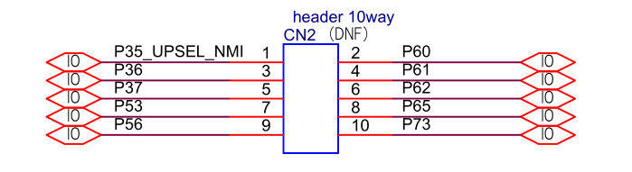   
Envision Kit のＣＮ２は、本来液晶を外さないとハンダづけ出来ないのですが、Ｌ型コネクタを使い、事前に足を少し切っておけば（基板に挿した時に出たピンが液晶の裏に当たらないように）液晶の裏に当たってショートしないでしょう。   
ハンダ付けは、Ｌ型なら、Ａ側（奇数）は裏からハンダ付けでき、Ｂ側（偶数）は、表から、少しスルホールが少し見えているので、隙間からハンダ付け出来ます。   
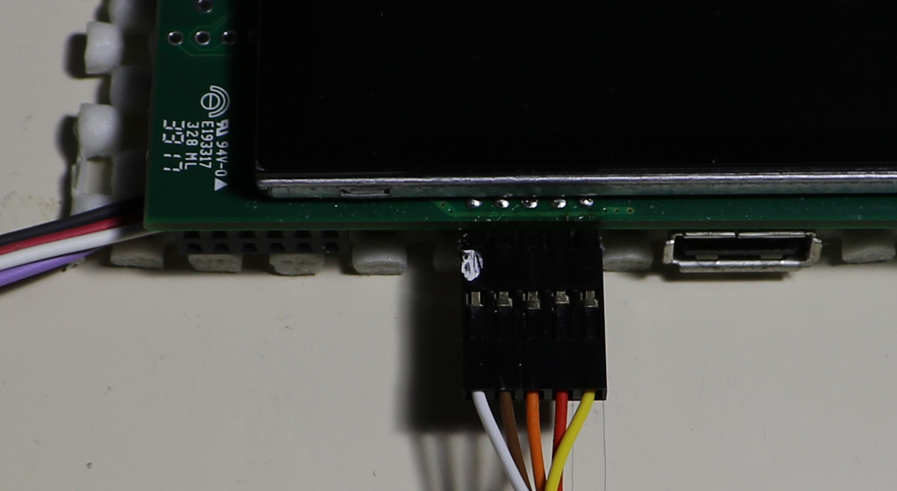   
   
1. P60 ( 2) - Vcc
2. P61 ( 4) - Vss (GND)
3. P62 ( 6) - P/S
4. P65 ( 8) - CLK
5. P73 (10) - OUT   
   
※ＣＭＯＳ４０２１は、消費電力が小さいので、ポートを出力にして電圧を供給します。   
   
---
### **シリアル入出力の追加**
   
デバッグ用など、シリアル入出力を出しておくと便利です。   
ほとんどのプロジェクトで、シリアルを活性しており、何らかのメッセージを出しています。   
   
シリアルは、Ｐｍｏｄ端子にＴＸＤ９、ＲＸＤ９が出ているので、それを活用しています。   
   
- PB6_RXD9_PMOD_10   
- PB7_TXD9_PMOD_9   
- GND_PMOD_11, GND_PMOD_5
   
上記３つを接続すれば、使えます。   
※ＵＳＢシリアルと接続する場合は、ＴＸＤとＲＸＤ、ＲＸＤとＴＸＤ、それとＧＮＤを接続します。   
   
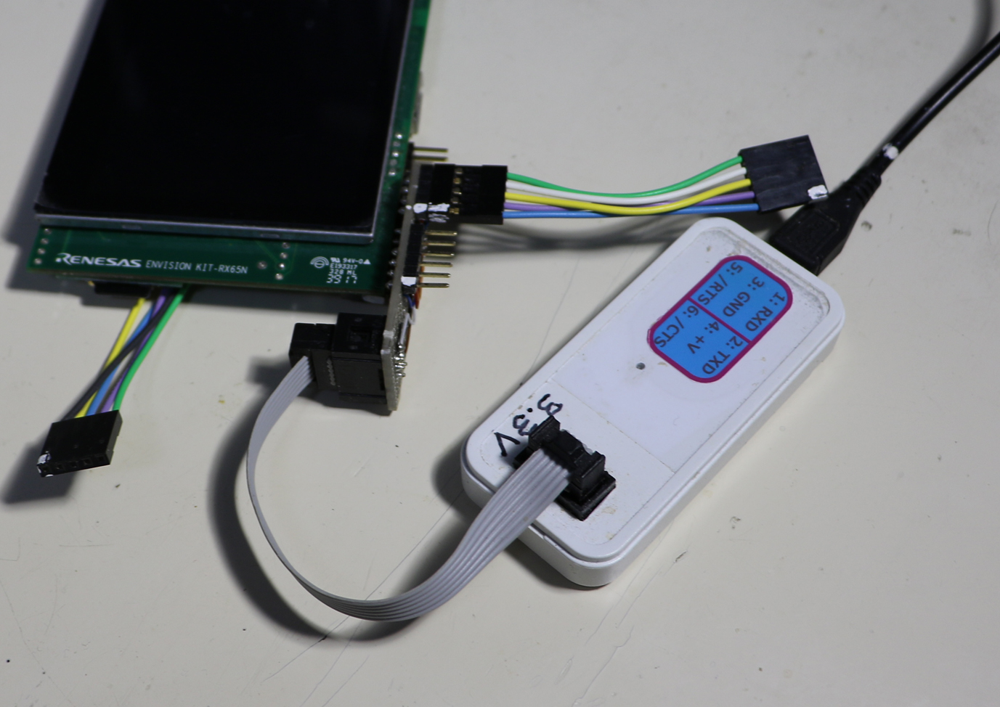   
   
※写真の物は、小さな基板にヘッダーピンを取り付け、マザーボード的にしています。   
   
ＰＣ側では、TeraTerm などを活用すると良いでしょう。   
設定：   
- シリアルポート：　ＵＳＢシリアルポートの番号
- ボーレート：　１１５２００
- 通信フォーマット：　８ビット、１ストップビット、パリティなし   
   
---
### （３）MP3/WAV オーディオ・プレイヤー
   
RX65N Envision Kit の性質を考えれば、オーディオプレイヤーは当然のアプリケーションです。   
そこで、以下のような仕様で実装してみました。   
- DMA によるオーディオ再生（最大、１６ビット４８ＫＨｚ）   
- libmad による MP3 コーデックのデコード（リアルタイム再生が可能）   
- WAV 形式のサポート   
- タグ情報の表示   
- タッチ画面によるファイル選択と操作など   
   
「ＳＤカードコネクター」、「オーディオ出力」の改造がしてあれば利用可能です。   
   
#### **タッチパネルでの操作方法**
- ３点タッチ（離れた時）で、ファイラーが有効になる。
- 上下のドラッグで、ファイルフォーカス
- 右ドラッグでファイル選択（ディレクトリーの場合、そのディレクトリーへ移動）
- 左ドラッグで、一つ手前のディレクトリーへ移動
- 再生中、右へドラッグで次の曲
- 再生中、左へドラッグでリプレイ
- 再生中、２点タッチ（離れた時）で一時停止
- 再生中、３点タッチ（離れた時）で再生中断
- 再生中は、曲の再生が終了したら、次の曲を再生
   
   
   
#### **ファミコン・パッドでの操作方法**
- 「SELECT」ボタンで、ファイラーが有効になる。（もう一度押すと無効）
- 上下ボタンで、ファイルフォーカス
- 右ボタンで選択（ディレクトリーの場合、そのディレクトリーへ移動）
- 左ボタンで、一つ手前のディレクトリーへ移動
- 再生中、右ボタンで次の曲
- 再生中、左ボタンでリプレイ
- 再生中、「SELECT」で一時停止
- 再生中「START」ボタンを押す事で、再生中断
- 再生中は、曲の再生が終了したら、次の曲を再生
   
#### **MP3、WAV ファイルの対応状況**
- WAV 形式の場合、最大 48KHz、16 ビット、ステレオのファイルフォーマットまで対応
- MP3 形式の場合、320Kbps まで対応 (44.1KHz, 48KHz, 16 Bits, Stereo/Mono)
- WAV 内タグのパース（一部）
- ID3V2 タグのパース（ID3V1 タグは未対応）
   
   
   
---
### （４）スペースインベーダー・エミュレーター
   
   
   
かなり昔に、海外のコミュニティーで Windows で動く、「SIDE」と呼ばれるスペースインベーダーのエミュレーションプログラムが作られました。   
以前に自分もこのコードを評価した事があったので、ポーティングしてみました。   
このプログラムは、８０８０ＣＰＵとインベーダー基板のハードウェアーをエミュレーションします。   
   
動かすには「Space Invaders」の業務用基板に使われている ROM データと、効果音データが必要です。   
※効果音データは、GitHub にコミット「RTK5_SIDE/wavs」してあります。   
※ＲＯＭデータの入手方法は自分で調べて下さい。   
（invaders.h、invaders.g、invaders.f、invaders.e）invaders.zip   
...
上記データは、ＳＤカードのルートに「inv_roms」、「inv_wavs」ディレクトリーを作成して、その中に格納しておきます。   
   
- ディレクトリーを移動して「make」します。   
```
cd RTK5_SIDE
make
```
- コンパイルがエラー無く通れば、「side.mot」が出来ていると思います。   
- ＲＯＭデータやＷＡＶデータが格納されたＳＤカードを本体にセット   
- 「Flash Programmer V3」を起動して、上記ファイルを書き込みます。   
- SELECT ボタンでコインが入ります。   
- START ボタンで開始。   
- 十字ボタン左右で砲台移動   
- Ａボタンで発射   
   
参考動画   
<https://www.youtube.com/watch?v=AkgoFYMugng>
   
---
### （５）ファミコン（ＮＥＳ）・エミュレーター
   
   
   
元々は、ＥＳＰ３２用にポートされたソースを使っています。   
それを修正してＲＸ６５Ｎで動くようにしています。   
ＲＸ６５Ｎでは、内臓ＲＡＭに余裕がありますので、ＲＯＭカートリッジデータをロードして動かしています。   
※ＥＳＰ３２では、カートリッジデータをＲＯＭに含めなくてはならず、色々なカートリッジを切り替えてプレイ出来ません。
その為、現状では、最大１ＭビットＲＯＭ１個程度のカートリッジまでしか動かす事が出来ません。   
※ＲＯＭカートリッジのデータファイル「.nes」ファイルの入手方法は自分で調べて下さい。   
   
- ディレクトリーを移動して「make」します。   
```
cd RTK5_SIDE
make
```
- コンパイルがエラー無く通れば、「nesemu.mot」が出来ていると思います。   
- ＲＯＭデータやＷＡＶデータが格納されたＳＤカードを本体にセット   
- 「Flash Programmer V3」を起動して、上記ファイルを書き込みます。   
- 「SELECT」、「START」ボタンを２秒程度同時押しする。
- ファイラーが開くので、上下ボタンで、ファイル名にフォーカスを移動。
-「xxx.nes」ファイルで、右方向ボタンを押す。
- ディレクトリーの場合は、そのディレクトリーへ移動する。
- ディレクトリーを戻る場合は、左方向ボタンを押す。
- 上記で選択したゲームが起動する。
   
自分が試した範囲では、以下のゲームが走りました。   
1. GALXIAN (NAMCOT)
2. GALAGA (NAMCOT)
3. PAC-MAN (NAMCOT)
4. DRAGON QUEST (ENIX)　（音が鳴る FIX 版）
5. DRAGON QUEST II (ENIX)　（音が鳴る FIX 版）
6. GRADIUS (KONAMI)
7. Solstice J (EPIC/SONY Records)
8. XEVIOUS (NAMCOT)
※他にも動作するカートリッジは沢山あると思います。   
   
画像のレンダリングにおける遅延も少なく、オーディオも綺麗に鳴ります。（それなりに苦労しました。）   
※組み込みマイコンを使い、この品質で、ファミコンのような複雑なハードウェアーをソフトウェアーだけでエミュレーション出来るのは、ＲＸマイコンの優秀性の賜物だと思います。   
   
参考動画
<https://www.youtube.com/watch?v=frRI-cbzGus>
   
---
以上のように、実用的なプログラムを走らせる事ができるので、応用しだいで色々なガジェットが作れます。   
   
また、現在製作中のプロジェクトがいくつかあります。   
- デジタルストレージオシロスコープ（RTK5_DSOS）   
  内臓 A/D 変換機のサンプリング周期が最大５００マイクロ秒程度で、同時二チャンネルのキャプチャーが可能なので、２チャンネルのデジタルストレージオシロに応用しようとしています。   
  ある程度実用的に使うには、外部に回路が必要なので、基板を作る予定で、回路を検討中です。   
- データロガー（RTK5_LOGGER）   
  外部にＧＰＳや各種センサーを接続して、色々な情報をロギングし、ＳＤカードに記録するものです。   
  主に、レース用車両のデータロガーとして利用する予定です。   
   
進展があれば、ブログで発表する予定です。   
   
---
## Makefile の勘所

ＲＸマイコン C++ フレームワークでは、プロジェクトのビルドに make コマンドを利用しています。   
通常、Makefile の記述は、わかり難く面倒で、cmake などの Makefile ジェネレーターを使い、生成するのが一般的です。   
このプロジェクトで用意してある Makefile は、cmake のようなコマンドを使わなくても、ベースとなる Makefile を少し変更するだけで、使いまわしが出来るように工夫されています。   
   
### **従属規則：**   
make コマンドでは、ファイルの異なるタイムスタンプを利用して、コマンドを実行する事が出来ます。   
C++ のソースコードは、複数のインクルードファイルの集まりで構成されており、その関係したファイルが変更されれば、コンパイルしてオブジェクトを作り直す必要があります。   
多くの Makefile の作成例では、この規則を記述する作業を手入力で行っています。   
この作業は間違いやすく、インクルードパスを変更したら、忘れずに変更する必要があります。   
そこで、それらを自動化しています。   
この自動化では、gcc に備わっている「-MM」オプションを利用しており、内部定義を厳密に評価しています。   
   
### **単一ディレクトリへの集約：**   
通常、ソースコードをコンパイルすると、同じパスにオブジェクトが作成されます、しかし、このフレームワークのように、一部のソースコードを共有するような場合。   
また、オブジェクトの一律管理をしたい場合など、それでは不都合で不便です。   
```
BUILD       =   release
```
そこで、上記のように「BUILD」キーワードを設けてあり、「release」だと「release」ディレクトリーに生成されたオブジェクトを生成するように工夫してあります。   
※また、ユーザー側で特定のキーワードに反応するような仕組みを追加すれば、特別なオプションをコンパイル時に設定する事が可能です。   
   
### **ソースコードの設定：**   
   
以下は、サンプルの Makefile の一部です。   
```
TARGET      =   raytracer

ASOURCES    =   common/start.s

CSOURCES    =   common/init.c \
                common/vect.c \
                common/syscalls.c \
                $(FATFS_VER)/src/ff.c \
                $(FATFS_VER)/src/option/unicode.c \
                common/time.c

PSOURCES    =   main.cpp \
                RX65x/icu_mgr.cpp \
                graphics/font8x16.cpp \
                common/stdapi.cpp
```
このサンプルでは、ターゲット「raytracer」をビルドするのに必要なソースファイルを定義してあります。   
- TARGET   
最終的に生成する実行バイナリーファイルです。   
※通常は、拡張子が「mot」のモトローラー形式のファイルです。   
中間状態として、ELF 形式の自由度の大きい実行型ファイルが作られます。   
   
- ASOURCES   
アセンブラのソースコード名です。   

- CSOURCES   
C のソースコードです。   

- PSOURCES   
C++ のソースコードです。   

※他にライブラリ、ライブラリパス、インクルードのルート、などを設定する必要があります。   
基本的にはソースコードを定義するだけです。   
   
後は、
```
make
```
とすれば、従属規則を自動で生成して、必要なコンパイルとリンクが行われます。   
   
以下に「main.cpp」の自動で生成された従属規則の一部を示します。   
```
release/main.o release/main.d: main.cpp ../common/renesas.hpp ../common/byte_order.h \
 ../common/vect.h ../common/delay.hpp ../common/device.hpp \
 ../common/io_utils.hpp ../RX65x/peripheral.hpp ../RX600/system.hpp \
 ../RX65x/power_mgr.hpp ../RX600/bus.hpp ../common/static_holder.hpp \
 ../RX65x/icu.hpp ../RX65x/icu_mgr.hpp ../common/dispatch.hpp \
 ../RX65x/port_map.hpp ../RX600/port.hpp ../RX600/mpc.hpp \
 ../RX600/lvda.hpp ../RX600/system_io.hpp ../RX600/dmac.hpp \
 ../RX600/elc.hpp ../RX600/exdmac.hpp ../RX600/tpu.hpp ../RX600/ppg.hpp \
 ../RX600/cmtw.hpp ../RX600/can.hpp ../RX600/qspi.hpp ../RX65x/s12adf.hpp \
 ../RX600/adc_in.hpp ../common/intr_utils.hpp ../RX600/r12da.hpp \
 ../RX600/dac_out.hpp ../RX600/sdram.hpp ../RX600/etherc.hpp \
 ../RX600/edmac.hpp ../RX600/usb.hpp ../RX600/rtc.hpp ../RX600/rtc_io.hpp \
 ../common/time.h ../RX600/wdta.hpp ../RX600/flash.hpp \
 ../RX600/flash_io.hpp ../common/format.hpp ../RX600/ether_io.hpp \
 ../chip/phy_base.hpp ../RX600/sdhi.hpp ../RX600/sdhi_io.hpp \
 ../ff12b/src/diskio.h ../ff12b/src/integer.h ../ff12b/src/ff.h \
 ../ff12b/src/ffconf.h ../RX600/mmcif.hpp ../RX600/pdc.hpp \
 ../RX600/standby_ram.hpp ../RX65x/glcdc.hpp ../RX65x/glcdc_io.hpp \
 ../graphics/pixel.hpp ../RX65x/glcdc_def.hpp ../RX65x/drw2d.hpp \
```
非常に複雑であり、自動で生成する必要がある事が判ります。   
   
### **ＲＸマイコン別設定：**   
   
ＲＸマイコンは、非常に多くの種類があり、デバイス毎に、ＲＡＭやＲＯＭ領域が異なっています。   
それを設定する為に以下のキーワードがあり、リンクローダーファイルを選択するキーワードを設定します。   
リンクローダーファイルは、個別のデバイスに適合する、領域、スタック領域などを定義しています。   
もし、自分が使いたいデバイスが無ければ、同じようなデバイスのファイルをコピーして、領域を修正する事で新規デバイスに対応する事が出来ます。   
```
DEVICE  = R5F571ML
```
リンクローダーファイルの一部（RX71M/R5F571ML.ld）
```
/* This memory layout corresponds to the smallest predicted RX71M chip.  */
MEMORY {
    RAM (w)    : ORIGIN = 0x00000000, LENGTH = 0x0007C000 /* 512k - (USTACK+ISTACK)(0x2000) */
    USTACK (w) : ORIGIN = 0x0007E000, LENGTH = 4 /* ustack 8192 */
    ISTACK (w) : ORIGIN = 0x00080000, LENGTH = 4 /* istack 8192 */
    ROM (w)    : ORIGIN = 0xFFC00000, LENGTH = 0x003FFFD0 /* 4M */
}
```
   
また、シリーズ名と、内部クロック周波数として、以下のように、設定しています。   
```
USER_DEFS   =   SIG_RX71M \
                F_ICLK=240000000 \
                F_PCLKA=120000000 F_PCLKB=60000000 F_PCLKC=60000000 F_PCLKD=60000000 \
                F_FCLK=60000000 F_BCLK=120000000
```
※標準とは異なる周期を使う場合、これらを適切に設定する必要があります。   
   
※ＲＸ７１Ｍマイコンの場合、内部動作を２４０ＭＨｚで行うのに、リセット後に起動するアセンブラプログラムで特別なレジスターを設定しており、以下の設定が必要です。   
※これは、マイコンがスーパーバイザ権限で走っている間しか出来ない為です。   
```
AS_OPT      =   -mcpu=rx600 --defsym MEMWAIT=1
```
   
マイコンに接続するクリスタルの周波数は、起動プログラムで設定しています。   
※ＲＸマイコンには、内部クロック周期を評価するハードウェアー機能が内臓されており、外部クロック周期を推定する事が可能と思うので、将来的には、自動化する予定です。
```
    typedef device::system_io<12000000> SYSTEM_IO;
```
※１２ＭＨｚのクリスタルを接続した場合。   
また、クリスタルを接続せず、直接オシレーターからクロックを注ぐ場合には、以下のような定義をして下さい。   
```
    typedef device::system_io<12000000, 240000000, true> SYSTEM_IO;
```
※第二パラメーター「240000000」は内部ＰＬＬ発信機の周波数で、ＲＸ６４Ｍ、ＲＸ７１Ｍ、ＲＸ６５Ｎの場合です。   
   
ＲＸマイコングループなどにより異なるのですが、内部クロックジェネレーターから分配されたいくつかのマスタークロックがあります。   
F_ICLK、F_PCLKA、F_PCLKB、F_PCLKC、F_PCLKD、F_PCLK、F_BCLK、などですが、これらは、外部接続のクリスタル周期との密接な関係があり、適当に決める事は出来ませんので、変更したい場合、ハードウェアーマニュアルを良く熟読して、適切な値を設定して下さい。   
また、これらの周期は、ＳＣＩ、タイマーなど周期計算のパラメーターとして使われています。   
   
### **最適化：**   
   
最適化を変更する場合、以下のキーワードを修正します。   
```
OPTIMIZE    =   -O3
```
上記は最大の最適化です、場合により、「-Os」（サイズ優先）、「-O2」、「-O1」など使えます。   
※現在、Ｃ＋＋フレームワークのテンプレートリソースの問題で、「-O0」（最適化無し）が正常にコンパイル出来ません。   
※通常最適化を最大で走らせておけばよく、メモリーに入りきれない場合だけ調整が必要です。   
   
### **インクルードパスを変更した場合：**
   
main.cpp などのソースコードで、インクルードパスを修正した場合、
```
make clean
```
とすれば、従属規則が消されます、次に「make」とすれば、新規に従属規則が生成されます。   
※これは、自動では行いません、注意が必要な仕様です。   
   
---
## Ｃ＋＋トピック
   
Ｃ＋＋に関する、いくつかのトピックについて簡単に説明します。   
※問題は、自分の持っているＣ＋＋に関する洞察があまり正確性を伴って厳密では無い事なので、参考程度にして下さい、今後改修していく予定です。   
また、もし、明らかな間違いや勘違いを認めた場合は、面倒かもしれませんが、連絡をお願いしたいです。   
改修して、より良い厳密なものにしたいと考えています。   
厳密では無いにしても、何かの役に立てばと願っています。   
   
### Ｃ＋＋参考書
   
良く、初心者が読むのに適したＣ＋＋の参考書は？と聞かれますので、とりあえず、この本をあげておきます。   
   
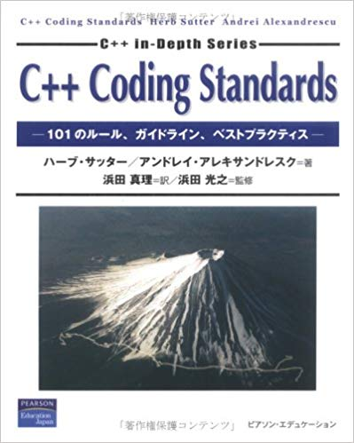   
   
<a href="http://www.amazon.co.jp/C-Coding-Standards%E2%80%95101%E3%81%AE%E3%83%AB%E3%83%BC%E3%83%AB%E3%80%81%E3%82%AC%E3%82%A4%E3%83%89%E3%83%A9%E3%82%A4%E3%83%B3%E3%80%81%E3%83%99%E3%82%B9%E3%83%88%E3%83%97%E3%83%A9%E3%82%AF%E3%83%86%E3%82%A3%E3%82%B9-%E2%80%90depth/dp/4894716860/ref=sr_1_1?s=books&amp;ie=UTF8&amp;qid=1379685876&amp;sr=1-1&amp;keywords=C%2B%2B+Coding+Standards">C++ Coding Standards―101のルール、ガイドライン、ベストプラクティス</a>   
   
ネットにも沢山の文書があります、

|名称|リンク|
|---------------------------------|----------------------------------------------|
|C++日本語リファレンス|https://cpprefjp.github.io/reference.html|
|C++リファレンス|https://ja.cppreference.com/w/cpp|
|ロベールのＣ＋＋教室|http://www7b.biglobe.ne.jp/~robe/cpphtml/|
   
※他にも、沢山あり、自分に合う物を探してみて下さい。   
   
---
### 名前空間
   
Ｃには無い便利な機能として「名前空間」があります、名前空間を活用する事で、プログラムを判りやすく、構造的にする事が出来ます。   
```
namespace graphics {

    class render {

    };

}
```
   
また、名前なしの名前空間も可能で、そうする事で、外部から参照できなくなります。   
```
namespace {

    uint32_t value_ = 100;
    graphics::render render_;

}
```
※Ｃでは、このような場合、「static」を使っていました。   
   
---
### 参照
   
「参照」は、Ｃ＋＋で最も利益のある機能の一つだと考えます。   
参照はポインターに似ている為、Ｃのプログラマーは軽視しがちですが、コンパイラーにとっては、最適化を進める上で、非常に強力な武器です、関数に渡すのがポインターでは無く、参照であれば、より進んだ最適化を行う可能性が生まれます。   
また、参照では、ポインターのような、ＮＵＬＬチェックを行う必要は無く、構造的に参照が適用出来ない場合は、コンパイラが教えてくれます。   
ポインターより少しだけ制限のある参照は、より洗練された構造をプログラムに提供し、それと同時に安全性も提供します。   
参照では、const をより明確に使え、明確な意図をもって伝播させる事が出来ます、これを最初は「ウザイ」と思う人もいますが、そうでは無い事は直に理解出来ると思います。   
一つの典型的な方法論として、まず参照で解決出来るか考えて、なるべく参照を使うように全体を設計し、どうしても参照に出来ない場合だけ、ポインターを使うようにします。   
   
---
### NULL について
「NULL」はＣ言語のマクロであり、Ｃ＋＋でも使えますが使うべきではありませんし、使う理由もありません。   
Ｃ＋＋では「nullptr」を使います。   
   
---
### 基本的な事
   
標準ライブラリーのインクルード   
Ｃ言語のヘッダーをインクルードする際に   
Ｃ＋＋では、Ｃ言語で使える関数も当然使えます、その際ヘッダーをインクルードしますが、Ｃ＋＋用に専用ヘッダーが用意されています。   
   
たとえば、「stdio.h」なら「cstdio」、「stdlib.h」なら「cstdlib」、「string.h」なら「cstring」です。   
※規則は察しがつくと思います。   
Ｃ＋＋の標準的ヘッダーは、「.h」などの拡張子が無いので、それに習っているのと、Ｃ＋＋から使う際の「おまじない」がしてあります。   
   
---
### 型について
Ｃ＋＋では、「型」を厳密に評価します。   
   
Ｃの場合、たとえばポインターは典型的に以下のように書きます。   
```
void func(char *ptr)
{
  char *tmp = NULL;
...

}
```
しかしＣ＋＋では・・   
```void func(char* ptr)
{
  char* tmp = nullptr;
...

}
```
ポインターを示す「＊」が、変数名に付いていたのが、型に付くようになっています。   
Ｃでは「ptr, tmp」の「ポインター」だったのが、Ｃ＋＋では「ptr, tmp」は「char」の「ポインター型」と言う考えによるものです。   
   
しかし、多くの人が、自分流の定型記述セオリーを持っており、少しでも異なると、「気持ち悪い」と感じる為、それだけでも、テンションが下がる要因になる場合も少なくありません。   
これは、慣れの問題で、もちろんコンパイラーは、「char \*tmp」でも「char\* tmp」でもエラー無くコンパイル出来ますが、しばらくは、自己流の狭い考えを捨てて、流れに身を任す事が寛容と考えます。   
   
ただ、ここで問題が起こります。   
```
    char* ptr, ch;
```
このように書くと、「ptr」は「ポインター型」ですが、「ch」は「char型」です 。   
これは、Ｃ言語との互換性を考慮して、このような不都合な事が起こります。   
なので、一つの方法として、複数の行で宣言して避ける事ができます。   
```
    char* ptr;
    char  ch;
```
---
### Ｃ＋＋、Ｃでは、ビットサイズが定型の整数型が標準であります。
   
```
    char、short、int、long
```
は、処理系により異なるビットサイズです。   

そこで、C++ では、ビットサイズが保障された型が用意されています。   
```
#include <cstdint>
{
    int8_t、int16_t、int32_t、int64_t
    uint8_t、uint16_t、uint32_t、uint64_t
}
```
使うには、「cstdint」をインクルードします。
※Ｃでは、「stdint.h」をインクルードします。
   
また、既にこのような型が用意されているのに、自分だけ判る個人的な型を定義して使っている人を見かけますが、特に必要が無い限り、ほかの人に判らない型を使うのはやめましょう、プログラムがわかり辛くなるだけです。   
これは、有名で、みんな良く使っているライブラリでも悪い見本として実践されていて、それを「真似て」いる場合もあるかもしれませんが、そのライブラリが良く出来ていたとしても反面教師にすべきです。   
   
---
### スコープを利用した宣言
   
以前、Ｃの典型的関数では、関数内で使う変数を、頭の方で、集中的に宣言していました。   
現代においても未だに実践している人がいますが・・   
```
void func(void)
{
    int i, j, k;
    char c;
...
}
```
しかし、Ｃ＋＋では、変数を使いたい時に、宣言します。   
```
void func()
{
  int i;
  int j;
...
  char c;
  int k;
...
}
```
また、スコープを使って、分離する事で、同じ変数名を何度でも宣言できます。   
```
void func()
{
    int j;
    {
        int i;
...
    }
    {
        int i;
        int j;
...
    }
}
```
これは、コードがより観やすくなるだけでは無く、関数内であってもモジュール化でき、最適化に貢献できます。   
ただ、↑の例で、スコープで囲まれた変数「j」を、大域の「j」と混同してしまう場合があり、注意する必要があります。   
※警告レベルの設定によりある程度回避出来ます   
その都度宣言する事で、不必要なコードが生成されると思っている人がいますが、最適化されたコードは、そのような事はありません。（コンパイラーの常識、プログラマーの非常識）   
コンパイラは、大抵は、「人」より賢く最適化します。   
   
---
### 初期化リスト
「クラス」には、「コンストラクター」と呼ばれる特別のメソッドがあります。   
```
class bitmap
{
public:
    // コンストラクター
    bitmap() { }
};
```
これは、ご承知の通りです。   
   
普通、コンストラクター内では、変数の初期化を行います。   
```
class bitmap
{
    int counter_;
public:
    // コンストラクター
    bitmap() { counter_ = 0; }
};
```
「= 0」と値を代入しています。   
これは、間違いでは無いのですが、「＝」（イコール）で代入するのでは無く、コンストラクターでは、「初期化リスト」を使います。   
違いは、初期化リストでは、各オブジェクトのコンストラクターを呼んでいるのに対して、代入では、＝オペレーターを呼んでいる事になります、最適化された場合は、殆ど同じになりますが、コンストラクター内では、初期化リストで初期化するようにして下さい。   
※詳細な理由については、ご自分で調べて下さい。   
   
---
### メンバー変数に「_」アンダースコアーを付ける   
```
class bitmap
{
    int counter_;
public:
    bitmap() : counter_(0) { }
}
```
   
クラス内のメンバー変数は、引数の変数名などと被らないようにします。   
典型的には、「m_counter」などとする事もありますが、これは、ハンガリアンスタイルと言えます、なので、シンプルに後ろに付けるのが好ましいと思えます。   
※これは、好みがあり、強制する事はできませんが、多人数が係わるプロジェクトでは、共通にすべきです。   
   
---
### インクルードガードにアンダースコアー   
多くの人（Ｃのプログラマーに多い）が、インクルードガードで使うキーワードに、未だにアンダースコアーを使っている人がいます。   
   
func.h の場合   
```
#ifndef __FUNC_H__
#define __FUNC_H__

...

#endif
```
しかしこれは、規約違反である事を念のため確認しておきます。   
※先頭アンダースコアの次に大文字が来る場合も規約違反となります。   
   
func.h の場合は   
```
#ifndef FUNC_H
#define FUNC_H

...

#endif
```
   
※私は、「#pragma once」をお勧めします。   
簡潔に書け、ほとんどのコンパイラで利用可能です。   
   
func.h の場合
```
#pragma once

...

```
   
---
### 引数の void
   
受け取るパラメーターが無い場合、C では void を使いました。   
```
void init(void)
{
}
```
   
C++ では、何も書く必要は無くなりましたので、引数が無ければ何も書きません。   
```
void init()
{
}
```
※書いてもエラーにはなりません、問題なのは、書く必要が無いのにあえて書く理由でしょうか？   
※ただ、これは意見が分かれるところでもあります。（引数が無い事を明確にしたい）   
※Ｃ言語では、何も書かないと**引数チェックが何もされません**、これは、古いＣ言語ソースをコンパイルする互換性の為にそうなっているようです、特に注意が必要です。   
   
---
### main 関数の戻り値
   
良く、例題で、以下のように書いてあります。   
```
int main()
{
    printf("Hello world !!\n");
    return 0;
}
```
ここで、main 関数のみ、「return 0;」を省略できます。   
言語規約で、main 関数の場合は、何も書かなければ、「０」が返る事が保障されています。   
```
int main()
{
    printf("Hello world !!\n");
}
```
※「return」文が無い事を指摘する人がいますが、何故無くてもエラーにならないかを考える必要があります。   
   
---
### 引数に標準的な値を代入できる（ヘッダーにおいて）
受け取るパラメーターがあったとして、標準的な値を代入しておく事が出来ます。   
```
void set(int value = 1)
{

}

...

    set();     //「１」が引数として使われる。
    set(100);  //「１００」が引数として使われる。
```

これらを利用して、色々と便利な事が行えます、応用してみて下さい。   
私がお勧めしたい応用として、ブールを使った、フラグの設定を紹介します。   
よく、状態として、「許可」と「不許可」を設定したい場合があります。   
そんな時・・・   
```
void enable() { }
void disable() { }
```
のようにしますか？   
ですが、これだと、何かの状態を評価してから、状態を設定する場合、関数を呼び分けなければなりません。   
```
    if(flag) enable();
    else disable();
```
そこで・・   
```
void enable(bool f = true)
{
}
```
とすればー   
```
    enable();  // 許可したい場合
```
```
    enable(false);  // 不許可したい場合
```
```
    bool flag = true;
...
    enable(flag);  // flag が「true」か「false」で、「許可」、「不許可」を設定できる。
```
※よく、二つの状態を受け渡しするのに、「int」を使う人がいますが、それは間違いです「bool」を使って下さい。   
「int」では、設定出来る範囲が広すぎて明確ではありません。   
   
※又、３つなら「int」が便利（1, 0, -1）と言う人がいますが、それも間違いで、３つの状態があるなら、enum class などで、３つの明確な状態を定義して、それを使います。   
※処理時間に違いはありません。   
```
    enum class TYPE {
        CANCEL,
        OK,
        NG
    };

...

    void set(TYPE t) {
        switch(t) {
        case TYPE::CANCEL:
            break;
        case TYPE::OK:
            break;
        case TYPE::NG:
            break;
        }
    }
```
   
---
### 関数に付ける const
   
読み出し専用として「const」を変数に付けるのはＣでも日常的に行います。
```
    static const int32_t low_limit_ = -45;
    static const int32_t high_limit = 80;
```
Ｃ＋＋では、クラスの関数に「const」を付ける場合があります。   
```
class analize {
    int32_t     value_;
public:
    analize() : value_(0) { }

    int32_t get_value() const { return value_; }
};
```
上記の場合「get_value」関数は、クラス内の変数を書き換えない事を保障しています。   
※もし、書き換える実装を行うとエラーになります。   
   
---
### enum の便利な使い方
   
C++ では、define を使わなくなりますし、あえて使う理由もありません、そこで定数を定義するのに便利な enum を C++ で便利に使う為の方法を紹介します。   
   
enum は意味のある値を定義する上で便利な機能ですが、不都合な事が起こります。
   
たとえば、以下のような、enum の定義では、enum 内に同じ名前のキーワードを定義できません。
```
enum holizontal {
  LEFT,
  CENTER,   // これは少し冗長
  RIGHT
};

enum vertical {
  TOP,
  CENTER,   // これは少し冗長
  BOTTOM
};
```
そこで、仕方なく、以下のように多少冗長な書き方になってしまいます。   
```
enum holizontal {
    LEFT,
    H_CENTER,
    RIGHT
};

enum vertical {
    TOP,
    V_CENTER,
    BOTTOM
};
```
しかし、Ｃ＋＋では、こう書けば・・   
```
struct holizontal {
    enum type {
        LEFT,
        CENTER,
        RIGHT
    };
};

struct vertical {
    enum type {
        TOP,
        CENTER,
        BOTTOM
    };
};
```
型名をクラス名にして、その中で enum を定義する事で、別々に定義出来ます。   
※名前空間で分離する事も出来ますが、私は、クラスで括る方が好みです。   
※私は、このような場合に enum の型として type と言うキーワードを使うのが好みです。   
```
int main()
{
    holizontal::type h = holizontal::CENTER;
    vertical::type v = vertical::CENTER;
...
}
```
※structとclassの違いについて   
C++ では、struct と class の違いは、殆どありません、private か、public の違いくらいです。   
   
C++11 以降、元々ある enum の欠点を見直した、enum class が使えるようになりました。   
enum class は「型」を厳密に認識するので、型の異なる enum class で同じメンバーを定義できます。   
```
    enum class holizontal {
        LEFT,
        CENTER,
        RIGHT
    };
    enum class vertical {
        TOP,
        CENTER,
        BOTTOM
    };
{
    holizontal h = holizontal::CENTER;
    vertical v = vertical::CENTER;

    switch (h) {
    case holizontal::LEFT:
        break;
    case holizontal::CENTER:
        break;
    case holizontal::RIGHT:
        break;
    }
    // enum class は、int 型にキャストして使う事が出来ます。
    for(int i = 0; i < 3; ++i) {
        if(static_cast<vertical>(i) == v) {
            switch(i) {
            case 0:
                break;
            case 1:
                break;
            case 2:
                break;
            }
            break;
        }
    }
}
```
「enum class」では、領域の確保は「int」として行われます。   
しかし、それでは領域の効率が悪い場合があり、「enum class」の内部型を明示的に指定できます。   
```
enum class holizontal : uint8_t {

};
```
---
### new、delete をなるべく使わない
   
クラスを定義して、それを使う場合、以前に良く見たサンプルは、以下のような物です。   
```
{
    func* f = new func;

    f->xxx();

    delete f;
}
```
しかし、このように書けば、new、delete を省略出来ます。   
```
{
    func f;

    f.xxx();
}
```
↑のように書けば、delete を忘れて、メモリーリークする事を防げますし、func クラスが生成されるタイミングもスコープで自由に制御できます。   
※上記サンプルでは、スコープを抜けると、「func」クラスが廃棄される。   
雑多な事はコンパイラに任せ、コンパイラに出来ない事に集中します、最適化にも貢献出来ます。   
設計上、「new」したオブジェクトは必ず「delete」しなければならず、C++ では、これを自動化する為の仕組みが色々あります、それらを組み合わせると、ほとんどの場合「new」する事を避けられます。   
従って、自動的にメモリーリークを避けられます。   
いくつかの言語に備わっている滑稽なガベージコレクションも必要ありません。   
   
---
### define
C では、例外無く、普通に define を使ってきました。   
しかしながら、多くのプログラミングガイドなどで、害悪が指摘されるように、C++ では define を使わなくても良い方法が提供されています。   
人によっては、少しだけ注意すれば便利なので、それ程とやかく言わなくても的な事を言う人もいますが、define より安全で、優れた機能が提供されているのに、何故、危険で制限のある古い方法を使うのか理解に苦しみます。   
※厳密には define を使わないと、どうしても解決出来ない事が全く無い訳では無いのですが、それは、「稀」な事と思います、普通は、使わなくても何とかなる事の方が多いハズです。   
「define」が最悪なのは、型が無効になってしまう事です。   
   
C では、define をアセンブラのマクロ命令のように、人間による最適化を施した拡張命令のように捉えられていると思われますが、「最適化」はいくつかの例外を除いて、人間がやるよりコンパイラに任せた方が安全で確実であると思います。   
※最適化は、それが必要になったら行うべき事項であり、開発途中の中途半端な段階で行うのは実りが少ないと言えます。   
   
C++ では、最大の最適化でも、「関数の呼び出し」を尊重してコンパイルします、その関数が少ないステップで構成されている場合でも、指示の無い事は行いません。   
もし、設計者が、ステップ数や、実行時間の比率などを考えて、関数を展開した方が有益と判断されるなら、「inline」を宣言する事で、その関数は展開され、呼び出しのコストが取り除かれます。   
ただ、注意しなければならない事があります、どんな場合でも「展開」する事が有益だとは限らない事です。   
たとえばキャッシュが小さいマイコンの場合は、展開する事で、キャッシュのヒット率が悪くなり、逆に速度が落ちるかもしれません。   
結局、計測してみないと本当の事は判らないと言う事です。   
※もちろん、キャッシュが無いような小規模なマイコンでは、当てはまりません。   
※「計測」は非常にスキルの必要なエンジニアリングです、浅はかな計測では大抵真実は明らかになりません。   
   
組み込みで、良く使われる define の利用法として、ハードウェアーの制御や定数の定義などがあります。   
   
たとえば、ボーレートの初期値として・・・
```
#define BAUD_RATE 9600
```
これは、単純に
```
static const int BAUD_RATE = 9600;
```
又は、   
```
enum rate {
  BAUD = 9600,
};
```
のように、名前空間などを利用した構造的な定義が出来ます。   
最適化されれば、余分なメモリーを消費する事も無く、参照されずに直接アセンブラ命令に埋め込まれます。   
※この場合の定数は、「int」型となりますので、int 型が都合悪ければキャストする必要があります。   
   
良くありがちな I/O デバイスの操作を「define」を多様して実装している場合があります・・   
```
void write_data(u8 data) {
    ACTIVE_PORT;    // ポートを有効
    OUT_DATA(data); // データ出力
    WRITE;          // ライト
    CS_LOW;         // CS 有効
    SETUP_DELAY;    // データのセットアップタイム
    CS_HIGH;        // CS 無効
    INACTIVE_PORT;  // ポートを無効
}
```
↑のように、あるデバイスにデータを出力する手続きを実装したものです。   
※本来、大文字で書かれた命令は、普通に関数（inline 関数など）を定義しても良いのですが、内部で行っている事が、少なく、関数を定義するのが「冗長」又は、マクロ展開で処理コストを節約とかの判断なのでしょう。   
典型的な C のプログラマーは、これを define で定義する事が多いように思います。   
※また、define では、パラメーターを埋め込んで、適当に整形して展開出来る為、かなり複雑な事も可能ですが、C++ では殆どの場合、テンプレート関数でそれを置き換える事が出来ると思います。   
```
#define ACTIVE_PORT { ... }
```
これは、単純に・・   
```
inline void ACTIVE_PORT() { ... }
```
引数が必要な場合   
```
#define OUT_DATA(d) { ... }
```
引数がある場合は、その引数の「型」を定義できるので、正確で安全です。   
```
inline void OUT_DATA(uint8_t d) { ... } 
```
次の例では、一次元配列に対して、二次元配列的にアクセスするマクロです、型に依存しない様にテンプレートで表現しています、define を使わなくても可能な例です。   
※配列サイズを超えたら、例外を投げるとか、色々拡張する事もできるでしょう。   
※参照を使っているので、関数に直接値を代入するような書き方が可能です。   
```
/// 読み出し専用
template <typename T, uint32_t ls>;
const T& get_dim_(const T* p, uint32_t row, uint32_t col) {
    return p[(col * ls) + row];
}

/// 書き込み専用
template <typename T, uint32_t ls>;
T& put_dim_(T* p, uint32_t row, uint32_t col) {
    return p[(col * ls) + row];
}
-----
    float mat[16];
    
    put_dim_<float, 4>(mat, 1, 3) = 10.0f;

    float a = get_dim_<float, 4>(mat, 1, 3);

```
   
---
### キャスト
C では、「キャスト」について、単純に警告を取り除く為の手段として利用しているのが殆どのように思います。   
C のキャストはたとえば、こんな感じの物です。   
```
    char ch;
...
    unsigned char data = (unsigned char)ch;
```
C++ では、いくつかのキャストが用意されており、場合によって使い分けます。   
```
    unsigned char data = static_cast<unsigned char>(ch);
```
   
良く、C++ のプログラムで、C のキャストを使う人がいますが、C のキャストは、変換が可能か不可能かに関係なくエラー検査無しに変換します。   
※驚く事に、「C++ のキャストは冗長だから、C のキャストを使う」と言っている人がいましたが、反面教師にすべきです。   
C++ では、static_cast を良く使いますが、もし変換が出来ない場合はエラーとなります。   
C++ のプログラムでは、C のキャストを使わないようにして下さい。   
また、const を取り除くようなキャストも行ってはなりません、そのような操作は、基本的に間違っています、通常、設計を正しくする事で避ける事が出来ます。   
※他のキャストについては、リファレンスを参照して下さい。   
※どうしても、避けられないキャストはあると思いますが、「稀」なものです。   
   
符号あり変数と符号無し変数を比較する場合：   
これは、エラー（警告）になります、そもそも論としては、このような事が多発するようなら、「設計」が悪いと言えると思います。   
どうしても避けれない場合は、「static_cast」を使い、適切な型に変換後比較を行います。   
   
---
### 警告
コンパイラが出力するレポートは非常に重要です、エラー検査は最大レベル（厳しいエラー検査）を設定し、一つでも警告が出たら、実行する前に、警告を取り除くようにソースコード修正する「クセ」をつける必要があると思います。   
良くありがちな事として、「警告は最後にまとめて取り除く」という方針を実践している人がいますが、効率が悪くなるだけです。   
「警告」が出るのには理由があり、コンパイラがソースコードの構造的欠陥を指摘しているのですから、警告が出ないような、抜本的な改修や、綺麗な設計が必要です。   
これらの優先順位は最後に回すべきものではなく、「今」行うべき事項であると認識して下さい。   
※とりあえず「警告」を無視する事の無いように・・・   
※「警告」が沢山出るプログラムは、そもそも設計が良くない場合が考えられます。   
   
---
### テンプレート
C 言語プログラマーが、C++ に移行して、最初に味わう挫折感は、テンプレートでは無いでしょうか？   
※継承とか、まぁ色々あると思いますが・・   
大抵、複雑なテンプレートに出会うと、理解不能で、これがどんなふうに機能するのか、理解出来ない事が多く、それが、C++ 不審に陥るキッカケになるかもしれません。   
   
テンプレートは変態的 define とあんまし変らないと思う人もいるかもしれません、ですが、単なるマクロとは大きく違い、C++ 言語としての仕様をちゃんと網羅しており、より複雑で精妙な事を実現できますし、エラー検査が厳密に行われます。   
   
最初は、簡単な物から、より複雑で、高機能な物へと順番に進んでいけば、良いと思えます。   
   
シリアルコミュニケーションのドライバーで使う FIFO を簡単なテンプレートで改修します。   
※シリアルコミュニケーションでは、FIFO を使って割り込みルーチンとメイン側でデータの受け渡しを行います。   
   
最初は、以下のような物でした・・
```
#include <cstdint>;
#include <cstdlib>;

namespace utils {

    class fifo {

        volatile uint32_t       get_;
        volatile uint32_t       put_;

        char*       buff_;
        uint32_t    size_;

    public:
        fifo() : get_(0), put_(0), buff_(nullptr), size_(0) { }

        ~fifo() { free(buff_); }

        void initialize(uint32_t size) {
            buff_ = static_cast<char*>(malloc(size));
            size_ = size;
            clear();
        }

        void clear() { get_ = put_ = 0; }

        void put(uint8_t v) {
            buff_[put_] = v;
            ++put_;
            if(put_ >= size_) {
                put_ = 0;
            }
        }

        uint8_t get() {
            uint8_t data = buff_[get_];
            ++get_;
            if(get_ >= size_) {
                get_ = 0;
            }
            return data;
        }

        uint32_t length() const {
            if(put_ >= get_) return (put_ - get_);
            else return (size_ + put_ - get_);
        }

        uint32_t pos_get() const { return get_; }

        uint32_t pos_put() const { return put_; }

        uint32_t size() const { return size_; }
    };
}
```
※記憶割り当てでは、通常 new delete を使うのですが、RX の gcc で、new、delete を呼び出す事で ROM サイズが大きくなる為、malloc、free にしてあります。   
   
上のクラスは設計が不十分です、動的にバッファのサイズを変えようと思っても、割り当てを廃棄する関数が無い為、実際には変えられません （メモリーリークします）、それに、「initialize」を呼ばずに使うとクラッシュしてしまいます、まぁこの辺は、メンバー関数を追加するとか、ポインターのチェックを行うなどすれば回避できるのですが、だんだん複雑になっていきます。   
そもそも、動的に変えられる仕様は必要でしょうか？   
通常、シリアルコミュニケーションを使う前に１度確保したら、プログラムが終了するまで、サイズを変える事は稀です。   
そこで、これをテンプレート化します。   
```
#include <cstdint>;

namespace utils {

    template <uint32_t size_ = 256>;
    class fifo {

        volatile uint32_t       get_;
        volatile uint32_t       put_;

        char       buff_[size_];

    public:
        fifo() : get_(0), put_(0) { }

        void clear() { get_ = put_ = 0; }

        void put(uint8_t v) {
            buff_[put_] = v;
            ++put_;
            if(put_ >= size_) {
                put_ = 0;
            }
        }

        uint8_t get() {
            uint8_t data = buff_[get_];
            ++get_;
            if(get_ >= size_) {
                get_ = 0;
            }
            return data;
        }

        uint32_t length() const {
            if(put_ >= get_) return (put_ - get_);
            else return (size_ + put_ - get_);
        }

        uint32_t pos_get() const { return get_; }

        uint32_t pos_put() const { return put_; }

        uint32_t size() const { return size_; }
    };
}
```
どうでしょうか？、随分シンプルになりました。   
   
インスタンスは、コンパイル時に決定する為、メモリー確保に関連するトラブルからも避けられ、サイズを与えれる（コンパイル時のインスタンス化）ので十分な実用性もあります。   
   
何も指定しないと、256 バイトでサイズが作られますが、以下のようにすれば、サイズを指定できます。   
```
    utils::fifo<512>    fifo_;
```
このテンプレートは「サイズ」をキーにしている為、サイズが異なれば、違う物とみなされる事になります。   
このクラスのポインターを取得したければ、以下のようにサイズが合っていなければなりません。   
```
    utils::fifo<512>*   fifo_ptr_;

    fifo_ptr_ = &fifo_;
```
   
本来は、ＳＴＬを使い、固定長アロケーターを定義して使うべきですが、８／１６ビットマイコンでは、ＳＴＬを呼ぶ事で、メモリを多く消費してしまう事があり、それを回避する目的で、小さな固定長クラスを実装しています。   
※ＲＸマイコンでは、ＳＴＬを使った方が良いかもしれません、今後の課題です。   
   
---
### auto
   
C++ では、名前空間によって、構成を構造的にできて便利なのですが、最下位にあるクラスの定義などを参照する場合や、そもそも名前が長い定義を書く場合は、多少不便な場合もあります。   
※日本人プログラマーは、長いスペルを省略して書く事がありますが、ネィティブな人は何故省略するのか不思議だそうです。   
   
例えば、ある関数が、以下のように値を返す場合。   
```
    const vtx::spos& get_position() const noexcept;
```
通常この値を受け取る場合は・・   
```
    const vtx::spos& v = get_position();
```
このように、同じように書きます。（インテリセンスが効いていれば、自動で候補を出してくれる）   
ですが、「auto」を使うと、自動で推定してくれます。   
```
    const auto& v = get_position();
```
※ここで、「const」と「＆」（参照）は適宜付加する必要があります。   
もし、「ｖ」の値を変更しないで使う場合は問題無いのですが、コピーしたい場合「const」や「＆」（参照）は余計です。   
   
---
### ファンクタ
   
C++ では、オペレーターを利用して、クラスを関数的に利用する手法が良く使われます。   
   
```
    class sqr {
    public:
        int operator() (int in) {
            return in * in;
        } 
    };

    sqr sqr_;
    auto ans = sqr_(100);
```
こうする事で、単純な関数にするより自由度が広がり、柔軟な実装が出来る場合があります。   
   
---
### ラムダ式
   
C++11 から、「ラムダ式」が使えるようになりました。   
これは、関数の呼び出しで実現する機能をインライン的に記述出来るものです。   
※詳しい説明や使い方はネットで探してみて下さい。   
   
これが便利なのは、通常、一旦関数を定義して、そこで実装する内容を、直接書く事が出来ます。   
C++ の場合、クラス内だと、関数にする事で、メンバーに対するアクセス手順が面倒になる場合があります。   
ラムダ式では、これも簡単に書く事が出来て便利です。   
```
    http_.set_link("/", "", [=](void) {
        time_t t = get_time();
        struct tm *m = localtime(&t);
        format("%s %s %d %02d:%02d:%02d  %4d<br>\n")
            % get_wday(m->tm_wday)
            % get_mon(m->tm_mon)
            % static_cast<uint32_t>(m->tm_mday)
            % static_cast<uint32_t>(m->tm_hour)
            % static_cast<uint32_t>(m->tm_min)
            % static_cast<uint32_t>(m->tm_sec)
            % static_cast<uint32_t>(m->tm_year + 1900);

        http_.tag_hr(500, 3);

        loop_ = 0;
    } );
```
※ラムダ式 [=] を使った、関数オブジェクトの直接実装例
   
---
## 標準出力 printf の基本的な仕組み
   
printf 関数を呼んだ場合、どのような機構で文字が出力されるのかを簡単に解説します。   
   
printf 関数は文字出力を行うのにファイル出力を利用しています。   
通常アプリケーションが起動した段階で、「stdout、stdin、stderr」と３つのファイルディスクリプタが定義された状態になっています。   
- stdin:  ０
- stdout: １
- stderr: ２
   
それぞれ、０、１，２番のファイルＩＤが割り当ててあります。   
つまり、printf を呼ぶと、上記のファイルディスクリプタを使って、出力する文字の数だけ「write」関数が呼ばれます。   
gcc のアプリケーションでは、POSIX の標準関数は、特別な定義になっていて、もしアプリケーション内に、write 関数の実装が存在すれば（リンク時に見つかれば）、その関数が優先される仕組みがあります。   
※具体的には、ヘッダーで、以下のように定義されています。   
```
int write(int fd, const void *ptr, int len) __attribute__((weak));
※「__attribute__((weak))」がある事で、アプリケーション定義のAPIが優先されます。
```
   
従って、write 関数内で「fd == 1」の場合に、シリアル出力するようにしておけば、printf 関数を呼べばそのままシリアル出力に流れていきます。   
   
この仕組みは「common/syscalls.c」に実装があります。   
   
また、シリアル出力として「sci_putch(char ch)」関数をユーザーのアプリ内で C言語の API として定義しておきます。   
※「sci_.putch(ch)」は、ユーザーが定義したシリアル入出力のクラスになっています。   
   
```
extern "C" {

    // syscalls.c から呼ばれる、標準出力（stdout, stderr）
    void sci_putch(char ch)
    {
        sci_.putch(ch);
    }

}
```
この仕組みが標準で搭載されている為、printf を呼ぶ事で、文字がシリアル出力されます。   
ただ、printf はスタックベースの関数郡であり、C++ では使いません。   
   
---
## printf を使わない事「common/format.hpp」
   
C 言語のプログラマや、組み込みプログラマの多くは、printf を何の疑いもなく利用していますが、この API は大きな欠陥があり、互換性の為だけに用意されています。   
これは、引数の受け渡しをスタックベースで行い、printf 内のフォーマット文字列と、引数の不整合は、プログラムを簡単にクラッシュさせてしまいます。   
   
多くの現場（製品）の開発では、printf の使用を禁止しており、安全な方法を用意しています。   
   
その為、C++ では、printf に代わる試みとして iostream クラスによる文字列出力を用意してあります。   
ただ、この方法は、直感的では無く、printf の利便性がありません。   
そこで、boost では、それを補う方法として、boost::format テンプレートクラスを用意しています。   
ところが、boost::format は、内部で iostream を利用しており、リソースの少ない組み込みマイコンでは、利用する事が難しい場合があります。   
※iostream で必要なライブラリなどをリンクすると巨大なＲＡＭとＲＯＭを消費します。   
   
ＲＸマイコン C++ フレームワークでは、少メモリで使う事が出来る「utils::format」を用意してあります。    
   
以下のように使います。   
```
#include <common/format.hpp>

{
    int value = 100;
    utils::format("Value = %d\n) % value;
}
```
C++ では、オペレーターと呼ばれる機能があり、上のサンプルでは「％」を引数を受け取る機能として使っています。   
...
文字列として格納したい場合は   
```
{
    char tmp[100];
    int value = 100;
    utils::sformat("Value = %d", tmp, sizeof(tmp)) % value;
    // 追記する場合
    int value2 = 150;
    utils::sformat(", Value2 = %d", tmp, sizeof(tmp), true) % value2;

    utils::format("%s\n") % tmp;
}
```
より詳しい使い方は、「common/format.hpp」を参照して下さい。   
   
---
## scanf を使わない事「common/input.hpp」
...
printf と同じように、scanf（sscanf）もスタックベースの可変引数を使っています。   
そこで、sscanf の C++ 版「input.hpp」も実装してあります。   
※標準入力から直接受け取る方法は、あまり一般的では無いので、実装されていません。   
行入力クラス「common/command.hpp」などを使って、一旦バッファリングしてから、input クラスに渡して下さい。   
   
以下のように使います。   
```
{
    int a = 0;
    uint32_t b = 0;
    int c = 0;
    static const char* inp = { "-99 100,200" };
    auto n = (utils::input("%d[, ]%x,%d", inp) % a % b % c).num();
}
```
- [, ] は,「,」、「 」（スペース）のいずれかにマッチします。   
- a、b、c、に値が格納されます。   
- 「num()」で取得した個数を得られます。   
- 上記の場合、a = -99、b = 0x100(256)、c = 200、が格納されます。    
- "%d%d" は、数字の切れ目を認識できないので、エラーとなります。（コンパイルは通る）   
- "%4d%3d" は、最初が数字４桁、次が数字３桁なので問題ありません。(符号があるとＮＧ)   
- 単に、変換が正常か、否かを知りたい場合は、「status()」を使います。   
```
{
    if((utils::input("%d[, ]%x,%d", inp) % a % b % c).status()) {
        // 変換 OK
    }
}
```
   
詳しい機能は「input.hpp」を参照して下さい。   
   
---
## git の利用
   
git は、プログラムを書く上で、絶対的に必要なツールです。   
基本的な事はぐぐってもらうとして、ソースコードのバージョン管理は「人」が自身で行うべき作業ではありません。   
使っていない人は、本当に「損」をしていると思います。   
   
まず、github で自分のアカウントを作る必要があります。   
コミットしたファイルは常に public になり全世界から参照されます。   
※企業で使う場合「public」は困る、公開したくないソースがある場合は有料アカウントを作ります。   
詳しくは、github で詳細を確認して下さい。   
   
---
## 最後に
   
C++ フレームワークは、常にアップデートしています。   
git を利用していれば、プルする事で、最新のソースコードにアップデートできます。   
ただ、変更を加えた場合はマージ操作が必要です、git の使い方を学んで下さい。   
※有益な修正であれば、プッシュリクエストを送って下さい。   
   
注意していますが、中途な状態で、ソースコードをプッシュして、コンパイル出来ない場合などあると思いますが、その場合、メールや twitter、ブログなどで連絡して下さい。   
また、何か判らない事があれば質問して下さい。   
※メールの場合、迷惑メールとして弾かれる恐れがあり返事が遅れる場合があります。   
   
hira@rvf-rc45.net   
@hira_kuni_45   
http://www.rvf-rc45.net/wordpress/
   
---
   