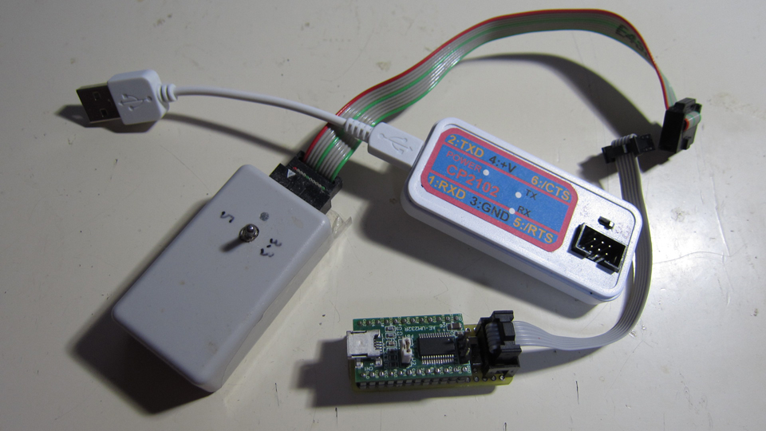

Renesas RX マイコン・フラッシュ・プログラミング・ツール (rx_prog)
=========


## 概要
シリアルインターフェースを使って、RX マイコンのフラッシュメモリーにプログラムを書き込む為のツール
   
---
## プロジェクト・リスト
 - main.cpp
 - area.hpp
 - conf_in.hpp
 - file_io.cpp
 - file_io.hpp
 - motsx_io.hpp
 - rs232c_io.hpp
 - rx_prog.hpp
 - rx_protocol.hpp
 - rx24t_protocol.hpp
 - rx63t_protocol.hpp
 - rx64m_protocol.hpp
 - rx65x_protocol.hpp
 - sjis_utf16.cpp
 - sjis_utf16.hpp
 - string_utils.cpp
 - string_utils.hpp
 - Makefile
 - rx_prog.conf
   
---
## ビルド（コンパイル）環境の準備（Windows）
 - MSYS2 のセットアップ
 - gcc 関係のインストール
 - boost のインストール（pacman を使って、mingw64 環境用をインストールする）
   
RX/README.md、RX/READMEja.md の開発環境準備を参照
   
---
## ビルド方法、環境設定
 - make する
 - make install により、設定ファイルと実行ファイルをコピー
 - /usr/local/bin にパスを通す
   
---
## 接続準備（シリアル接続）
- マイコン側の VSS 端子と、USB シリアルの GND を接続。
- マイコン側の RXD1 端子と、USB シリアルの TXD を接続。
- マイコン側の TXD1 端子と、USB シリアルの RXD を接続。
※ブート時のＳＣＩポート（通常 SCI1 です、要確認ハードウェアーマニュアル）   
- UB 端子があるデバイスの場合、プルダウンする。(4.7K)
- EMLE 端子がある場合プルダウンする。（4.7K)
- MD 端子を「Low レベル」にして「リセット」信号を入れる。
- 内臓プログラムを実行する場合は MD 端子を「High レベル」にして、リセット信号を入れる。
   
---
## 接続端子一覧
|端子|RX24T (100 Pin)|RX66T (100 Pin)|RX64M (176 Pin)|RX71M (176 Pin)|RX65N (176 Pin)|
|---|---|---|---|---|---|
|UB|X|UB/P00 (4)|PC7/UB (76)|PC7/UB (76)|PC7/UB (76)|
|MD|MD (6)|MD/FINED (6)|MD/FINED (18)|MD/FINED (18)|MD/FINED (18)|
|EMLE|X|EMLE (2)|EMLE (10)|EMLE (10)|EMLE (10)|
|RXD|PD5/RXD1 (20)|PD5/RXD1 (20)|PF2/RXD1 (31)|PF2/RXD1 (31)|PF2/RXD1 (31)|
|TXD|PD3/TXD1 (22)|PD3/TXD1 (22)|PF0/TXD1 (35)|PF0/TXD1 (35)|PF0/TXD1 (35)|
   
- UB、MD、EMLE 端子は、抵抗（4.7K 程度）でプルアップ、又はプルダウン。
- XTAL、EXTAL に適切なクリスタルを接続。
- VSS、VCC、AVSS、AVCC 等電源を全て接続、バイパスコンデンサを入れる。
- USB_VSS、USB_VCC などの USB 電源を適切に接続する。
   
※詳しくは、各デバイスのハードウェアーマニュアル「概要、ピン配置図」、「フラッシュメモル、ブートモード」を参照して下さい。   
※ルネサス製ボードの回路図が公開されていますので参考にして下さい。   
   
---
## 操作方法

### rx_prog の起動確認
 - rx_prog を実行して、動作する事を確認（help がリストされる）
```
rx_prog
Renesas RX Series Programmer Version 1.10b
Copyright (C) 2016,2019 Hiramatsu Kunihito (hira@rvf-rc45.net)
usage:
rx_prog [options] [mot file] ...

Options :
    -P PORT,   --port=PORT     Specify serial port
    -s SPEED,  --speed=SPEED   Specify serial speed
    -d DEVICE, --device=DEVICE Specify device name
    -e, --erase                Perform a device erase to a minimum
    -v, --verify               Perform data verify
    -w, --write                Perform data write
    --progress                 display Progress output
    --erase-page-wait=WAIT     Delay per read page  (2000) [uS]
    --write-page-wait=WAIT     Delay per write page (5000) [uS]
    --device-list              Display device list
    --verbose                  Verbose output
    -h, --help                 Display this
```
   
### rx_prog.conf 設定
 - 各デバイスの設定、ポート、ボーレートの設定などを記述する。
 - 各プラットホームで設定を共有出来るように、シリアルデバイスのポートパスを個別に指定できる。
 - 自分の環境に合わせてポート名、ボーレートなど設定しておく。
   
rx_prog.conf 設定例
```
# 標準のシリアルポート、プラットホーム依存ポート名
# port_win, port_osx, port_linux は、プラットホーム別に認識し、port より優先されます。
#port = /dev/ttyS10
#port = COM12
port_win   = COM3
port_osx   = /dev/tty.usbserial-DA00X2QP
port_linux = /dev/ttyUSB0

# 標準のシリアル・スピード、プラットホーム依存スピード
# speed_win, speed_osx, speed_linux は、プラットホーム別に認識し、speed より優先されます。
# ※設定できる最大速度は、プラットホームにより異なります。
#speed = 230400
speed_win = 230400
speed_osx = 230400
speed_linux = 230400

# erase-page command wait [uS]
erase_page_wait = 2000
# write-page command wait [uS]
write_page_wait = 5000
```
rx_prog.conf は、以下の順番にスキャンされ、ロードされます。   
- カレント・ディレクトリ
- コマンド・ディレクトリ（通常、/usr/local/bin）
   
対応デバイス・リスト表示
```
rx_prog --device-list
R5F563T6 (RAM: 8K, Program-Flash: 64K, Data-Flash: 8K)
R5F524T8 (RAM: 16K, Program-Flash: 128K, Data-Flash: 8K)
R5F524TA (RAM: 16K, Program-Flash: 256K, Data-Flash: 8K)
R5F564MF (RAM: 512K, Program-Flash: 2048K, Data-Flash: 64K)
R5F5671F (RAM: 512K, Program-Flash: 2048K, Data-Flash: 64K)
R5F564MG (RAM: 512K, Program-Flash: 2560K, Data-Flash: 64K)
R5F571MG (RAM: 512K, Program-Flash: 2560K, Data-Flash: 64K)
R5F564MJ (RAM: 512K, Program-Flash: 3072K, Data-Flash: 64K)
R5F571MJ (RAM: 512K, Program-Flash: 3072K, Data-Flash: 64K)
R5F564ML (RAM: 512K, Program-Flash: 4096K, Data-Flash: 64K)
R5F571ML (RAM: 512K, Program-Flash: 4096K, Data-Flash: 64K)
R5F565NE (RAM: 640K, Program-Flash: 2048K, Data-Flash: 32K)
R5F566TA (RAM: 64K, Program-Flash: 256K, Data-Flash: 32K)
R5F566TE (RAM: 64K, Program-Flash: 512K, Data-Flash: 32K)
R5F566TF (RAM: 128K, Program-Flash: 512K, Data-Flash: 32K)
R5F566TK (RAM: 128K, Program-Flash: 1024K, Data-Flash: 32K)
```
   
### コネクション検査

```
rx_prog -d RX71M --verbose
# Platform: 'Cygwin'
# Configuration file path: '/usr/local/bin/rx_prog.conf'
# Device: 'RX71M'
# Serial port path: 'COM3'
# Serial port speed: 230400
# Serial port alias: COM3 ---> /dev/ttyS2
# Serial port path: '/dev/ttyS2'
# Connection OK.
#01/01: Device Type TYP: 20 02 FD 09 01 48 40 00
#01/01: Device Type OSA: 16000000
#01/01: Device Type OSI: 16000000
#01/01: Device Type CPA: 120000000
#01/01: Device Type CPI: 120000000
#01/01: Endian is little.
#01/01: System clock: 120000000
#01/01: Device clock: 60000000
#01/01: Change baud rate: 230400
#01/01: ID: Disable
```
   
### 消去、書き込み、比較（プログレスバー付、「test_sample.mot」ファイルの場合）
```
rx_prog -d RX71M --progress --write --verify test_sample.mot
Erase:  #################################################
Write:  #################################################
Verify: #################################################
```
   
---
### 不必要なシリアルポートの削除（Windows）
```
set devmgr_show_nonpresent_devices=1
start devmgmt.msc
```
   
- 全ての USB シリアルデバイスをコンピューターから取り外す。
- 上記で BAT ファイルを作成して、右クリックにて、「管理者権限」で実行する。
- 「表示」-「非表示のデバイスの表示」にチェックを入れる。
- 使っていない COM ポートを削除する。
- 改めて、USB シリアルデバイスを順番にコンピューターに接続していく。
   
※同メーカーデバイスの場合、二個目以降、COM ポート番号の移り変わりなどが発生するので状況に応じてメーカー専用ツールなどで内部シリアル ID 番号を変更するなどの対処を行う必要がある。
※専用ツールの利用に関して、デバイスメーカーのＨＰで確認下さい。
   
---
### FT232RL, FT231XS と CP2102 の違い
FT231XS, FT232RL:
```
Neptune./d/Git/RX/RAYTRACER_sample/RX66T % time rx_prog -d RX66T --progress --erase --write --verify raytracer_sample.mot
Erase:  #################################################
Write:  #################################################
Verify: #################################################

real    0m16.617s
user    0m0.202s
sys     0m0.421s
```
   
CP2102:
```
Neptune./d/Git/RX/RAYTRACER_sample/RX66T % time rx_prog -P COM12 -d RX66T --progress --erase --write --verify raytracer_sample.mot
Erase:  #################################################
Write:  #################################################
Verify: #################################################

real    0m6.616s
user    0m0.078s
sys     0m0.187s
```
   
※FTDI のデバイスはシリコンラボ製デバイスに比べて低速なようです。
   
-----
   
License
----

MIT
